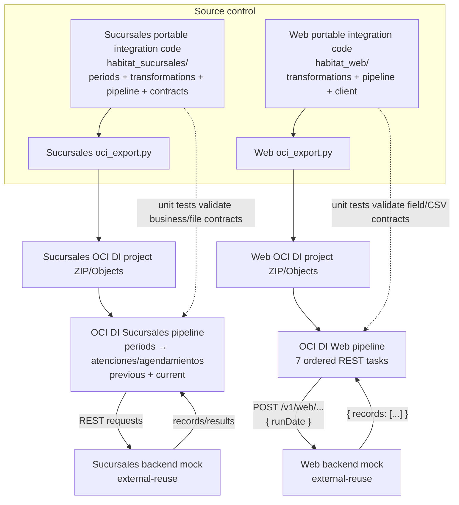
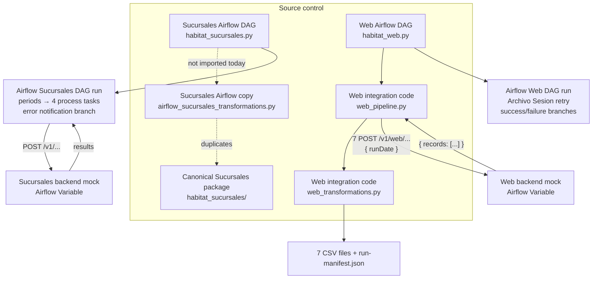

# Portable Pentaho Migration Demonstrator

This repository contains source-controlled migrations of two Pentaho flows:
`Sucursales` and `Web`. Each flow has an OCI Data Integration (ODI) and/or
Apache Airflow delivery. The intended portable asset is the integration code,
not the generated visual pipeline or the runtime-specific DAG.

- OCI Data Integration (ODI) for the OCI-native pipeline.
- Apache Airflow for code-first orchestration on the supplied Compute host.

The backend mock is an external-reuse boundary. Its URL is local deployment
configuration, never embedded in portable code or generated artifacts.

## Portable integration code — canonical locations

**The integration code that must be portable is not the OCI DI visual pipeline
and not the Airflow DAG.** It is the Python implementation of each migrated
Pentaho flow:

| Flow | Canonical portable code | Includes |
| --- | --- | --- |
| Sucursales | [`habitat-e2e-demo/oci-odi/sucursales/implementation/habitat_sucursales/`](habitat-e2e-demo/oci-odi/sucursales/implementation/habitat_sucursales/) | `periods.py`, `transformations.py`, `pipeline.py`, and `contracts.py`: period calculation, RUT/motive transformations, file input/output, validation, and failure-notification behavior. |
| Web | [`habitat-e2e-demo/oci-odi/web/implementation/habitat_web/`](habitat-e2e-demo/oci-odi/web/implementation/habitat_web/) | `transformations.py`, `pipeline.py`, and `client.py`: seven dataset contracts, field/date/null formatting, HTTP boundary calls, CSV output, and manifests. |

These packages are checked into Git and should be versioned, tested, and
promoted unchanged between TEST and PROD. The ODI project ZIP/JSON and Airflow
DAGs are runtime adapters around this code. The repository still has
runtime-specific copies in `oci-airflow/*/implementation`; they should be
replaced with imports of a shared versioned Python package to prevent drift.

## ODI: pipeline and integration code

For ODI, the **pipeline** is the importable OCI Data Integration project: its
ordered task graph, REST task definitions, and publishable root task. The
**integration code** is normal Python that implements and tests the Pentaho
business/data contract before the project artifact is generated.

| Flow | ODI pipeline: runtime artifact | ODI integration code: portable implementation | Relationship |
| --- | --- | --- | --- |
| Sucursales | [`target/`](habitat-e2e-demo/oci-odi/sucursales/target/) — generated OCI DI project ZIP and `Objects/*.json`; [`oci_export.py`](habitat-e2e-demo/oci-odi/sucursales/implementation/habitat_sucursales/oci_export.py) builds it deterministically. | [`habitat_sucursales/`](habitat-e2e-demo/oci-odi/sucursales/implementation/habitat_sucursales/) — period derivation, four monthly processing stages, transformations, schemas, eight output files, validation, and notification behavior. | Python is the portable, testable source of the integration contract; the OCI DI project is its OCI deployment/pipeline representation. |
| Web | [`target/`](habitat-e2e-demo/oci-odi/web/target/) — `HABITAT_WEB.project.zip` and OCI DI `Objects/*.json`; [`oci_export.py`](habitat-e2e-demo/oci-odi/web/implementation/habitat_web/oci_export.py) builds it deterministically. | [`habitat_web/`](habitat-e2e-demo/oci-odi/web/implementation/habitat_web/) — seven data contracts, field/session-date transformations, route runner, HTTP client, CSV output, and manifest. | Python defines the contract and tests; the OCI DI pipeline invokes the seven mock-backed REST stages in order. |

Do not put new business transformation rules exclusively in OCI DI visual
operators. Add them to the portable package first, add tests, then regenerate
the immutable ODI project artifact.

## Airflow: pipeline and integration code

For Airflow, the **pipeline** is the DAG: scheduling, dependencies, retry,
Airflow Variable lookup, and Pentaho-equivalent success/failure branches. The
**integration code** is Python outside the DAG that handles transformation,
boundary validation, and output contracts.

| Flow | Airflow pipeline: DAG | Airflow integration code | Relationship / current state |
| --- | --- | --- | --- |
| Sucursales | [`habitat_sucursales.py`](habitat-e2e-demo/oci-airflow/sucursales-via-skill/dags/habitat_sucursales.py) | [`airflow_sucursales_transformations.py`](habitat-e2e-demo/oci-airflow/sucursales-via-skill/implementation/airflow_sucursales_transformations.py) contains portable period, RUT, closing-date, and motive-splitting functions. The fuller canonical implementation remains [`habitat_sucursales/`](habitat-e2e-demo/oci-odi/sucursales/implementation/habitat_sucursales/). | The present DAG calls the external mock processing routes directly. It does **not** yet import the canonical package; this is a portability gap to close. |
| Web | [`habitat_web.py`](habitat-e2e-demo/oci-airflow/web-via-skill/dags/habitat_web.py) | [`web_pipeline.py`](habitat-e2e-demo/oci-airflow/web-via-skill/implementation/web_pipeline.py) runs the seven routes/writes manifests; [`web_transformations.py`](habitat-e2e-demo/oci-airflow/web-via-skill/implementation/web_transformations.py) enforces output contracts. | The deployer installs both modules beside the DAG. The DAG imports `web_pipeline.py`, keeping retry and branch logic thin. |

Do not add business transformation logic directly to a DAG task. Add it to a
portable package with unit tests; the DAG should only call that package and
coordinate runtime behavior.

## 1. OCI Data Integration pipeline

This diagram separates the two ODI pipelines from their portable integration
packages. The **solid arrows from package to exporter** show source-controlled
code used to build the runtime artifact. The **solid arrows from pipeline to
mock** show the live integration boundary.

The project ZIP/Objects is the OCI runtime artifact. The Python packages are
the portable implementation and test authority. Neither ODI deployer creates,
starts, stops, nor health-checks its external-reuse mock.

## 2. Airflow pipeline

This diagram separates Airflow DAG orchestration from integration code. A
**solid DAG-to-code arrow** means the DAG imports/uses that code at runtime. A
**dashed arrow** marks the current Sucursales portability gap.

The Web deployer installs `web_pipeline.py` and `web_transformations.py` beside
the DAG, verifies their checksums, and materializes only the mock URL as an
Airflow Variable. Sucursales should be changed to import its canonical package
before it can make the same portability claim.

## Portable integration code: where it is

The full, locally executable integration implementations are here:

| Flow | Portable integration package | Integration logic it contains |
| --- | --- | --- |
| Sucursales | [`habitat_sucursales/`](habitat-e2e-demo/oci-odi/sucursales/implementation/habitat_sucursales/) | [`periods.py`](habitat-e2e-demo/oci-odi/sucursales/implementation/habitat_sucursales/periods.py) calculates current/prior periods; [`transformations.py`](habitat-e2e-demo/oci-odi/sucursales/implementation/habitat_sucursales/transformations.py) cleans RUT values and splits paired motive/submotive data; [`pipeline.py`](habitat-e2e-demo/oci-odi/sucursales/implementation/habitat_sucursales/pipeline.py) reads inputs, writes the eight outputs, validates them, and preserves failure notification behavior; [`contracts.py`](habitat-e2e-demo/oci-odi/sucursales/implementation/habitat_sucursales/contracts.py) defines schemas and file contracts. |
| Web | [`habitat_web/`](habitat-e2e-demo/oci-odi/web/implementation/habitat_web/) | [`transformations.py`](habitat-e2e-demo/oci-odi/web/implementation/habitat_web/transformations.py) defines all seven source field/output contracts and session-date rules; [`pipeline.py`](habitat-e2e-demo/oci-odi/web/implementation/habitat_web/pipeline.py) executes the ordered routes and emits CSV/manifests; [`client.py`](habitat-e2e-demo/oci-odi/web/implementation/habitat_web/client.py) is the portable HTTP boundary adapter. |

These packages are the code that should be independently versioned, tested,
and promoted unchanged between TEST and PROD. Their tests sit beside them
under each `implementation/tests/` folder.

## Runtime adapters and generated artifacts

The following are source-controlled too, but they wrap or generate the
portable integration code; they are not the primary business implementation.

| Runtime | Files | Responsibility |
| --- | --- | --- |
| OCI DI | `oci_export.py`, `cli.py`, `mock_*.py` in each package | Build an importable OCI DI project, expose local commands, and provide deterministic test/mock infrastructure. |
| OCI DI | `target/*.project.zip` and `target/*.project/Objects/*.json` | Generated/importable OCI DI visual pipeline artifact. It is a release artifact, not where business transformations should live. |
| Airflow Sucursales | [`airflow_sucursales_transformations.py`](habitat-e2e-demo/oci-airflow/sucursales-via-skill/implementation/airflow_sucursales_transformations.py), [`habitat_sucursales.py`](habitat-e2e-demo/oci-airflow/sucursales-via-skill/dags/habitat_sucursales.py) | Airflow-specific duplicate transformations and DAG orchestration. |
| Airflow Web | [`web_transformations.py`](habitat-e2e-demo/oci-airflow/web-via-skill/implementation/web_transformations.py), [`web_pipeline.py`](habitat-e2e-demo/oci-airflow/web-via-skill/implementation/web_pipeline.py), [`habitat_web.py`](habitat-e2e-demo/oci-airflow/web-via-skill/dags/habitat_web.py) | Airflow-specific portable-code copy plus DAG retry/branching adapter. |

### Current gap

There is **not yet one shared package** consumed by ODI and Airflow. The Web
and Sucursales logic is duplicated in runtime-specific directories, so changes
can drift. The next hardening step is to move the two packages above into a
shared `src/` Python distribution, publish an immutable wheel, and make both
OCI DI and Airflow adapters consume that same versioned release.

## What is not committed as portable code

- `.env` and `.deploy.env`: ignored local deployment values, including host
  addresses, SSH key path, OCI identifiers, and mock URL.
- Credentials, private keys, passwords, or environment endpoints.
- Live Airflow metadata, task logs, generated temporary files, and mock state.

## Migration directories

- [OCI DI Sucursales migration](habitat-e2e-demo/oci-odi/sucursales/README.md)
- [OCI DI Web migration](habitat-e2e-demo/oci-odi/web/README.md)
- [Airflow Sucursales migration](habitat-e2e-demo/oci-airflow/sucursales-via-skill/README.md)
- [Airflow Web migration](habitat-e2e-demo/oci-airflow/web-via-skill/README.md)
- [Pentaho Sucursales source/specification](habitat-e2e-demo/sot/Pentaho_Habitat_Sucursales-llm-assets/)
- [Pentaho Web source/specification](habitat-e2e-demo/sot/Pentaho_Habitat_Web-llm-assets/)
