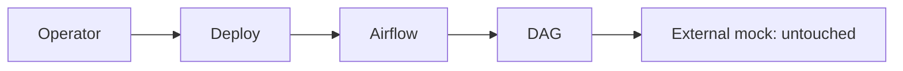

# Habitat Sucursales — Airflow migration

The DAG `habitat_sucursales_carga_archivo_externo` preserves the Pentaho job
order and uses the user-managed mock through an Airflow Variable.

Run `./deploy.sh --config .deploy.env --app-name NAME --dry-run`, then repeat
without `--dry-run`. In Airflow, locate the DAG by its exact ID and click Run.
