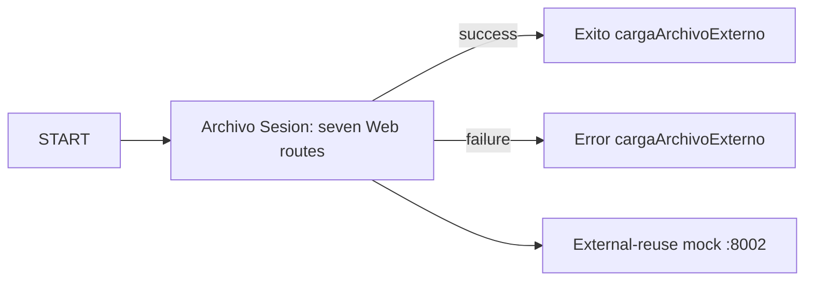

# Habitat Web — Airflow migration

`habitat_web_carga_archivo_externo` preserves the evidenced job branches and seven KTR data contracts.

Copy `.deploy.env.example` to ignored `.deploy.env`, set the Airflow host values, then run:

`./deploy.sh --config .deploy.env --app-name habitat-web --dry-run`

Deploy without `--dry-run`, then open Airflow and manually run DAG `habitat_web_carga_archivo_externo`. Logs are in the Airflow task instance; CSV files and `run-manifest.json` are written under `HABITAT_WEB_OUTPUT_ROOT` (or `/tmp/habitat-web`).

Traceability: [behavior contract](analysis/behavior-contract.md), [mock contract](analysis/mock-contract.md), [implementation](implementation/web_transformations.py), and [tests](implementation/tests/test_web_airflow_pipeline.py).
