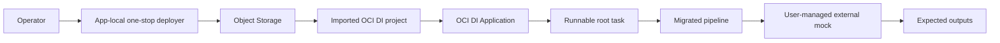

# HABITAT_SUCURSALES_VIA_SKILL Migrated Demo

The one-stop script materializes the user-supplied external mock URL, imports the
immutable OCI Data Integration project, publishes the runnable task, and reports
`READY`. It never probes or manages that external mock.

## How the POC works



Mock status:

- `mock-required`: yes
- mock exists: user-supplied external service
- action: `external-reuse`
- deployment validation: URL materialization only; routes are validated by task run

## 1. Configure

Copy the blank deployment example to an ignored file. Fill every value. Keep OCI
identifiers, IPs, SSH key paths, bucket details, and endpoints out of version
control.

## 2. Preview

Run the generic deploy script with the explicit config path and `--dry-run`. Review
the resolved project, application, task, VM, network, archive, and run date.

## 3. Deploy

```bash
./deploy.sh \
  --config PATH \
  --app-name NAME
```

Wait for `READY`.

### What the one-stop script does

1. validates required inputs and checksums;
2. leaves the user-managed mock untouched;
3. uploads and imports `PROJECT-NAME.project.zip` with replacement;
4. materializes the approved mock URL and run inputs into parameter-free REST tasks;
5. creates or reuses the named application;
6. publishes the named pipeline task and verifies it is present.

## 4. Run

Open the exact OCI Data Integration application and filter Tasks by the reported
runnable task identifier. If it is not on the first page, check the next page.
Choose **Run** without adding parameters and wait for a terminal run status.

## 5. Verify

Run the output validator. Compare the exact file set, row counts, byte format, and
SHA-256 values with the expected-output manifest.

## Troubleshooting

- External mock failure: inspect the OCI task run and the mock owner's logs.
- Task absent: use filter/next page or CLI listing with all pages.
- Publication failed: inspect the terminal patch response and errors.
- Run failed: inspect the task-run response and mock service log.
