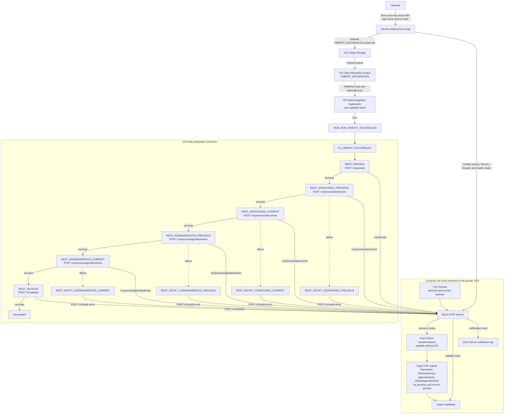

# Habitat Sucursales Demo

One script prepares the VM mock and publishes the OCI Data Integration task.
After it finishes, open the application and click Run.

## How the POC works



## 1. Deploy everything

Run once from the repository root:

```bash
./platforms/oci/scripts/deploy-habitat-sucursales-demo.sh \
  --app-name HABITAT_SUCURSALES_DEMO \
  --as-of-date 2026-07-15
```

Wait for `READY`.

The script reads the local, untracked configuration from:

```text
habitat-e2e-demo/oci-odi/sucursales/.demo-deploy.env
```

## What the script does

- verifies the release checksum;
- uses the application name you pass; there is no default application;
- installs and starts the mock on the Compute VM;
- registers and enables `habitat-sucursales-mock.service`;
- restricts TCP 8080 to the Data Integration workspace subnet;
- performs the `/health` check;
- uploads the project ZIP to the configured Object Storage bucket;
- imports or replaces the OCI Data Integration project;
- puts the VM private URL and `AS_OF_DATE` into the REST tasks;
- creates the application name you pass when missing;
- finds the imported task `TASK_RUN_HABITAT_SUCURSALES`; and
- publishes the task and stops immediately if OCI rejects the patch.

Run it again with another `--app-name` to reuse the same deployment in another
application.

## 2. Open the application

In the OCI Console:

1. Open **Data Integration** → **Workspaces** → the target workspace.
2. Open **Applications** → `HABITAT_SUCURSALES_DEMO`.
3. Open **Tasks**. Page 1 contains the ten REST dependencies.
4. Click **Page 2**, or use **Filter by name** for
   `TASK_RUN_HABITAT_SUCURSALES`.
5. Open `TASK_RUN_HABITAT_SUCURSALES`.

## 3. Click Run

Choose **Run**. Do not enter parameters: the script already materialized the
mock URL and run date. Start the run and wait for **Succeeded** under **Runs**.

The eight result CSVs are written on the VM under:

```text
/var/lib/habitat-sucursales/output
```
