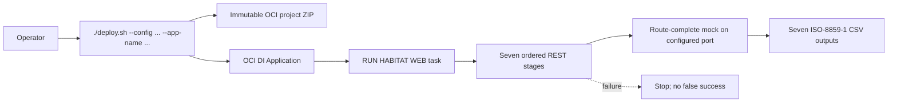

# Habitat Web OCI Data Integration POC

This app migrates the evidenced Pentaho Web flow into portable Python contracts
and a parameter-free OCI Data Integration project.

## Run offline tests

1. `cd implementation`
2. `python3 -m pytest -q`
3. `python3 -m compileall habitat_web`

The fixture-backed tests start an ephemeral local mock and verify all seven
published REST routes without contacting the deployed service.

Build the immutable Compute release with:

`PYTHONPATH=implementation python3 -m habitat_web.mock_release --implementation-root implementation --output target/habitat-web-mock-backend-1.1.0.tar.gz`

## Deploy

1. Copy `.demo-deploy.env.example` to an ignored path and replace every value.
2. Validate without mutation:
   `./deploy.sh --config /path/to/web.env --app-name HABITAT_WEB_DEMO --dry-run`
3. Deploy:
   `./deploy.sh --config /path/to/web.env --app-name HABITAT_WEB_DEMO`

## What the one-stop script does

1. Requires explicit config and app name.
2. Verifies the immutable project checksum.
3. Trusts the operator-supplied mock URL; it does not probe the service.
4. Uploads and imports the project with `REPLACE`.
5. Materializes the configured mock URL and run date into imported REST tasks.
6. Creates/reuses the Application, publishes the root task, and verifies it with `--all`.

Console path after publication: Data Integration → Applications → selected
application → Tasks → filter `RUN HABITAT WEB` → Run. No runtime parameters.

Expected outputs are under `expected-output/`. The packaged mock contains the
seven `/v1/web/...` routes used by the OCI pipeline, accepts the `runDate`
contract, and returns the matching deterministic fixture envelope. A successful
live deploy reports `READY_WITH_TRUSTED_MOCK`; operators must keep the deployed
service port and `MOCK_BASE_URL` port identical.
