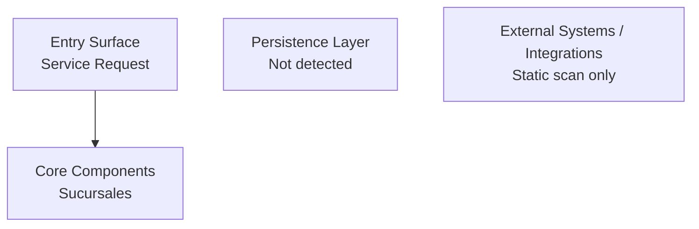

# Sucursales Analysis

🗺️ [Modernization Roadmap](../../modernization-roadmap/Sucursales/roadmap.md) | 🔬 [Deep Dive](./deep-dive.md)

## Overview
**Application Name:** Sucursales
**Domain:** Enterprise Services
**Type:** Pentaho Data Integration Workflow
**Version:** OSB export metadata not declared
**Business Criticality:** Medium-to-High (core enterprise services component)

## Artifacts Observed
- Source files: 6
- Class definitions: 0
- Configuration files: XML (0), Properties (0), WSDL (0), SQL (0), Tuxedo (0)
- Primary packages: Not evidenced

## What This App Does

- **Primary role**: `Sucursales` orchestrates 1 Pentaho job(s) and 5 transformation(s).
- **Entry workflows**: `cargaArchivoExterno` invoke Not evidenced.
- **Data processing**: 40 steps cover database reads/lookups/writes, variables, embedded JavaScript/SQL, filtering, grouping, and file/Excel I/O.

## Component Inventory
### Classes / Services (0)
| Component Name | Package | Business Domain | Type | Complexity |
|---|---|---|---|---|
**Total:** ~0 classes

## Source Code Statistics
### Package Structure
- Primary packages: Not evidenced

### Key Metrics
- Total source files: 6
- Estimated methods/functions: ~0
- Configuration files: 0 (XML, properties, WSDL, SQL)
- Architectural signals: General source/configuration patterns (inferred)

## Architecture (Tier Diagram)

## Key Implementation Patterns (Brief)
- Kettle `.kjb` jobs provide control flow; `.ktr` transformations provide row-level data flow.
- TRANS/JOB entries compose nested workflows through source-relative references.
- Variables and database connections pass state across transformations; embedded JavaScript and SQL implement migration-critical rules.
- Evaluated success/failure branches are distinct from unconditional job transitions.

## Top Findings (Prioritized)
1. **Workflow footprint**: 1 job(s), 5 transformation(s), 40 transformation steps.
2. **Database surface**: `AgileBI`, `Bonobo`, `cnTower`, `FUGA`, `Kettle`, `MsSQLServer_JNDI@TotalPack(Datawarehouse)`.
3. **Embedded logic**: 1 delegated JavaScript/SQL fragment(s).
4. **Backup variants**: 0 transformation(s) are under `respaldo` and require scope confirmation.

## Observed Anti-Patterns and Modernization Traps

- **Embedded-rule coupling**: JavaScript and SQL inside workflow XML must be ported and parity-tested with their originating step context.
- **Shared mutable variables**: Set/GetVariable steps create ordering and state dependencies across nested workflows.
- **Operational branching**: email, evaluation, success, and abort paths are functional behavior, not incidental orchestration.
- **Duplicate variants**: backup/test transformations must be compared with primary flows before migration scope is frozen.

## Dependencies (Top)
### Inbound
- Enterprise Services orchestration layer → Sucursales service calls
- External callers via detected service interfaces, routes, or contracts

### Outbound
- Sucursales → Persistence layer (Not detected)
- Sucursales → Logging framework

## Next Deep-Dive Options
- **TARGETED DEEP DIVE:** Input/Processing/Output (IPO) data flow for key use cases
- **CODE AUDIT:** Exception handling, transaction boundaries, concurrency patterns
- **REFACTOR ASSESSMENT:** Target runtime/container migration candidate
- **DEPENDENCY MESH:** Map integration with downstream systems
- **MIGRATION ESTIMATE (STAGE C):** Effort/complexity for cloud-native replatforming

*Generated: 2026-07-22*
*Evidence Base: Decompiled source code scan + configuration introspection*

> **Evidence & Limits**
> Analysis derived from programmatic scan of decompiled source code.
> Static analysis cannot resolve runtime behaviour.
> Confidence: Medium (source found, limited pentaho kettle workflow files)
