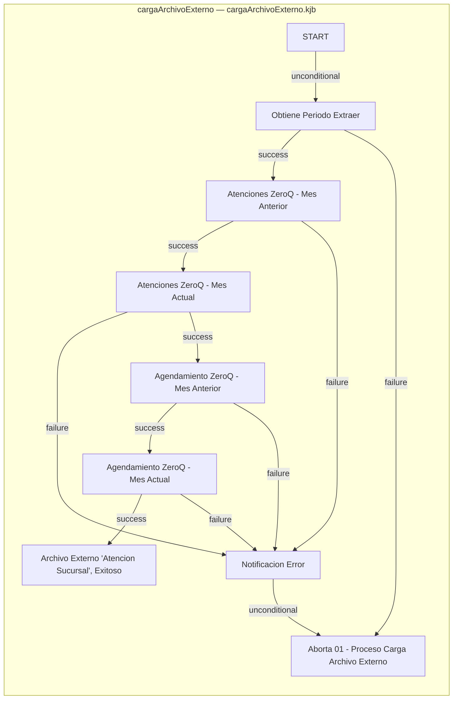

# Sucursales — Deep Dive (Stage B)

📄 [Back to Analysis](./analysis.md) | 🗺️ [Modernization Roadmap](../../modernization-roadmap/Sucursales/roadmap.md)

**Type:** Pentaho Data Integration Workflow

## B0. Evidence Index (anchors)

| Artifact | Source-relative path | Role | Evidence |
|---|---|---|---|
| Kettle job | `cargaArchivoExterno.kjb` | Primary orchestration | 9 entries; 12 hops; references Not evidenced; inferred path(s) `START -> Obtiene Periodo Extraer -> Atenciones ZeroQ - Mes Anterior -> Atenciones ZeroQ - Mes Actual -> Notificacion Error -> Aborta 01 - Proceso Carga Archivo Externo`, `START -> Obtiene Periodo Extraer -> Atenciones ZeroQ - Mes Anterior -> Atenciones ZeroQ - Mes Actual -> Agendamiento ZeroQ - Mes Anterior -> Agendamiento ZeroQ - Mes Actual -> Archivo Externo "Atencion Sucursal", Exitoso`, `START -> Obtiene Periodo Extraer -> Atenciones ZeroQ - Mes Anterior -> Atenciones ZeroQ - Mes Actual -> Agendamiento ZeroQ - Mes Anterior -> Agendamiento ZeroQ - Mes Actual -> Notificacion Error -> Aborta 01 - Proceso Carga Archivo Externo`, `START -> Obtiene Periodo Extraer -> Atenciones ZeroQ - Mes Anterior -> Atenciones ZeroQ - Mes Actual -> Agendamiento ZeroQ - Mes Anterior -> Notificacion Error -> Aborta 01 - Proceso Carga Archivo Externo`, `START -> Obtiene Periodo Extraer -> Atenciones ZeroQ - Mes Anterior -> Notificacion Error -> Aborta 01 - Proceso Carga Archivo Externo`, `START -> Obtiene Periodo Extraer -> Aborta 01 - Proceso Carga Archivo Externo` |
| Kettle transformation | `transf_AgendamientoZeroQ_TDS.ktr` | Primary transformation | 6 steps; 5 hops; inferred anchors `AgendamientoZeroQ [output]`, `Archivo_AgendamientoZeroQ [input]`, `Campos que continuan [transformation]`, `Extrae Fecha Archivo [processing]`, `Obtiene Fecha Cierre [transformation]`, `Replace puntos en el rutEjecutivo [processing]` |
| Kettle transformation | `transf_AtencionesZeroQ_TDS.ktr` | Primary transformation | 6 steps; 5 hops; inferred anchors `Archivo_AtencionZeroQ [input]`, `AtencionesZeroQ [output]`, `Campos que continuan [transformation]`, `Extrae Fecha Archivo [processing]`, `Obtiene Fecha Cierre [transformation]`, `Replace puntos en el rutEjecutivo [processing]` |
| Kettle transformation | `transf_MotivoAgendamientoZeroQ_TDS.ktr` | Primary transformation | 13 steps; 13 hops; inferred anchors `Archivo_AgendamientoZeroQ [input]`, `Blocking step [processing]`, `Crea Archivo motivosAgendamientoZeroq [output]`, `Extrae Fecha Archivo [processing]`, `Obtiene Fecha Cierre [transformation]`, `Select values [transformation]`, `Select values motivos [transformation]`, `Split fields Desc Mov [processing]`, `Split fields ID Mot [processing]`, `Stream lookup [lookup]`, `dummy [processing]`, `split IDMotivos [processing]`, `split desc Motivos [processing]` |
| Kettle transformation | `transf_MotivoAtencionZeroQ_TDS.ktr` | Primary transformation | 13 steps; 13 hops; inferred anchors `Archivo_AtencionZeroQ [input]`, `Blocking step [processing]`, `Crea Archivo motivosAtencionZeroq [output]`, `Dummy (do nothing) [processing]`, `Extrae Fecha Archivo [processing]`, `Obtiene Fecha Cierre [transformation]`, `Select values [transformation]`, `Select values motivos [transformation]`, `Split fields Desc Mov [processing]`, `Split fields ID Mot [processing]`, `Stream lookup [lookup]`, `split IDMotivos [processing]`, `split desc Motivos [processing]` |
| Kettle transformation | `transf_obtenerPeriodoExtraer.ktr` | Primary transformation | 2 steps; 1 hops; inferred anchors `Asigna Variables [output]`, `Obtener Listado Fechas [input]` |

- **Corpus files:** 6 (5 KTR, 1 KJB).
- **Primary transformations:** 5; backup/variant transformations: 0.
- **Embedded fragments:** 1; migration units: 6.

## B1. Job Entry Points and Nested Workflow Contracts

| Job | Source | Entry | Type | Referenced workflow |
|---|---|---|---|---|
| `cargaArchivoExterno` | `cargaArchivoExterno.kjb` | `Archivo Externo "Atencion Sucursal", Exitoso` | `SUCCESS` | `` |
| `cargaArchivoExterno` | `cargaArchivoExterno.kjb` | `Atenciones ZeroQ - Mes Anterior` | `SHELL` | `${atensucu.ruta.shell}descargarAtencionesZeroQ.sh` |
| `cargaArchivoExterno` | `cargaArchivoExterno.kjb` | `Aborta 01 - Proceso Carga Archivo Externo` | `ABORT` | `` |
| `cargaArchivoExterno` | `cargaArchivoExterno.kjb` | `START` | `SPECIAL` | `` |
| `cargaArchivoExterno` | `cargaArchivoExterno.kjb` | `Obtiene Periodo Extraer` | `TRANS` | `` |
| `cargaArchivoExterno` | `cargaArchivoExterno.kjb` | `Atenciones ZeroQ - Mes Actual` | `SHELL` | `${atensucu.ruta.shell}descargarAtencionesZeroQ.sh` |
| `cargaArchivoExterno` | `cargaArchivoExterno.kjb` | `Notificacion Error` | `MAIL` | `` |
| `cargaArchivoExterno` | `cargaArchivoExterno.kjb` | `Agendamiento ZeroQ - Mes Anterior` | `SHELL` | `${atensucu.ruta.shell}descargarAgendamientoZeroQ.sh` |
| `cargaArchivoExterno` | `cargaArchivoExterno.kjb` | `Agendamiento ZeroQ - Mes Actual` | `SHELL` | `${atensucu.ruta.shell}descargarAgendamientoZeroQ.sh` |

## B2. Job Orchestration, Conditions, and Error Paths

| Job / Source | Transition | Outcome | Condition |
|---|---|---|---|
| `cargaArchivoExterno` / `cargaArchivoExterno.kjb` | Obtiene Periodo Extraer -> Atenciones ZeroQ - Mes Anterior (success) | `success` | previous entry succeeded |
| `cargaArchivoExterno` / `cargaArchivoExterno.kjb` | Obtiene Periodo Extraer -> Aborta 01 - Proceso Carga Archivo Externo (failure) | `failure` | previous entry failed or evaluated false |
| `cargaArchivoExterno` / `cargaArchivoExterno.kjb` | START -> Obtiene Periodo Extraer (unconditional) | `unconditional` | always continue |
| `cargaArchivoExterno` / `cargaArchivoExterno.kjb` | Atenciones ZeroQ - Mes Anterior -> Atenciones ZeroQ - Mes Actual (success) | `success` | previous entry succeeded |
| `cargaArchivoExterno` / `cargaArchivoExterno.kjb` | Atenciones ZeroQ - Mes Anterior -> Notificacion Error (failure) | `failure` | previous entry failed or evaluated false |
| `cargaArchivoExterno` / `cargaArchivoExterno.kjb` | Notificacion Error -> Aborta 01 - Proceso Carga Archivo Externo (unconditional) | `unconditional` | always continue |
| `cargaArchivoExterno` / `cargaArchivoExterno.kjb` | Atenciones ZeroQ - Mes Actual -> Notificacion Error (failure) | `failure` | previous entry failed or evaluated false |
| `cargaArchivoExterno` / `cargaArchivoExterno.kjb` | Atenciones ZeroQ - Mes Actual -> Agendamiento ZeroQ - Mes Anterior (success) | `success` | previous entry succeeded |
| `cargaArchivoExterno` / `cargaArchivoExterno.kjb` | Agendamiento ZeroQ - Mes Anterior -> Agendamiento ZeroQ - Mes Actual (success) | `success` | previous entry succeeded |
| `cargaArchivoExterno` / `cargaArchivoExterno.kjb` | Agendamiento ZeroQ - Mes Actual -> Archivo Externo "Atencion Sucursal", Exitoso (success) | `success` | previous entry succeeded |
| `cargaArchivoExterno` / `cargaArchivoExterno.kjb` | Agendamiento ZeroQ - Mes Anterior -> Notificacion Error (failure) | `failure` | previous entry failed or evaluated false |
| `cargaArchivoExterno` / `cargaArchivoExterno.kjb` | Agendamiento ZeroQ - Mes Actual -> Notificacion Error (failure) | `failure` | previous entry failed or evaluated false |

## B3. Runtime, Database, and Embedded-Code Dependencies

- **Database connections:** `AgileBI`, `Bonobo`, `cnTower`, `FUGA`, `Kettle`, `MsSQLServer_JNDI@TotalPack(Datawarehouse)`, `MySQL5`, `MySQL_JNDI@SGC(Datawarehouse)`, `Oracle_JDBC@DESA_RTP(Datawarehouse)`, `Oracle_JDBC@DESA_RTP(IPINCHEI)`, `Oracle_JNDI@DESA_RTP(IPINCHEI)`, `Oracle_JNDI@DOCUWARE(Datawarehouse)`.
- **Nested workflows:** Not evidenced.
- **Embedded analyzers:** `plsql`.

| Step type | Count | Migration significance |
|---|---:|---|
| `SelectValues` | 6 | Transformation behavior |
| `ReplaceString` | 6 | Transformation behavior |
| `TextFileOutput` | 4 | Published flat-file contract |
| `TextFileInput` | 4 | Transformation behavior |
| `Formula` | 4 | Transformation behavior |
| `FieldSplitter` | 4 | Transformation behavior |
| `SplitFieldToRows3` | 4 | Transformation behavior |
| `BlockingStep` | 2 | Transformation behavior |
| `StreamLookup` | 2 | Transformation behavior |
| `Dummy` | 2 | Transformation behavior |
| `SetVariable` | 1 | Cross-step state |
| `TableInput` | 1 | Database query contract |

## B4. Structural Complexity Profile

- **Jobs / transformations:** 1 / 5.
- **Transformation steps / hops:** 40 / 37.
- **Job entries / hops:** 9 / 12.
- **Most frequent step types:** `SelectValues` (6), `ReplaceString` (6), `TextFileOutput` (4), `TextFileInput` (4), `Formula` (4), `FieldSplitter` (4), `SplitFieldToRows3` (4), `BlockingStep` (2), `StreamLookup` (2), `Dummy` (2).
- **Decision/error evidence:** 10 evaluated job branch(es); 5 failure branch(es).
- NLOC/cyclomatic metrics are not meaningful for Kettle XML; migration sizing uses workflow nodes, hops, embedded code, I/O contracts, and branch count.

## B5. Modernization Impact Deltas (Evidence-based)

| Legacy feature | Current evidence | Required migration treatment | Key parity risk |
|---|---|---|---|
| Kettle orchestration | 1 KJB job(s), 12 job hops | Recreate entry order, nested calls, and branch semantics | Unconditional and failure branches drift |
| Embedded rules | 0 ScriptValueMod; 0 ExecSQL | Port through delegated language/SQL pipelines with step provenance | Hidden field/default logic changes |
| Database access | Connections `AgileBI`, `Bonobo`, `cnTower`, `FUGA`, `Kettle`, `MsSQLServer_JNDI@TotalPack(Datawarehouse)`, `MySQL5`, `MySQL_JNDI@SGC(Datawarehouse)`; TableInput/DBLookup/TableOutput | Rebind credentials and preserve SQL/read/write contracts | SQL Server dialect and transaction differences |
| File and spreadsheet I/O | TextFileOutput, ExcelInput/ExcelWriter evidence | Preserve layouts, names, encodings, ordering, and control totals | Consumer incompatibility or reconciliation mismatch |
| Variables and operational control | 1 SetVariable step(s); mail/evaluation/abort entries | Model explicit state and failure handling | Silent continuation or missed notification |
| Backup variants | 0 transformation(s) under `respaldo` | Compare, then classify as current, obsolete, or rollback-only | Duplicate migration scope |

## B6. Deep-Dive Recommendations (Next Actions)

1. **Workflow owner:** confirm the inferred entry paths for `cargaArchivoExterno` and classify every TRANS/JOB reference plus backup/variant evidence.
2. **Data engineer:** baseline source queries, lookup keys, output fields, fixed-width/text layouts, spreadsheets, and database write reconciliation totals.
3. **Developer:** port each ScriptValueMod and ExecSQL fragment through its delegated analyzer while retaining source file and step traceability.
4. **QA:** execute path tests for unconditional transitions, evaluated success paths, every failure branch, mail notification, and Abort job behavior.
5. **Security/operations:** recreate connection references through managed secrets; never migrate embedded password values from Kettle XML.

## B7. Software Requirements Specification (SRS)

### Functional Requirements

| ID | Evidence-backed requirement | Priority | Source evidence |
|---|---|---|---|
| FR-PDI-001 | Execute `cargaArchivoExterno` through inferred path(s) `START -> Obtiene Periodo Extraer -> Atenciones ZeroQ - Mes Anterior -> Atenciones ZeroQ - Mes Actual -> Notificacion Error -> Aborta 01 - Proceso Carga Archivo Externo`, `START -> Obtiene Periodo Extraer -> Atenciones ZeroQ - Mes Anterior -> Atenciones ZeroQ - Mes Actual -> Agendamiento ZeroQ - Mes Anterior -> Agendamiento ZeroQ - Mes Actual -> Archivo Externo "Atencion Sucursal", Exitoso`, `START -> Obtiene Periodo Extraer -> Atenciones ZeroQ - Mes Anterior -> Atenciones ZeroQ - Mes Actual -> Agendamiento ZeroQ - Mes Anterior -> Agendamiento ZeroQ - Mes Actual -> Notificacion Error -> Aborta 01 - Proceso Carga Archivo Externo`, `START -> Obtiene Periodo Extraer -> Atenciones ZeroQ - Mes Anterior -> Atenciones ZeroQ - Mes Actual -> Agendamiento ZeroQ - Mes Anterior -> Notificacion Error -> Aborta 01 - Proceso Carga Archivo Externo`, `START -> Obtiene Periodo Extraer -> Atenciones ZeroQ - Mes Anterior -> Notificacion Error -> Aborta 01 - Proceso Carga Archivo Externo`, `START -> Obtiene Periodo Extraer -> Aborta 01 - Proceso Carga Archivo Externo`; preserve transition outcomes `Obtiene Periodo Extraer -> Atenciones ZeroQ - Mes Anterior (success)`, `Obtiene Periodo Extraer -> Aborta 01 - Proceso Carga Archivo Externo (failure)`, `START -> Obtiene Periodo Extraer (unconditional)`, `Atenciones ZeroQ - Mes Anterior -> Atenciones ZeroQ - Mes Actual (success)`, `Atenciones ZeroQ - Mes Anterior -> Notificacion Error (failure)`, `Notificacion Error -> Aborta 01 - Proceso Carga Archivo Externo (unconditional)`, `Atenciones ZeroQ - Mes Actual -> Notificacion Error (failure)`, `Atenciones ZeroQ - Mes Actual -> Agendamiento ZeroQ - Mes Anterior (success)`, `Agendamiento ZeroQ - Mes Anterior -> Agendamiento ZeroQ - Mes Actual (success)`, `Agendamiento ZeroQ - Mes Actual -> Archivo Externo "Atencion Sucursal", Exitoso (success)`, `Agendamiento ZeroQ - Mes Anterior -> Notificacion Error (failure)`, `Agendamiento ZeroQ - Mes Actual -> Notificacion Error (failure)`. | HIGH | `cargaArchivoExterno.kjb` |
| FR-PDI-002 | Preserve `transf_AgendamientoZeroQ_TDS` as `AgendamientoZeroQ [output]`, `Archivo_AgendamientoZeroQ [input]`, `Campos que continuan [transformation]`, `Extrae Fecha Archivo [processing]`, `Obtiene Fecha Cierre [transformation]`, `Replace puntos en el rutEjecutivo [processing]`; retain fields `fechaCierre`, `ID_Reserva`, `ID_Llamada`, `ID_Oficina`, `Codigo_de_Oficina`, `Oficina`, `ID_Serie`, `Serie`, `ID_Linea`, `Fila`, `Modulo`, `DNI_Ejecutivo`, `Nombre_Ejecutivo`, `Fecha_Reserva`, `Hora_Reserva`, `Prefijo_Fila`, `Terminal_Reserva`, `DNI_Cliente`, `ID_Tipo_Cliente`, `Tipo_Cliente`, `Nombre_Cliente`, `Email_Cliente`, `Fecha_Creacion_Reserva`, `Hora_Creacion_Reserva`, `Fecha_Atencion`, `Hora_Atencion`, `Hora_Termino_Atencion`, `Tiempo_Espera`, `Tiempo_Atencion`, `Cancelado`, `Fecha_Cancelacion`, `Usuario_que_Cancelo`, `Motivo_de_Cancelacion`, `Formulario`, `Perdido`, `Saltado`, `Origen_de_Creacion`, `Nombre_Agente`, `Email_Agente`, `DNI_Agente`. | HIGH | `transf_AgendamientoZeroQ_TDS.ktr` |
| FR-PDI-003 | Preserve `transf_AtencionesZeroQ_TDS` as `Archivo_AtencionZeroQ [input]`, `AtencionesZeroQ [output]`, `Campos que continuan [transformation]`, `Extrae Fecha Archivo [processing]`, `Obtiene Fecha Cierre [transformation]`, `Replace puntos en el rutEjecutivo [processing]`; retain fields `ID_Ticket`, `ID_Llamada`, `ID_Oficina`, `Codigo_de_Oficina`, `Oficina`, `ID_Serie`, `Serie`, `ID_Linea`, `Fila`, `Modulo`, `DNI_Ejecutivo`, `Nombre_Ejecutivo`, `Fecha`, `Prefijo_Ticket`, `Nro._Ticket`, `DNI_Cliente`, `ID_Tipo_Cliente`, `Tipo_Cliente`, `Nombre_Cliente`, `Email_Cliente`, `Hora_Emision_Ticket`, `Hora_Inicio_Atencion`, `Hora_Termino_Atencion`, `Tiempo_Espera`, `Tiempo_Atencion`, `ID_Motivos`, `Motivo_Atencion`, `Perdido`, `Saltado`, `Formulario`, `Modo_de_Atencion`, `fechaCierre`. | HIGH | `transf_AtencionesZeroQ_TDS.ktr` |
| FR-PDI-004 | Preserve `transf_MotivoAgendamientoZeroQ_TDS` as `Archivo_AgendamientoZeroQ [input]`, `Blocking step [processing]`, `Crea Archivo motivosAgendamientoZeroq [output]`, `Extrae Fecha Archivo [processing]`, `Obtiene Fecha Cierre [transformation]`, `Select values [transformation]`, `Select values motivos [transformation]`, `Split fields Desc Mov [processing]`, `Split fields ID Mot [processing]`, `Stream lookup [lookup]`, `dummy [processing]`, `split IDMotivos [processing]`, `split desc Motivos [processing]`; retain fields `ID_Reserva`, `ID_Llamada`, `ID_Oficina`, `Codigo_de_Oficina`, `Oficina`, `ID_Serie`, `Serie`, `ID_Linea`, `Fila`, `Modulo`, `DNI_Ejecutivo`, `Nombre_Ejecutivo`, `Fecha_Reserva`, `Hora_Reserva`, `Prefijo_Fila`, `Terminal_Reserva`, `DNI_Cliente`, `ID_Tipo_Cliente`, `Tipo_Cliente`, `Nombre_Cliente`, `Email_Cliente`, `Fecha_Creacion_Reserva`, `Hora_Creacion_Reserva`, `Fecha_Atencion`, `Hora_Atencion`, `Hora_Termino_Atencion`, `Tiempo_Espera`, `Tiempo_Atencion`, `Cancelado`, `Fecha_Cancelacion`, `Usuario_que_Cancelo`, `Motivo_de_Cancelacion`, `ID_Motivos`, `Motivo_Atencion`, `Formulario`, `Perdido`, `Saltado`, `Origen_de_Creacion`, `Nombre_Agente`, `Email_Agente`. | HIGH | `transf_MotivoAgendamientoZeroQ_TDS.ktr` |
| FR-PDI-005 | Preserve `transf_MotivoAtencionZeroQ_TDS` as `Archivo_AtencionZeroQ [input]`, `Blocking step [processing]`, `Crea Archivo motivosAtencionZeroq [output]`, `Dummy (do nothing) [processing]`, `Extrae Fecha Archivo [processing]`, `Obtiene Fecha Cierre [transformation]`, `Select values [transformation]`, `Select values motivos [transformation]`, `Split fields Desc Mov [processing]`, `Split fields ID Mot [processing]`, `Stream lookup [lookup]`, `split IDMotivos [processing]`, `split desc Motivos [processing]`; retain fields `ID_Ticket`, `ID_Llamada`, `ID_Oficina`, `Codigo_de_Oficina`, `Oficina`, `ID_Serie`, `Serie`, `ID_Linea`, `Fila`, `Modulo`, `DNI_Ejecutivo`, `Nombre_Ejecutivo`, `Fecha`, `Prefijo_Ticket`, `Nro._Ticket`, `DNI_Cliente`, `ID_Tipo_Cliente`, `Tipo_Cliente`, `Nombre_Cliente`, `Email_Cliente`, `Hora_Emision_Ticket`, `Hora_Inicio_Atencion`, `Hora_Termino_Atencion`, `Tiempo_Espera`, `Tiempo_Atencion`, `ID_Motivos`, `Motivo_Atencion`, `Perdido`, `Saltado`, `fechaCierre`, `IDMotivoAtencion`, `DescMotivoAtencion`, `IDSubMotivoAtencion`, `DescSubMotivoAtencion`, `numMotivo`, `nombreArchivo`. | HIGH | `transf_MotivoAtencionZeroQ_TDS.ktr` |
| FR-PDI-006 | Preserve `transf_obtenerPeriodoExtraer` as `Asigna Variables [output]`, `Obtener Listado Fechas [input]`; retain fields `periodoMesDesde`, `periodoMesHasta`, `fechaIniDesde`, `fechaFinDesde`, `fechaIniHasta`, `fechaFinHasta`. | HIGH | `transf_obtenerPeriodoExtraer.ktr` |

### Operation Contracts

| Operation | Contract facet | Evidence-backed behavior |
|---|---|---|
| `cargaArchivoExterno` | Trigger / preconditions | `START -> Obtiene Periodo Extraer (unconditional)`; execute source-ordered anchors `START`, `Obtiene Periodo Extraer`, `Atenciones ZeroQ - Mes Anterior`, `Atenciones ZeroQ - Mes Actual`, `Notificacion Error`, `Aborta 01 - Proceso Carga Archivo Externo`, `Agendamiento ZeroQ - Mes Anterior`, `Agendamiento ZeroQ - Mes Actual`, `Archivo Externo "Atencion Sucursal", Exitoso`. |
| `cargaArchivoExterno` | Processing / outcomes | Preserve `Obtiene Periodo Extraer -> Atenciones ZeroQ - Mes Anterior (success)`, `Obtiene Periodo Extraer -> Aborta 01 - Proceso Carga Archivo Externo (failure)`, `START -> Obtiene Periodo Extraer (unconditional)`, `Atenciones ZeroQ - Mes Anterior -> Atenciones ZeroQ - Mes Actual (success)`, `Atenciones ZeroQ - Mes Anterior -> Notificacion Error (failure)`, `Notificacion Error -> Aborta 01 - Proceso Carga Archivo Externo (unconditional)`, `Atenciones ZeroQ - Mes Actual -> Notificacion Error (failure)`, `Atenciones ZeroQ - Mes Actual -> Agendamiento ZeroQ - Mes Anterior (success)`, `Agendamiento ZeroQ - Mes Anterior -> Agendamiento ZeroQ - Mes Actual (success)`, `Agendamiento ZeroQ - Mes Actual -> Archivo Externo "Atencion Sucursal", Exitoso (success)`, `Agendamiento ZeroQ - Mes Anterior -> Notificacion Error (failure)`, `Agendamiento ZeroQ - Mes Actual -> Notificacion Error (failure)` and keep success, failure, notification, cleanup, and decision roles observable when evidenced. |
| `transf_AgendamientoZeroQ_TDS` | Inputs / processing / outputs | Execute `AgendamientoZeroQ [output]`, `Archivo_AgendamientoZeroQ [input]`, `Campos que continuan [transformation]`, `Extrae Fecha Archivo [processing]`, `Obtiene Fecha Cierre [transformation]`, `Replace puntos en el rutEjecutivo [processing]` in inferred path order `Archivo_AgendamientoZeroQ -> Replace puntos en el rutEjecutivo -> Extrae Fecha Archivo -> Obtiene Fecha Cierre -> Campos que continuan -> AgendamientoZeroQ`; preserve fields `fechaCierre`, `ID_Reserva`, `ID_Llamada`, `ID_Oficina`, `Codigo_de_Oficina`, `Oficina`, `ID_Serie`, `Serie`, `ID_Linea`, `Fila`, `Modulo`, `DNI_Ejecutivo`, `Nombre_Ejecutivo`, `Fecha_Reserva`, `Hora_Reserva`, `Prefijo_Fila`, `Terminal_Reserva`, `DNI_Cliente`, `ID_Tipo_Cliente`, `Tipo_Cliente`, `Nombre_Cliente`, `Email_Cliente`, `Fecha_Creacion_Reserva`, `Hora_Creacion_Reserva`, `Fecha_Atencion`, `Hora_Atencion`, `Hora_Termino_Atencion`, `Tiempo_Espera`, `Tiempo_Atencion`, `Cancelado`, `Fecha_Cancelacion`, `Usuario_que_Cancelo`, `Motivo_de_Cancelacion`, `Formulario`, `Perdido`, `Saltado`, `Origen_de_Creacion`, `Nombre_Agente`, `Email_Agente`, `DNI_Agente`. |
| `transf_AtencionesZeroQ_TDS` | Inputs / processing / outputs | Execute `Archivo_AtencionZeroQ [input]`, `AtencionesZeroQ [output]`, `Campos que continuan [transformation]`, `Extrae Fecha Archivo [processing]`, `Obtiene Fecha Cierre [transformation]`, `Replace puntos en el rutEjecutivo [processing]` in inferred path order `Archivo_AtencionZeroQ -> Replace puntos en el rutEjecutivo -> Extrae Fecha Archivo -> Obtiene Fecha Cierre -> Campos que continuan -> AtencionesZeroQ`; preserve fields `ID_Ticket`, `ID_Llamada`, `ID_Oficina`, `Codigo_de_Oficina`, `Oficina`, `ID_Serie`, `Serie`, `ID_Linea`, `Fila`, `Modulo`, `DNI_Ejecutivo`, `Nombre_Ejecutivo`, `Fecha`, `Prefijo_Ticket`, `Nro._Ticket`, `DNI_Cliente`, `ID_Tipo_Cliente`, `Tipo_Cliente`, `Nombre_Cliente`, `Email_Cliente`, `Hora_Emision_Ticket`, `Hora_Inicio_Atencion`, `Hora_Termino_Atencion`, `Tiempo_Espera`, `Tiempo_Atencion`, `ID_Motivos`, `Motivo_Atencion`, `Perdido`, `Saltado`, `Formulario`, `Modo_de_Atencion`, `fechaCierre`. |
| `transf_MotivoAgendamientoZeroQ_TDS` | Inputs / processing / outputs | Execute `Archivo_AgendamientoZeroQ [input]`, `Blocking step [processing]`, `Crea Archivo motivosAgendamientoZeroq [output]`, `Extrae Fecha Archivo [processing]`, `Obtiene Fecha Cierre [transformation]`, `Select values [transformation]`, `Select values motivos [transformation]`, `Split fields Desc Mov [processing]`, `Split fields ID Mot [processing]`, `Stream lookup [lookup]`, `dummy [processing]`, `split IDMotivos [processing]`, `split desc Motivos [processing]` in inferred path order `Archivo_AgendamientoZeroQ -> dummy -> split IDMotivos -> Split fields ID Mot -> Blocking step -> Stream lookup -> Select values motivos -> Extrae Fecha Archivo -> Obtiene Fecha Cierre -> Crea Archivo motivosAgendamientoZeroq`, `Archivo_AgendamientoZeroQ -> dummy -> split desc Motivos -> Split fields Desc Mov -> Select values -> Stream lookup -> Select values motivos -> Extrae Fecha Archivo -> Obtiene Fecha Cierre -> Crea Archivo motivosAgendamientoZeroq`; preserve fields `ID_Reserva`, `ID_Llamada`, `ID_Oficina`, `Codigo_de_Oficina`, `Oficina`, `ID_Serie`, `Serie`, `ID_Linea`, `Fila`, `Modulo`, `DNI_Ejecutivo`, `Nombre_Ejecutivo`, `Fecha_Reserva`, `Hora_Reserva`, `Prefijo_Fila`, `Terminal_Reserva`, `DNI_Cliente`, `ID_Tipo_Cliente`, `Tipo_Cliente`, `Nombre_Cliente`, `Email_Cliente`, `Fecha_Creacion_Reserva`, `Hora_Creacion_Reserva`, `Fecha_Atencion`, `Hora_Atencion`, `Hora_Termino_Atencion`, `Tiempo_Espera`, `Tiempo_Atencion`, `Cancelado`, `Fecha_Cancelacion`, `Usuario_que_Cancelo`, `Motivo_de_Cancelacion`, `ID_Motivos`, `Motivo_Atencion`, `Formulario`, `Perdido`, `Saltado`, `Origen_de_Creacion`, `Nombre_Agente`, `Email_Agente`. |
| `transf_MotivoAtencionZeroQ_TDS` | Inputs / processing / outputs | Execute `Archivo_AtencionZeroQ [input]`, `Blocking step [processing]`, `Crea Archivo motivosAtencionZeroq [output]`, `Dummy (do nothing) [processing]`, `Extrae Fecha Archivo [processing]`, `Obtiene Fecha Cierre [transformation]`, `Select values [transformation]`, `Select values motivos [transformation]`, `Split fields Desc Mov [processing]`, `Split fields ID Mot [processing]`, `Stream lookup [lookup]`, `split IDMotivos [processing]`, `split desc Motivos [processing]` in inferred path order `Archivo_AtencionZeroQ -> Dummy (do nothing) -> split IDMotivos -> Split fields ID Mot -> Blocking step -> Stream lookup -> Select values motivos -> Extrae Fecha Archivo -> Obtiene Fecha Cierre -> Crea Archivo motivosAtencionZeroq`, `Archivo_AtencionZeroQ -> Dummy (do nothing) -> split desc Motivos -> Split fields Desc Mov -> Select values -> Stream lookup -> Select values motivos -> Extrae Fecha Archivo -> Obtiene Fecha Cierre -> Crea Archivo motivosAtencionZeroq`; preserve fields `ID_Ticket`, `ID_Llamada`, `ID_Oficina`, `Codigo_de_Oficina`, `Oficina`, `ID_Serie`, `Serie`, `ID_Linea`, `Fila`, `Modulo`, `DNI_Ejecutivo`, `Nombre_Ejecutivo`, `Fecha`, `Prefijo_Ticket`, `Nro._Ticket`, `DNI_Cliente`, `ID_Tipo_Cliente`, `Tipo_Cliente`, `Nombre_Cliente`, `Email_Cliente`, `Hora_Emision_Ticket`, `Hora_Inicio_Atencion`, `Hora_Termino_Atencion`, `Tiempo_Espera`, `Tiempo_Atencion`, `ID_Motivos`, `Motivo_Atencion`, `Perdido`, `Saltado`, `fechaCierre`, `IDMotivoAtencion`, `DescMotivoAtencion`, `IDSubMotivoAtencion`, `DescSubMotivoAtencion`, `numMotivo`, `nombreArchivo`. |
| `transf_obtenerPeriodoExtraer` | Inputs / processing / outputs | Execute `Asigna Variables [output]`, `Obtener Listado Fechas [input]` in inferred path order `Obtener Listado Fechas -> Asigna Variables`; preserve fields `periodoMesDesde`, `periodoMesHasta`, `fechaIniDesde`, `fechaFinDesde`, `fechaIniHasta`, `fechaFinHasta`. |

### Non-Functional Requirements

- **Determinism:** identical source inputs and parameters must produce reconciliation-equivalent database, text, and spreadsheet outputs.
- **Traceability:** migrated components must retain source KJB/KTR, step, field, SQL/script, and hop provenance.
- **Security:** credentials must be supplied by the target secret mechanism; source password values must not appear in reports or generated artifacts.
- **Observability:** every job/transformation start, completion, row count, failure branch, notification, and abort must be externally observable.
- **Performance:** establish throughput and runtime baselines from production evidence; no unsupported request-concurrency or SLA value is inferred from static workflows.

## B8. Architecture & Data Flow Diagram

The deep dive keeps the job-led control flow compact. Use the interactive HTML for full transformation drill-down.

### Transformation drill-down index

| Transformation | Source | Steps | Hops | Role |
|---|---|---:|---:|---|
| `transf_AgendamientoZeroQ_TDS` | `transf_AgendamientoZeroQ_TDS.ktr` | 6 | 5 | primary |
| `transf_AtencionesZeroQ_TDS` | `transf_AtencionesZeroQ_TDS.ktr` | 6 | 5 | primary |
| `transf_MotivoAgendamientoZeroQ_TDS` | `transf_MotivoAgendamientoZeroQ_TDS.ktr` | 13 | 13 | primary |
| `transf_MotivoAtencionZeroQ_TDS` | `transf_MotivoAtencionZeroQ_TDS.ktr` | 13 | 13 | primary |
| `transf_obtenerPeriodoExtraer` | `transf_obtenerPeriodoExtraer.ktr` | 2 | 1 | primary |

[Open interactive Pentaho workflow graph](pentaho-flow.html)

## B9. Data Flow & Processing Logic (Detailed)

### Overview

`Sucursales` is a Kettle workflow set with 1 orchestration job(s), 5 transformations, 40 steps, 49 hops, and 1 delegated code fragment(s).

### SOURCE EVIDENCE ANCHORS

- Jobs: `cargaArchivoExterno.kjb`.
- Primary transformations: `transf_AgendamientoZeroQ_TDS.ktr`, `transf_AtencionesZeroQ_TDS.ktr`, `transf_MotivoAgendamientoZeroQ_TDS.ktr`, `transf_MotivoAtencionZeroQ_TDS.ktr`, `transf_obtenerPeriodoExtraer.ktr`.
- Backup/variant transformations: Not evidenced.

### ENTRY CONTRACTS / OPERATIONS

- `cargaArchivoExterno` in `cargaArchivoExterno.kjb` starts the control flow and invokes Not evidenced.

### INPUT DATA

| Parameter | Type | Description | Sample Data |
|---|---|---|---|
| `Archivo_AgendamientoZeroQ` | `TextFileInput` | transf_AgendamientoZeroQ_TDS: fields `ID_Reserva`, `ID_Llamada`, `ID_Oficina`, `Codigo_de_Oficina`, `Oficina`, `ID_Serie`, `Serie`, `ID_Linea`, `Fila`, `Modulo`, `DNI_Ejecutivo`, `Nombre_Ejecutivo`; separator=;; enclosure="; header=Y; footer=N; format=mixed; file.name=${atensucu.ruta.archivo}; format=#; format=yyyy-MM-dd; format=HH:mm:ss | `transf_AgendamientoZeroQ_TDS.ktr` |
| `Archivo_AtencionZeroQ` | `TextFileInput` | transf_AtencionesZeroQ_TDS: fields `ID_Ticket`, `ID_Llamada`, `ID_Oficina`, `Codigo_de_Oficina`, `Oficina`, `ID_Serie`, `Serie`, `ID_Linea`, `Fila`, `Modulo`, `DNI_Ejecutivo`, `Nombre_Ejecutivo`; separator=;; enclosure="; header=Y; footer=N; format=mixed; file.name=${atensucu.ruta.archivo}; format=#; format=yyyy-MM-dd; format=HH:mm:ss | `transf_AtencionesZeroQ_TDS.ktr` |
| `Archivo_AgendamientoZeroQ` | `TextFileInput` | transf_MotivoAgendamientoZeroQ_TDS: fields `ID_Reserva`, `ID_Llamada`, `ID_Oficina`, `Codigo_de_Oficina`, `Oficina`, `ID_Serie`, `Serie`, `ID_Linea`, `Fila`, `Modulo`, `DNI_Ejecutivo`, `Nombre_Ejecutivo`; separator=;; enclosure="; header=Y; footer=N; format=mixed; file.name=${atensucu.ruta.archivo}; format=#; format=yyyy-MM-dd; format=HH:mm:ss | `transf_MotivoAgendamientoZeroQ_TDS.ktr` |
| `Archivo_AtencionZeroQ` | `TextFileInput` | transf_MotivoAtencionZeroQ_TDS: fields `ID_Ticket`, `ID_Llamada`, `ID_Oficina`, `Codigo_de_Oficina`, `Oficina`, `ID_Serie`, `Serie`, `ID_Linea`, `Fila`, `Modulo`, `DNI_Ejecutivo`, `Nombre_Ejecutivo`; separator=;; enclosure="; header=Y; footer=N; format=mixed; file.name=${atensucu.ruta.archivo}; format=#; format=yyyy-MM-dd; format=HH:mm:ss | `transf_MotivoAtencionZeroQ_TDS.ktr` |
| `Obtener Listado Fechas` | `TableInput` | transf_obtenerPeriodoExtraer: SQL `SELECT DATEFORMAT(DATEADD(month, -1, fecha), 'YYYYMM') AS periodoMesDesde, DATEFORMAT(fecha, 'YYYYMM') AS periodoMesHasta, DATEFORMAT(DATE(periodoMesDesde \|\| '01'), 'YYYY-MM-DD') AS fechaIniDesde, DATEFORMAT(DMGestion.obtenerUltimaFechaMe`; fields `periodoMesDesde`, `periodoMesHasta`, `fechaIniDesde`, `fechaFinDesde`, `fechaIniHasta`, `fechaFinHasta`; connection=SybaseIQ_JNDI@habitat(DMGestion) | `transf_obtenerPeriodoExtraer.ktr` |

### PROCESSING LOGIC

#### Job control flow

- **cargaArchivoExterno** (`cargaArchivoExterno.kjb`):
  - Obtiene Periodo Extraer -> Atenciones ZeroQ - Mes Anterior (success) — previous entry succeeded.
  - Obtiene Periodo Extraer -> Aborta 01 - Proceso Carga Archivo Externo (failure) — previous entry failed or evaluated false.
  - START -> Obtiene Periodo Extraer (unconditional) — always continue.
  - Atenciones ZeroQ - Mes Anterior -> Atenciones ZeroQ - Mes Actual (success) — previous entry succeeded.
  - Atenciones ZeroQ - Mes Anterior -> Notificacion Error (failure) — previous entry failed or evaluated false.
  - Notificacion Error -> Aborta 01 - Proceso Carga Archivo Externo (unconditional) — always continue.
  - Atenciones ZeroQ - Mes Actual -> Notificacion Error (failure) — previous entry failed or evaluated false.
  - Atenciones ZeroQ - Mes Actual -> Agendamiento ZeroQ - Mes Anterior (success) — previous entry succeeded.
  - Agendamiento ZeroQ - Mes Anterior -> Agendamiento ZeroQ - Mes Actual (success) — previous entry succeeded.
  - Agendamiento ZeroQ - Mes Actual -> Archivo Externo "Atencion Sucursal", Exitoso (success) — previous entry succeeded.
  - Agendamiento ZeroQ - Mes Anterior -> Notificacion Error (failure) — previous entry failed or evaluated false.
  - Agendamiento ZeroQ - Mes Actual -> Notificacion Error (failure) — previous entry failed or evaluated false.

#### Transformation data flow

- **transf_AgendamientoZeroQ_TDS** (`transf_AgendamientoZeroQ_TDS.ktr`): Archivo_AgendamientoZeroQ -> Replace puntos en el rutEjecutivo (flow); Replace puntos en el rutEjecutivo -> Extrae Fecha Archivo (flow); Extrae Fecha Archivo -> Obtiene Fecha Cierre (flow); Obtiene Fecha Cierre -> Campos que continuan (flow); Campos que continuan -> AgendamientoZeroQ (flow).
- **transf_AtencionesZeroQ_TDS** (`transf_AtencionesZeroQ_TDS.ktr`): Campos que continuan -> AtencionesZeroQ (flow); Extrae Fecha Archivo -> Obtiene Fecha Cierre (flow); Replace puntos en el rutEjecutivo -> Extrae Fecha Archivo (flow); Obtiene Fecha Cierre -> Campos que continuan (flow); Archivo_AtencionZeroQ -> Replace puntos en el rutEjecutivo (flow).
- **transf_MotivoAgendamientoZeroQ_TDS** (`transf_MotivoAgendamientoZeroQ_TDS.ktr`): Archivo_AgendamientoZeroQ -> dummy (flow); dummy -> split IDMotivos (flow); dummy -> split desc Motivos (flow); split IDMotivos -> Split fields ID Mot (flow); split desc Motivos -> Split fields Desc Mov (flow); Split fields ID Mot -> Blocking step (flow); Split fields Desc Mov -> Select values (flow); Blocking step -> Stream lookup (flow); Select values -> Stream lookup (flow); Stream lookup -> Select values motivos (flow); Select values motivos -> Extrae Fecha Archivo (flow); Extrae Fecha Archivo -> Obtiene Fecha Cierre (flow); Obtiene Fecha Cierre -> Crea Archivo motivosAgendamientoZeroq (flow).
- **transf_MotivoAtencionZeroQ_TDS** (`transf_MotivoAtencionZeroQ_TDS.ktr`): Dummy (do nothing) -> split IDMotivos (flow); split IDMotivos -> Split fields ID Mot (flow); Dummy (do nothing) -> split desc Motivos (flow); split desc Motivos -> Split fields Desc Mov (flow); Split fields Desc Mov -> Select values (flow); Select values -> Stream lookup (flow); Stream lookup -> Select values motivos (flow); Split fields ID Mot -> Blocking step (flow); Blocking step -> Stream lookup (flow); Archivo_AtencionZeroQ -> Dummy (do nothing) (flow); Select values motivos -> Extrae Fecha Archivo (flow); Extrae Fecha Archivo -> Obtiene Fecha Cierre (flow); Obtiene Fecha Cierre -> Crea Archivo motivosAtencionZeroq (flow).
- **transf_obtenerPeriodoExtraer** (`transf_obtenerPeriodoExtraer.ktr`): Obtener Listado Fechas -> Asigna Variables (flow).

#### Embedded and migration-critical logic

- transf_AgendamientoZeroQ_TDS.ktr: database connection name=AgileBI; type=MONETDB; access=Native; server=localhost; database=pentaho-instaview; port=50000; username=monetdb
- transf_AgendamientoZeroQ_TDS.ktr: database connection name=Bonobo; type=MYSQL; access=Native; server=localhost; database=bonobo; port=3306; username=root
- transf_AgendamientoZeroQ_TDS.ktr: database connection name=cnTower; type=MSSQL; access=Native; server=PDTOWH1; database=WMP_HABITAT; port=1433; username=DATAWAREHOUSE
- transf_AgendamientoZeroQ_TDS.ktr: database connection name=FUGA; type=ORACLE; access=Native; server=lnxdbplan12c.afphabitat.cl; database=PRODWINV; port=1521; username=fdelcamp[FUGA]
- transf_AgendamientoZeroQ_TDS.ktr: database connection name=Kettle; type=ORACLE; access=Native; server=192.168.10.63; database=expl10g2; port=1521; username=kettle
- transf_AgendamientoZeroQ_TDS.ktr: database connection name=MsSQLServer_JNDI@TotalPack(Datawarehouse); type=ORACLE; access=JNDI; database=TotalPack; port=1521
- transf_AgendamientoZeroQ_TDS.ktr: database connection name=MySQL5; type=MYSQL; access=Native; server=localhost; database=testPentaho; port=3306; username=root
- transf_AgendamientoZeroQ_TDS.ktr: database connection name=MySQL_JNDI@SGC(Datawarehouse); type=MYSQL; access=JNDI; server=192.168.200.130; database=SGC; port=3306
- transf_AgendamientoZeroQ_TDS.ktr: database connection name=Oracle_JDBC@DESA_RTP(Datawarehouse); type=ORACLE; access=Native; database=(DESCRIPTION=(FAILOVER=on)(LOAD_BALANCE=yes)(ADDRESS_LIST=(ADDRESS=(PROTOCOL=TCP)(HOST=dbdete10g-rac1.afphabitat.cl)(PORT=1532)))(CONNECT_DATA=(FAILOVER_MODE=(TYPE=select)(METHOD=basic))(SERVER=dedicated)(SERVICE_NAME=DESARTP))); port=-1; username=CZAVALET
- transf_AgendamientoZeroQ_TDS.ktr: database connection name=Oracle_JDBC@DESA_RTP(IPINCHEI); type=ORACLE; access=Native; database=(DESCRIPTION=(FAILOVER=on)(LOAD_BALANCE=yes)(ADDRESS_LIST=(ADDRESS=(PROTOCOL=TCP)(HOST=dbdete10g-rac1.afphabitat.cl)(PORT=1532)))(CONNECT_DATA=(FAILOVER_MODE=(TYPE=select)(METHOD=basic))(SERVER=dedicated)(SERVICE_NAME=DESARTP))); port=-1; username=ipinchei[exp_enfermoterminal]
- transf_AgendamientoZeroQ_TDS.ktr: database connection name=Oracle_JNDI@DESA_RTP(IPINCHEI); type=ORACLE; access=Native; database=(DESCRIPTION=(FAILOVER=on)(LOAD_BALANCE=yes)(ADDRESS_LIST=(ADDRESS=(PROTOCOL=TCP)(HOST=dbdete10g-rac1.afphabitat.cl)(PORT=1532)))(CONNECT_DATA=(FAILOVER_MODE=(TYPE=select)(METHOD=basic))(SERVER=dedicated)(SERVICE_NAME=DESARTP))); port=-1; username=ipinchei[exp_enfermoterminal]
- transf_AgendamientoZeroQ_TDS.ktr: database connection name=Oracle_JNDI@DOCUWARE(Datawarehouse); type=ORACLE; access=JNDI; database=DOCUWARE; port=1521
- transf_AgendamientoZeroQ_TDS.ktr: database connection name=Oracle_JNDI@EXPL10G2(Datawarehouse); type=ORACLE; access=JNDI; server=192.168.10.63; database=EXPL10G2; port=1521
- transf_AgendamientoZeroQ_TDS.ktr: database connection name=Oracle_JNDI@FINPRD(Datawarehouse); type=ORACLE; access=JNDI; database=FINPRD; port=1521
- transf_AgendamientoZeroQ_TDS.ktr: database connection name=Oracle_JNDI@HABITAT(Cierre_Mes); type=ORACLE; access=JNDI; server=${ServidorCierreMes}; database=CIERRE_MES; port=${puerto.base.Oracle}
- transf_AgendamientoZeroQ_TDS.ktr: database connection name=Oracle_JNDI@PRDINV(Datawarehouse); type=ORACLE; access=JNDI; database=PRDINV; port=1521
- transf_AgendamientoZeroQ_TDS.ktr: database connection name=Oracle_JNDI@PROD11G(Datawarehouse); type=ORACLE; access=JNDI; database=PROD11G; port=-1
- transf_AgendamientoZeroQ_TDS.ktr: database connection name=Oracle_JNDI@PRODAFP(Datawarehouse); type=ORACLE; access=JNDI; database=PRODAFP; port=1521
- transf_AgendamientoZeroQ_TDS.ktr: database connection name=Oracle_JNDI@PRODWINV(Datawarehouse); type=ORACLE; access=JNDI; server=lnxdbplan12c.afphabitat.cl; database=PRODWINV; port=1521
- transf_AgendamientoZeroQ_TDS.ktr: database connection name=Oracle_JNDI@RTCHabitat(Datawarehouse); type=ORACLE; access=JNDI; server=qa-rac2-vip.afphabitat.cl; database=RTCHabitat; port=1521
- transf_AgendamientoZeroQ_TDS.ktr: database connection name=OracleJDBC@CERTRTC(Datawarehouse); type=ORACLE; access=Native; database=(DESCRIPTION=(FAILOVER=on)(LOAD_BALANCE=yes)(ADDRESS_LIST=(ADDRESS=(PROTOCOL=TCP)(HOST=dbcert10g-rac1-vip)(PORT=1531))(ADDRESS=(PROTOCOL=TCP)(HOST=dbcert10g-rac2-vip)(PORT=1531)))(CONNECT_DATA=(FAILOVER_MODE=(TYPE=select)(METHOD=basic))(SER; port=-1; username=DATAWAREHOUSE
- transf_AgendamientoZeroQ_TDS.ktr: database connection name=OracleJDBC@CERTRTP(Datawarehouse); type=ORACLE; access=Native; database=(DESCRIPTION=(FAILOVER=on)(LOAD_BALANCE=yes)(ADDRESS_LIST=(ADDRESS=(PROTOCOL=TCP)(HOST=dbcert10g-rac1-vip)(PORT=1532)))(CONNECT_DATA=(FAILOVER_MODE=(TYPE=select)(METHOD=basic))(SERVER=dedicated)(SERVICE_NAME=CERTRTP))); port=-1; username=datawarehouse
- transf_AgendamientoZeroQ_TDS.ktr: database connection name=OracleJDBC@DESARTC(Datawarehouse); type=ORACLE; access=Native; database=(DESCRIPTION=(FAILOVER=on)(LOAD_BALANCE=yes)(ADDRESS_LIST=(ADDRESS=(PROTOCOL=TCP)(HOST=dbdete10g-rac1.afphabitat.cl)(PORT=1531)))(CONNECT_DATA=(FAILOVER_MODE=(TYPE=select)(METHOD=basic))(SERVER=dedicated)(SERVICE_NAME=DESARTC))); port=-1; username=CZAVALET
- transf_AgendamientoZeroQ_TDS.ktr: database connection name=OracleJDBC@DESARTP(Datawarehouse); type=ORACLE; access=Native; database=(DESCRIPTION=(FAILOVER=on)(LOAD_BALANCE=yes)(ADDRESS_LIST=(ADDRESS=(PROTOCOL=TCP)(HOST=dbdete10g-rac1.afphabitat.cl)(PORT=1532)))(CONNECT_DATA=(FAILOVER_MODE=(TYPE=select)(METHOD=basic))(SERVER=dedicated)(SERVICE_NAME=DESARTP))); port=-1; username=czavalet
- transf_AgendamientoZeroQ_TDS.ktr: database connection name=OracleJDBC@DESARTP(OWN_TRIBUTARIO); type=ORACLE; access=Native; database=(DESCRIPTION=(FAILOVER=on)(LOAD_BALANCE=yes)(ADDRESS_LIST=(ADDRESS=(PROTOCOL=TCP)(HOST=dbdete10g-rac1.afphabitat.cl)(PORT=1532)))(CONNECT_DATA=(FAILOVER_MODE=(TYPE=select)(METHOD=basic))(SERVER=dedicated)(SERVICE_NAME=DESARTP))); port=-1; username=czavalet
- transf_AgendamientoZeroQ_TDS.ktr: database connection name=OracleJDBC@PRODCAR(AHERMOSI); type=ORACLE; access=Native; database=(DESCRIPTION=(FAILOVER=on)(LOAD_BALANCE=yes)(ADDRESS_LIST=(ADDRESS=(PROTOCOL=TCP)(HOST=lnxdbprod11g-rac1-vip.afphabitat.cl)(PORT=1523))(ADDRESS=(PROTOCOL=TCP)(HOST=lnxdbprod11g-rac2-vip.afphabitat.cl)(PORT=1523)))(CONNECT_DATA=(FAILOVER_MOD; port=-1; username=AHERMOSI
- transf_AgendamientoZeroQ_TDS.ktr: database connection name=PostgreSQL_JNDI@JiraLEAN(bigdata); type=POSTGRESQL; access=JNDI; server=atlprdh1.afphabitat.cl; database=LEAN; port=45432
- transf_AgendamientoZeroQ_TDS.ktr: database connection name=SampleData; type=HYPERSONIC; access=Native; server=localhost; database=SampleData; port=9001; username=pentaho_user
- transf_AgendamientoZeroQ_TDS.ktr: database connection name=SybaseIQ_JDBC@habitat(DMGestion); type=SYBASEIQ; access=Native; server=192.168.10.247; database=habitat; port=2638; username=DMGestion
- transf_AgendamientoZeroQ_TDS.ktr: database connection name=SybaseIQ_JNDI@habitat(AFC); type=SYBASEIQ; access=JNDI; server=192.168.10.247; database=AFC; port=2638
- transf_AgendamientoZeroQ_TDS.ktr: database connection name=SybaseIQ_JNDI@habitat(Auditoria); type=SYBASEIQ; access=JNDI; database=Auditoria; port=1521
- transf_AgendamientoZeroQ_TDS.ktr: database connection name=SybaseIQ_JNDI@habitat(BonoCargoFiscal); type=SYBASEIQ; access=JNDI; database=BonoCargoFiscal; port=1521
- transf_AgendamientoZeroQ_TDS.ktr: database connection name=SybaseIQ_JNDI@habitat(Circular119); type=SYBASEIQ; access=JNDI; database=Circular119; port=1521
- transf_AgendamientoZeroQ_TDS.ktr: database connection name=SybaseIQ_JNDI@habitat(Circular1509); type=SYBASEIQ; access=JNDI; server=${ServidorSybaseIQ}; database=Circular1509; port=${puerto.SybaseIQ}
- transf_AgendamientoZeroQ_TDS.ktr: database connection name=SybaseIQ_JNDI@habitat(Circular1532); type=SYBASEIQ; access=JNDI; database=Circular1532; port=1521
- transf_AgendamientoZeroQ_TDS.ktr: database connection name=SybaseIQ_JNDI@habitat(Circular1536); type=SYBASEIQ; access=JNDI; server=${ServidorSybaseIQ}; database=Circular1536; port=${puerto.SybaseIQ}
- transf_AgendamientoZeroQ_TDS.ktr: database connection name=SybaseIQ_JNDI@habitat(Circular1661V1); type=SYBASEIQ; access=JNDI; server=${ServidorSybaseIQ}; database=Circular1661V1; port=${puerto.SybaseIQ}
- transf_AgendamientoZeroQ_TDS.ktr: database connection name=SybaseIQ_JNDI@habitat(ControlProcesos); type=SYBASEIQ; access=JNDI; database=ControlProcesos; port=1521
- transf_AgendamientoZeroQ_TDS.ktr: database connection name=SybaseIQ_JNDI@habitat(Datawarehouse); type=SYBASEIQ; access=JNDI; server=iqprod16; database=Datawarehouse; port=2638
- transf_AgendamientoZeroQ_TDS.ktr: database connection name=SybaseIQ_JNDI@habitat(DDS); type=GENERIC; access=JNDI; server=192.168.10.247; database=DDS; port=2638
- transf_AgendamientoZeroQ_TDS.ktr: database connection name=SybaseIQ_JNDI@habitat(DMGestion); type=SYBASEIQ; access=JNDI; server=iqprod16; database=DMGestion; port=2638
- transf_AgendamientoZeroQ_TDS.ktr: database connection name=SybaseIQ_JNDI@habitat(Interfaz); type=SYBASEIQ; access=JNDI; database=DMGestion; port=1521
- transf_AgendamientoZeroQ_TDS.ktr: database connection name=SybaseIQ_JNDI@habitat(LavadoActivos); type=SYBASEIQ; access=JNDI; database=LavadoActivos; port=1521
- transf_AgendamientoZeroQ_TDS.ktr: database connection name=SybaseIQ_JNDI@habitat(MAC); type=SYBASEIQ; access=JNDI; server=${ServidorSybaseIQ}; database=MAC; port=${puerto.SybaseIQ}
- transf_AgendamientoZeroQ_TDS.ktr: database connection name=SybaseIQ_JNDI@habitat(PAET); type=SYBASEIQ; access=JNDI; database=PAET; port=1521
- transf_AgendamientoZeroQ_TDS.ktr: database connection name=SybaseIQ_JNDI@habitat(PowerBI); type=SYBASEIQ; access=JNDI; database=PowerBI; port=1521
- transf_AgendamientoZeroQ_TDS.ktr: database connection name=SybaseIQ_JNDI@habitat(Retiro10); type=SYBASEIQ; access=JNDI; database=Retiro10; port=1521
- transf_AgendamientoZeroQ_TDS.ktr: database connection name=SybaseIQ_JNDI@habitat(SalesForce); type=SYBASEIQ; access=JNDI; database=DMGestion; port=1521
- transf_AgendamientoZeroQ_TDS.ktr: database connection name=SybaseIQ_JNDI@habitat(TDS); type=SYBASEIQ; access=JNDI; database=TDS; port=1521
- transf_AgendamientoZeroQ_TDS.ktr: database connection name=testOracle@HABITAT; type=ORACLE; access=Native; database=(DESCRIPTION=(FAILOVER=on)(LOAD_BALANCE=yes)(ADDRESS_LIST=(ADDRESS=(PROTOCOL=TCP)(HOST=habitatvip1.afphabitat.cl)(PORT=1521))(ADDRESS=(PROTOCOL=TCP)(HOST=habitatvip2.afphabitat.cl)(PORT=1521)))(CONNECT_DATA=(FAILOVER_MODE=(TYPE=select)(METH; port=-1; username=datawarehouse
- transf_AgendamientoZeroQ_TDS.ktr: database connection name=testOracle@PRODAFP; type=ORACLE; access=Native; database=(DESCRIPTION=(FAILOVER=on)(LOAD_BALANCE=on)(ADDRESS_LIST=(ADDRESS=(PROTOCOL=TCP)(HOST=prodafpvip1.afphabitat.cl)(PORT=1522))(ADDRESS=(PROTOCOL=TCP)(HOST=prodafpvip2.afphabitat.cl)(PORT=1522)))(CONNECT_DATA=(FAILOVER_MODE=(TYPE=select)(METHO; port=-1; username=czavalet
- transf_AgendamientoZeroQ_TDS.ktr: database connection name=testSybase@IQProd; type=SYBASEIQ; access=Native; server=192.168.10.247; database=habitat; port=2638; username=DMGestion
- transf_AgendamientoZeroQ_TDS.ktr: database connection name=testSybase@IQProd(16.1); type=SYBASEIQ; access=Native; server=192.168.10.32; database=iq_habitat; port=2638; username=DMGestion
- transf_AgendamientoZeroQ_TDS.ktr: database connection name=TotalPackV24; type=MSSQL; access=Native; server=NET-SQL01; database=modeltotalpack; port=1433; username=DATAWAREHOUSE
- transf_AtencionesZeroQ_TDS.ktr: database connection name=AgileBI; type=MONETDB; access=Native; server=localhost; database=pentaho-instaview; port=50000; username=monetdb
- transf_AtencionesZeroQ_TDS.ktr: database connection name=Bonobo; type=MYSQL; access=Native; server=localhost; database=bonobo; port=3306; username=root
- transf_AtencionesZeroQ_TDS.ktr: database connection name=cnTower; type=MSSQL; access=Native; server=PDTOWH1; database=WMP_HABITAT; port=1433; username=DATAWAREHOUSE
- transf_AtencionesZeroQ_TDS.ktr: database connection name=FUGA; type=ORACLE; access=Native; server=lnxdbplan12c.afphabitat.cl; database=PRODWINV; port=1521; username=fdelcamp[FUGA]
- transf_AtencionesZeroQ_TDS.ktr: database connection name=Kettle; type=ORACLE; access=Native; server=192.168.10.63; database=expl10g2; port=1521; username=kettle
- transf_AtencionesZeroQ_TDS.ktr: database connection name=MsSQLServer_JNDI@TotalPack(Datawarehouse); type=ORACLE; access=JNDI; database=TotalPack; port=1521
- transf_AtencionesZeroQ_TDS.ktr: database connection name=MySQL5; type=MYSQL; access=Native; server=localhost; database=testPentaho; port=3306; username=root
- transf_AtencionesZeroQ_TDS.ktr: database connection name=MySQL_JNDI@SGC(Datawarehouse); type=MYSQL; access=JNDI; server=192.168.200.130; database=SGC; port=3306
- transf_AtencionesZeroQ_TDS.ktr: database connection name=Oracle_JDBC@DESA_RTP(Datawarehouse); type=ORACLE; access=Native; database=(DESCRIPTION=(FAILOVER=on)(LOAD_BALANCE=yes)(ADDRESS_LIST=(ADDRESS=(PROTOCOL=TCP)(HOST=dbdete10g-rac1.afphabitat.cl)(PORT=1532)))(CONNECT_DATA=(FAILOVER_MODE=(TYPE=select)(METHOD=basic))(SERVER=dedicated)(SERVICE_NAME=DESARTP))); port=-1; username=CZAVALET
- transf_AtencionesZeroQ_TDS.ktr: database connection name=Oracle_JDBC@DESA_RTP(IPINCHEI); type=ORACLE; access=Native; database=(DESCRIPTION=(FAILOVER=on)(LOAD_BALANCE=yes)(ADDRESS_LIST=(ADDRESS=(PROTOCOL=TCP)(HOST=dbdete10g-rac1.afphabitat.cl)(PORT=1532)))(CONNECT_DATA=(FAILOVER_MODE=(TYPE=select)(METHOD=basic))(SERVER=dedicated)(SERVICE_NAME=DESARTP))); port=-1; username=ipinchei[exp_enfermoterminal]
- transf_AtencionesZeroQ_TDS.ktr: database connection name=Oracle_JNDI@DESA_RTP(IPINCHEI); type=ORACLE; access=Native; database=(DESCRIPTION=(FAILOVER=on)(LOAD_BALANCE=yes)(ADDRESS_LIST=(ADDRESS=(PROTOCOL=TCP)(HOST=dbdete10g-rac1.afphabitat.cl)(PORT=1532)))(CONNECT_DATA=(FAILOVER_MODE=(TYPE=select)(METHOD=basic))(SERVER=dedicated)(SERVICE_NAME=DESARTP))); port=-1; username=ipinchei[exp_enfermoterminal]
- transf_AtencionesZeroQ_TDS.ktr: database connection name=Oracle_JNDI@DOCUWARE(Datawarehouse); type=ORACLE; access=JNDI; database=DOCUWARE; port=1521
- transf_AtencionesZeroQ_TDS.ktr: database connection name=Oracle_JNDI@EXPL10G2(Datawarehouse); type=ORACLE; access=JNDI; server=192.168.10.63; database=EXPL10G2; port=1521
- transf_AtencionesZeroQ_TDS.ktr: database connection name=Oracle_JNDI@FINPRD(Datawarehouse); type=ORACLE; access=JNDI; database=FINPRD; port=1521
- transf_AtencionesZeroQ_TDS.ktr: database connection name=Oracle_JNDI@HABITAT(Cierre_Mes); type=ORACLE; access=JNDI; server=${ServidorCierreMes}; database=CIERRE_MES; port=${puerto.base.Oracle}
- transf_AtencionesZeroQ_TDS.ktr: database connection name=Oracle_JNDI@PRDINV(Datawarehouse); type=ORACLE; access=JNDI; database=PRDINV; port=1521
- transf_AtencionesZeroQ_TDS.ktr: database connection name=Oracle_JNDI@PROD11G(Datawarehouse); type=ORACLE; access=JNDI; database=PROD11G; port=-1
- transf_AtencionesZeroQ_TDS.ktr: database connection name=Oracle_JNDI@PRODAFP(Datawarehouse); type=ORACLE; access=JNDI; database=PRODAFP; port=1521
- transf_AtencionesZeroQ_TDS.ktr: database connection name=Oracle_JNDI@PRODWINV(Datawarehouse); type=ORACLE; access=JNDI; server=lnxdbplan12c.afphabitat.cl; database=PRODWINV; port=1521
- transf_AtencionesZeroQ_TDS.ktr: database connection name=Oracle_JNDI@RTCHabitat(Datawarehouse); type=ORACLE; access=JNDI; server=qa-rac2-vip.afphabitat.cl; database=RTCHabitat; port=1521
- transf_AtencionesZeroQ_TDS.ktr: database connection name=OracleJDBC@CERTRTC(Datawarehouse); type=ORACLE; access=Native; database=(DESCRIPTION=(FAILOVER=on)(LOAD_BALANCE=yes)(ADDRESS_LIST=(ADDRESS=(PROTOCOL=TCP)(HOST=dbcert10g-rac1-vip)(PORT=1531))(ADDRESS=(PROTOCOL=TCP)(HOST=dbcert10g-rac2-vip)(PORT=1531)))(CONNECT_DATA=(FAILOVER_MODE=(TYPE=select)(METHOD=basic))(SER; port=-1; username=DATAWAREHOUSE
- transf_AtencionesZeroQ_TDS.ktr: database connection name=OracleJDBC@CERTRTP(Datawarehouse); type=ORACLE; access=Native; database=(DESCRIPTION=(FAILOVER=on)(LOAD_BALANCE=yes)(ADDRESS_LIST=(ADDRESS=(PROTOCOL=TCP)(HOST=dbcert10g-rac1-vip)(PORT=1532)))(CONNECT_DATA=(FAILOVER_MODE=(TYPE=select)(METHOD=basic))(SERVER=dedicated)(SERVICE_NAME=CERTRTP))); port=-1; username=datawarehouse
- transf_AtencionesZeroQ_TDS.ktr: database connection name=OracleJDBC@DESARTC(Datawarehouse); type=ORACLE; access=Native; database=(DESCRIPTION=(FAILOVER=on)(LOAD_BALANCE=yes)(ADDRESS_LIST=(ADDRESS=(PROTOCOL=TCP)(HOST=dbdete10g-rac1.afphabitat.cl)(PORT=1531)))(CONNECT_DATA=(FAILOVER_MODE=(TYPE=select)(METHOD=basic))(SERVER=dedicated)(SERVICE_NAME=DESARTC))); port=-1; username=CZAVALET
- transf_AtencionesZeroQ_TDS.ktr: database connection name=OracleJDBC@DESARTP(Datawarehouse); type=ORACLE; access=Native; database=(DESCRIPTION=(FAILOVER=on)(LOAD_BALANCE=yes)(ADDRESS_LIST=(ADDRESS=(PROTOCOL=TCP)(HOST=dbdete10g-rac1.afphabitat.cl)(PORT=1532)))(CONNECT_DATA=(FAILOVER_MODE=(TYPE=select)(METHOD=basic))(SERVER=dedicated)(SERVICE_NAME=DESARTP))); port=-1; username=czavalet
- transf_AtencionesZeroQ_TDS.ktr: database connection name=OracleJDBC@DESARTP(OWN_TRIBUTARIO); type=ORACLE; access=Native; database=(DESCRIPTION=(FAILOVER=on)(LOAD_BALANCE=yes)(ADDRESS_LIST=(ADDRESS=(PROTOCOL=TCP)(HOST=dbdete10g-rac1.afphabitat.cl)(PORT=1532)))(CONNECT_DATA=(FAILOVER_MODE=(TYPE=select)(METHOD=basic))(SERVER=dedicated)(SERVICE_NAME=DESARTP))); port=-1; username=czavalet
- transf_AtencionesZeroQ_TDS.ktr: database connection name=OracleJDBC@PRODCAR(AHERMOSI); type=ORACLE; access=Native; database=(DESCRIPTION=(FAILOVER=on)(LOAD_BALANCE=yes)(ADDRESS_LIST=(ADDRESS=(PROTOCOL=TCP)(HOST=lnxdbprod11g-rac1-vip.afphabitat.cl)(PORT=1523))(ADDRESS=(PROTOCOL=TCP)(HOST=lnxdbprod11g-rac2-vip.afphabitat.cl)(PORT=1523)))(CONNECT_DATA=(FAILOVER_MOD; port=-1; username=AHERMOSI
- transf_AtencionesZeroQ_TDS.ktr: database connection name=PostgreSQL_JNDI@JiraLEAN(bigdata); type=POSTGRESQL; access=JNDI; server=atlprdh1.afphabitat.cl; database=LEAN; port=45432
- transf_AtencionesZeroQ_TDS.ktr: database connection name=SampleData; type=HYPERSONIC; access=Native; server=localhost; database=SampleData; port=9001; username=pentaho_user
- transf_AtencionesZeroQ_TDS.ktr: database connection name=SybaseIQ_JDBC@habitat(DMGestion); type=SYBASEIQ; access=Native; server=192.168.10.247; database=habitat; port=2638; username=DMGestion
- transf_AtencionesZeroQ_TDS.ktr: database connection name=SybaseIQ_JNDI@habitat(AFC); type=SYBASEIQ; access=JNDI; server=192.168.10.247; database=AFC; port=2638
- transf_AtencionesZeroQ_TDS.ktr: database connection name=SybaseIQ_JNDI@habitat(Auditoria); type=SYBASEIQ; access=JNDI; database=Auditoria; port=1521
- transf_AtencionesZeroQ_TDS.ktr: database connection name=SybaseIQ_JNDI@habitat(BonoCargoFiscal); type=SYBASEIQ; access=JNDI; database=BonoCargoFiscal; port=1521
- transf_AtencionesZeroQ_TDS.ktr: database connection name=SybaseIQ_JNDI@habitat(Circular119); type=SYBASEIQ; access=JNDI; database=Circular119; port=1521
- transf_AtencionesZeroQ_TDS.ktr: database connection name=SybaseIQ_JNDI@habitat(Circular1509); type=SYBASEIQ; access=JNDI; server=${ServidorSybaseIQ}; database=Circular1509; port=${puerto.SybaseIQ}
- transf_AtencionesZeroQ_TDS.ktr: database connection name=SybaseIQ_JNDI@habitat(Circular1532); type=SYBASEIQ; access=JNDI; database=Circular1532; port=1521
- transf_AtencionesZeroQ_TDS.ktr: database connection name=SybaseIQ_JNDI@habitat(Circular1536); type=SYBASEIQ; access=JNDI; server=${ServidorSybaseIQ}; database=Circular1536; port=${puerto.SybaseIQ}
- transf_AtencionesZeroQ_TDS.ktr: database connection name=SybaseIQ_JNDI@habitat(Circular1661V1); type=SYBASEIQ; access=JNDI; server=${ServidorSybaseIQ}; database=Circular1661V1; port=${puerto.SybaseIQ}
- transf_AtencionesZeroQ_TDS.ktr: database connection name=SybaseIQ_JNDI@habitat(ControlProcesos); type=SYBASEIQ; access=JNDI; database=ControlProcesos; port=1521
- transf_AtencionesZeroQ_TDS.ktr: database connection name=SybaseIQ_JNDI@habitat(Datawarehouse); type=SYBASEIQ; access=JNDI; server=iqprod16; database=Datawarehouse; port=2638
- transf_AtencionesZeroQ_TDS.ktr: database connection name=SybaseIQ_JNDI@habitat(DDS); type=GENERIC; access=JNDI; server=192.168.10.247; database=DDS; port=2638
- transf_AtencionesZeroQ_TDS.ktr: database connection name=SybaseIQ_JNDI@habitat(DMGestion); type=SYBASEIQ; access=JNDI; server=iqprod16; database=DMGestion; port=2638
- transf_AtencionesZeroQ_TDS.ktr: database connection name=SybaseIQ_JNDI@habitat(Interfaz); type=SYBASEIQ; access=JNDI; database=DMGestion; port=1521
- transf_AtencionesZeroQ_TDS.ktr: database connection name=SybaseIQ_JNDI@habitat(LavadoActivos); type=SYBASEIQ; access=JNDI; database=LavadoActivos; port=1521
- transf_AtencionesZeroQ_TDS.ktr: database connection name=SybaseIQ_JNDI@habitat(MAC); type=SYBASEIQ; access=JNDI; server=${ServidorSybaseIQ}; database=MAC; port=${puerto.SybaseIQ}
- transf_AtencionesZeroQ_TDS.ktr: database connection name=SybaseIQ_JNDI@habitat(PAET); type=SYBASEIQ; access=JNDI; database=PAET; port=1521
- transf_AtencionesZeroQ_TDS.ktr: database connection name=SybaseIQ_JNDI@habitat(PowerBI); type=SYBASEIQ; access=JNDI; database=PowerBI; port=1521
- transf_AtencionesZeroQ_TDS.ktr: database connection name=SybaseIQ_JNDI@habitat(Retiro10); type=SYBASEIQ; access=JNDI; database=Retiro10; port=1521
- transf_AtencionesZeroQ_TDS.ktr: database connection name=SybaseIQ_JNDI@habitat(SalesForce); type=SYBASEIQ; access=JNDI; database=DMGestion; port=1521
- transf_AtencionesZeroQ_TDS.ktr: database connection name=SybaseIQ_JNDI@habitat(TDS); type=SYBASEIQ; access=JNDI; database=TDS; port=1521
- transf_AtencionesZeroQ_TDS.ktr: database connection name=testOracle@HABITAT; type=ORACLE; access=Native; database=(DESCRIPTION=(FAILOVER=on)(LOAD_BALANCE=yes)(ADDRESS_LIST=(ADDRESS=(PROTOCOL=TCP)(HOST=habitatvip1.afphabitat.cl)(PORT=1521))(ADDRESS=(PROTOCOL=TCP)(HOST=habitatvip2.afphabitat.cl)(PORT=1521)))(CONNECT_DATA=(FAILOVER_MODE=(TYPE=select)(METH; port=-1; username=datawarehouse
- transf_AtencionesZeroQ_TDS.ktr: database connection name=testOracle@PRODAFP; type=ORACLE; access=Native; database=(DESCRIPTION=(FAILOVER=on)(LOAD_BALANCE=on)(ADDRESS_LIST=(ADDRESS=(PROTOCOL=TCP)(HOST=prodafpvip1.afphabitat.cl)(PORT=1522))(ADDRESS=(PROTOCOL=TCP)(HOST=prodafpvip2.afphabitat.cl)(PORT=1522)))(CONNECT_DATA=(FAILOVER_MODE=(TYPE=select)(METHO; port=-1; username=czavalet
- transf_AtencionesZeroQ_TDS.ktr: database connection name=testSybase@IQProd; type=SYBASEIQ; access=Native; server=192.168.10.247; database=habitat; port=2638; username=DMGestion
- transf_AtencionesZeroQ_TDS.ktr: database connection name=testSybase@IQProd(16.1); type=SYBASEIQ; access=Native; server=192.168.10.32; database=iq_habitat; port=2638; username=DMGestion
- transf_AtencionesZeroQ_TDS.ktr: database connection name=TotalPackV24; type=MSSQL; access=Native; server=NET-SQL01; database=modeltotalpack; port=1433; username=DATAWAREHOUSE
- transf_MotivoAgendamientoZeroQ_TDS.ktr: database connection name=AgileBI; type=MONETDB; access=Native; server=localhost; database=pentaho-instaview; port=50000; username=monetdb
- transf_MotivoAgendamientoZeroQ_TDS.ktr: database connection name=Bonobo; type=MYSQL; access=Native; server=localhost; database=bonobo; port=3306; username=root
- transf_MotivoAgendamientoZeroQ_TDS.ktr: database connection name=cnTower; type=MSSQL; access=Native; server=PDTOWH1; database=WMP_HABITAT; port=1433; username=DATAWAREHOUSE
- transf_MotivoAgendamientoZeroQ_TDS.ktr: database connection name=FUGA; type=ORACLE; access=Native; server=lnxdbplan12c.afphabitat.cl; database=PRODWINV; port=1521; username=fdelcamp[FUGA]
- transf_MotivoAgendamientoZeroQ_TDS.ktr: database connection name=Kettle; type=ORACLE; access=Native; server=192.168.10.63; database=expl10g2; port=1521; username=kettle
- transf_MotivoAgendamientoZeroQ_TDS.ktr: database connection name=MsSQLServer_JNDI@TotalPack(Datawarehouse); type=ORACLE; access=JNDI; database=TotalPack; port=1521
- transf_MotivoAgendamientoZeroQ_TDS.ktr: database connection name=MySQL5; type=MYSQL; access=Native; server=localhost; database=testPentaho; port=3306; username=root
- transf_MotivoAgendamientoZeroQ_TDS.ktr: database connection name=MySQL_JNDI@SGC(Datawarehouse); type=MYSQL; access=JNDI; server=192.168.200.130; database=SGC; port=3306
- transf_MotivoAgendamientoZeroQ_TDS.ktr: database connection name=Oracle_JDBC@DESA_RTP(Datawarehouse); type=ORACLE; access=Native; database=(DESCRIPTION=(FAILOVER=on)(LOAD_BALANCE=yes)(ADDRESS_LIST=(ADDRESS=(PROTOCOL=TCP)(HOST=dbdete10g-rac1.afphabitat.cl)(PORT=1532)))(CONNECT_DATA=(FAILOVER_MODE=(TYPE=select)(METHOD=basic))(SERVER=dedicated)(SERVICE_NAME=DESARTP))); port=-1; username=CZAVALET
- transf_MotivoAgendamientoZeroQ_TDS.ktr: database connection name=Oracle_JDBC@DESA_RTP(IPINCHEI); type=ORACLE; access=Native; database=(DESCRIPTION=(FAILOVER=on)(LOAD_BALANCE=yes)(ADDRESS_LIST=(ADDRESS=(PROTOCOL=TCP)(HOST=dbdete10g-rac1.afphabitat.cl)(PORT=1532)))(CONNECT_DATA=(FAILOVER_MODE=(TYPE=select)(METHOD=basic))(SERVER=dedicated)(SERVICE_NAME=DESARTP))); port=-1; username=ipinchei[exp_enfermoterminal]
- transf_MotivoAgendamientoZeroQ_TDS.ktr: database connection name=Oracle_JNDI@DESA_RTP(IPINCHEI); type=ORACLE; access=Native; database=(DESCRIPTION=(FAILOVER=on)(LOAD_BALANCE=yes)(ADDRESS_LIST=(ADDRESS=(PROTOCOL=TCP)(HOST=dbdete10g-rac1.afphabitat.cl)(PORT=1532)))(CONNECT_DATA=(FAILOVER_MODE=(TYPE=select)(METHOD=basic))(SERVER=dedicated)(SERVICE_NAME=DESARTP))); port=-1; username=ipinchei[exp_enfermoterminal]
- transf_MotivoAgendamientoZeroQ_TDS.ktr: database connection name=Oracle_JNDI@DOCUWARE(Datawarehouse); type=ORACLE; access=JNDI; database=DOCUWARE; port=1521
- transf_MotivoAgendamientoZeroQ_TDS.ktr: database connection name=Oracle_JNDI@EXPL10G2(Datawarehouse); type=ORACLE; access=JNDI; server=192.168.10.63; database=EXPL10G2; port=1521
- transf_MotivoAgendamientoZeroQ_TDS.ktr: database connection name=Oracle_JNDI@FINPRD(Datawarehouse); type=ORACLE; access=JNDI; database=FINPRD; port=1521
- transf_MotivoAgendamientoZeroQ_TDS.ktr: database connection name=Oracle_JNDI@HABITAT(Cierre_Mes); type=ORACLE; access=JNDI; server=${ServidorCierreMes}; database=CIERRE_MES; port=${puerto.base.Oracle}
- transf_MotivoAgendamientoZeroQ_TDS.ktr: database connection name=Oracle_JNDI@PRDINV(Datawarehouse); type=ORACLE; access=JNDI; database=PRDINV; port=1521
- transf_MotivoAgendamientoZeroQ_TDS.ktr: database connection name=Oracle_JNDI@PROD11G(Datawarehouse); type=ORACLE; access=JNDI; database=PROD11G; port=-1
- transf_MotivoAgendamientoZeroQ_TDS.ktr: database connection name=Oracle_JNDI@PRODAFP(Datawarehouse); type=ORACLE; access=JNDI; database=PRODAFP; port=1521
- transf_MotivoAgendamientoZeroQ_TDS.ktr: database connection name=Oracle_JNDI@PRODWINV(Datawarehouse); type=ORACLE; access=JNDI; server=lnxdbplan12c.afphabitat.cl; database=PRODWINV; port=1521
- transf_MotivoAgendamientoZeroQ_TDS.ktr: database connection name=Oracle_JNDI@RTCHabitat(Datawarehouse); type=ORACLE; access=JNDI; server=qa-rac2-vip.afphabitat.cl; database=RTCHabitat; port=1521
- transf_MotivoAgendamientoZeroQ_TDS.ktr: database connection name=OracleJDBC@CERTRTC(Datawarehouse); type=ORACLE; access=Native; database=(DESCRIPTION=(FAILOVER=on)(LOAD_BALANCE=yes)(ADDRESS_LIST=(ADDRESS=(PROTOCOL=TCP)(HOST=dbcert10g-rac1-vip)(PORT=1531))(ADDRESS=(PROTOCOL=TCP)(HOST=dbcert10g-rac2-vip)(PORT=1531)))(CONNECT_DATA=(FAILOVER_MODE=(TYPE=select)(METHOD=basic))(SER; port=-1; username=DATAWAREHOUSE
- transf_MotivoAgendamientoZeroQ_TDS.ktr: database connection name=OracleJDBC@CERTRTP(Datawarehouse); type=ORACLE; access=Native; database=(DESCRIPTION=(FAILOVER=on)(LOAD_BALANCE=yes)(ADDRESS_LIST=(ADDRESS=(PROTOCOL=TCP)(HOST=dbcert10g-rac1-vip)(PORT=1532)))(CONNECT_DATA=(FAILOVER_MODE=(TYPE=select)(METHOD=basic))(SERVER=dedicated)(SERVICE_NAME=CERTRTP))); port=-1; username=datawarehouse
- transf_MotivoAgendamientoZeroQ_TDS.ktr: database connection name=OracleJDBC@DESARTC(Datawarehouse); type=ORACLE; access=Native; database=(DESCRIPTION=(FAILOVER=on)(LOAD_BALANCE=yes)(ADDRESS_LIST=(ADDRESS=(PROTOCOL=TCP)(HOST=dbdete10g-rac1.afphabitat.cl)(PORT=1531)))(CONNECT_DATA=(FAILOVER_MODE=(TYPE=select)(METHOD=basic))(SERVER=dedicated)(SERVICE_NAME=DESARTC))); port=-1; username=CZAVALET
- transf_MotivoAgendamientoZeroQ_TDS.ktr: database connection name=OracleJDBC@DESARTP(Datawarehouse); type=ORACLE; access=Native; database=(DESCRIPTION=(FAILOVER=on)(LOAD_BALANCE=yes)(ADDRESS_LIST=(ADDRESS=(PROTOCOL=TCP)(HOST=dbdete10g-rac1.afphabitat.cl)(PORT=1532)))(CONNECT_DATA=(FAILOVER_MODE=(TYPE=select)(METHOD=basic))(SERVER=dedicated)(SERVICE_NAME=DESARTP))); port=-1; username=czavalet
- transf_MotivoAgendamientoZeroQ_TDS.ktr: database connection name=OracleJDBC@DESARTP(OWN_TRIBUTARIO); type=ORACLE; access=Native; database=(DESCRIPTION=(FAILOVER=on)(LOAD_BALANCE=yes)(ADDRESS_LIST=(ADDRESS=(PROTOCOL=TCP)(HOST=dbdete10g-rac1.afphabitat.cl)(PORT=1532)))(CONNECT_DATA=(FAILOVER_MODE=(TYPE=select)(METHOD=basic))(SERVER=dedicated)(SERVICE_NAME=DESARTP))); port=-1; username=czavalet
- transf_MotivoAgendamientoZeroQ_TDS.ktr: database connection name=OracleJDBC@PRODCAR(AHERMOSI); type=ORACLE; access=Native; database=(DESCRIPTION=(FAILOVER=on)(LOAD_BALANCE=yes)(ADDRESS_LIST=(ADDRESS=(PROTOCOL=TCP)(HOST=lnxdbprod11g-rac1-vip.afphabitat.cl)(PORT=1523))(ADDRESS=(PROTOCOL=TCP)(HOST=lnxdbprod11g-rac2-vip.afphabitat.cl)(PORT=1523)))(CONNECT_DATA=(FAILOVER_MOD; port=-1; username=AHERMOSI
- transf_MotivoAgendamientoZeroQ_TDS.ktr: database connection name=PostgreSQL_JNDI@JiraLEAN(bigdata); type=POSTGRESQL; access=JNDI; server=atlprdh1.afphabitat.cl; database=LEAN; port=45432
- transf_MotivoAgendamientoZeroQ_TDS.ktr: database connection name=SampleData; type=HYPERSONIC; access=Native; server=localhost; database=SampleData; port=9001; username=pentaho_user
- transf_MotivoAgendamientoZeroQ_TDS.ktr: database connection name=SybaseIQ_JDBC@habitat(DMGestion); type=SYBASEIQ; access=Native; server=192.168.10.247; database=habitat; port=2638; username=DMGestion
- transf_MotivoAgendamientoZeroQ_TDS.ktr: database connection name=SybaseIQ_JNDI@habitat(AFC); type=SYBASEIQ; access=JNDI; server=192.168.10.247; database=AFC; port=2638
- transf_MotivoAgendamientoZeroQ_TDS.ktr: database connection name=SybaseIQ_JNDI@habitat(Auditoria); type=SYBASEIQ; access=JNDI; database=Auditoria; port=1521
- transf_MotivoAgendamientoZeroQ_TDS.ktr: database connection name=SybaseIQ_JNDI@habitat(BonoCargoFiscal); type=SYBASEIQ; access=JNDI; database=BonoCargoFiscal; port=1521
- transf_MotivoAgendamientoZeroQ_TDS.ktr: database connection name=SybaseIQ_JNDI@habitat(Circular119); type=SYBASEIQ; access=JNDI; database=Circular119; port=1521
- transf_MotivoAgendamientoZeroQ_TDS.ktr: database connection name=SybaseIQ_JNDI@habitat(Circular1509); type=SYBASEIQ; access=JNDI; server=${ServidorSybaseIQ}; database=Circular1509; port=${puerto.SybaseIQ}
- transf_MotivoAgendamientoZeroQ_TDS.ktr: database connection name=SybaseIQ_JNDI@habitat(Circular1532); type=SYBASEIQ; access=JNDI; database=Circular1532; port=1521
- transf_MotivoAgendamientoZeroQ_TDS.ktr: database connection name=SybaseIQ_JNDI@habitat(Circular1536); type=SYBASEIQ; access=JNDI; server=${ServidorSybaseIQ}; database=Circular1536; port=${puerto.SybaseIQ}
- transf_MotivoAgendamientoZeroQ_TDS.ktr: database connection name=SybaseIQ_JNDI@habitat(Circular1661V1); type=SYBASEIQ; access=JNDI; server=${ServidorSybaseIQ}; database=Circular1661V1; port=${puerto.SybaseIQ}
- transf_MotivoAgendamientoZeroQ_TDS.ktr: database connection name=SybaseIQ_JNDI@habitat(ControlProcesos); type=SYBASEIQ; access=JNDI; database=ControlProcesos; port=1521
- transf_MotivoAgendamientoZeroQ_TDS.ktr: database connection name=SybaseIQ_JNDI@habitat(Datawarehouse); type=SYBASEIQ; access=JNDI; server=iqprod16; database=Datawarehouse; port=2638
- transf_MotivoAgendamientoZeroQ_TDS.ktr: database connection name=SybaseIQ_JNDI@habitat(DDS); type=GENERIC; access=JNDI; server=192.168.10.247; database=DDS; port=2638
- transf_MotivoAgendamientoZeroQ_TDS.ktr: database connection name=SybaseIQ_JNDI@habitat(DMGestion); type=SYBASEIQ; access=JNDI; server=iqprod16; database=DMGestion; port=2638
- transf_MotivoAgendamientoZeroQ_TDS.ktr: database connection name=SybaseIQ_JNDI@habitat(Interfaz); type=SYBASEIQ; access=JNDI; database=DMGestion; port=1521
- transf_MotivoAgendamientoZeroQ_TDS.ktr: database connection name=SybaseIQ_JNDI@habitat(LavadoActivos); type=SYBASEIQ; access=JNDI; database=LavadoActivos; port=1521
- transf_MotivoAgendamientoZeroQ_TDS.ktr: database connection name=SybaseIQ_JNDI@habitat(MAC); type=SYBASEIQ; access=JNDI; server=${ServidorSybaseIQ}; database=MAC; port=${puerto.SybaseIQ}
- transf_MotivoAgendamientoZeroQ_TDS.ktr: database connection name=SybaseIQ_JNDI@habitat(PAET); type=SYBASEIQ; access=JNDI; database=PAET; port=1521
- transf_MotivoAgendamientoZeroQ_TDS.ktr: database connection name=SybaseIQ_JNDI@habitat(PowerBI); type=SYBASEIQ; access=JNDI; database=PowerBI; port=1521
- transf_MotivoAgendamientoZeroQ_TDS.ktr: database connection name=SybaseIQ_JNDI@habitat(Retiro10); type=SYBASEIQ; access=JNDI; database=Retiro10; port=1521
- transf_MotivoAgendamientoZeroQ_TDS.ktr: database connection name=SybaseIQ_JNDI@habitat(SalesForce); type=SYBASEIQ; access=JNDI; database=DMGestion; port=1521
- transf_MotivoAgendamientoZeroQ_TDS.ktr: database connection name=SybaseIQ_JNDI@habitat(TDS); type=SYBASEIQ; access=JNDI; database=TDS; port=1521
- transf_MotivoAgendamientoZeroQ_TDS.ktr: database connection name=testOracle@HABITAT; type=ORACLE; access=Native; database=(DESCRIPTION=(FAILOVER=on)(LOAD_BALANCE=yes)(ADDRESS_LIST=(ADDRESS=(PROTOCOL=TCP)(HOST=habitatvip1.afphabitat.cl)(PORT=1521))(ADDRESS=(PROTOCOL=TCP)(HOST=habitatvip2.afphabitat.cl)(PORT=1521)))(CONNECT_DATA=(FAILOVER_MODE=(TYPE=select)(METH; port=-1; username=datawarehouse
- transf_MotivoAgendamientoZeroQ_TDS.ktr: database connection name=testOracle@PRODAFP; type=ORACLE; access=Native; database=(DESCRIPTION=(FAILOVER=on)(LOAD_BALANCE=on)(ADDRESS_LIST=(ADDRESS=(PROTOCOL=TCP)(HOST=prodafpvip1.afphabitat.cl)(PORT=1522))(ADDRESS=(PROTOCOL=TCP)(HOST=prodafpvip2.afphabitat.cl)(PORT=1522)))(CONNECT_DATA=(FAILOVER_MODE=(TYPE=select)(METHO; port=-1; username=czavalet
- transf_MotivoAgendamientoZeroQ_TDS.ktr: database connection name=testSybase@IQProd; type=SYBASEIQ; access=Native; server=192.168.10.247; database=habitat; port=2638; username=DMGestion
- transf_MotivoAgendamientoZeroQ_TDS.ktr: database connection name=testSybase@IQProd(16.1); type=SYBASEIQ; access=Native; server=192.168.10.32; database=iq_habitat; port=2638; username=DMGestion
- transf_MotivoAgendamientoZeroQ_TDS.ktr: database connection name=TotalPackV24; type=MSSQL; access=Native; server=NET-SQL01; database=modeltotalpack; port=1433; username=DATAWAREHOUSE
- transf_MotivoAtencionZeroQ_TDS.ktr: database connection name=AgileBI; type=MONETDB; access=Native; server=localhost; database=pentaho-instaview; port=50000; username=monetdb
- transf_MotivoAtencionZeroQ_TDS.ktr: database connection name=Bonobo; type=MYSQL; access=Native; server=localhost; database=bonobo; port=3306; username=root
- transf_MotivoAtencionZeroQ_TDS.ktr: database connection name=cnTower; type=MSSQL; access=Native; server=PDTOWH1; database=WMP_HABITAT; port=1433; username=DATAWAREHOUSE
- transf_MotivoAtencionZeroQ_TDS.ktr: database connection name=FUGA; type=ORACLE; access=Native; server=lnxdbplan12c.afphabitat.cl; database=PRODWINV; port=1521; username=fdelcamp[FUGA]
- transf_MotivoAtencionZeroQ_TDS.ktr: database connection name=Kettle; type=ORACLE; access=Native; server=192.168.10.63; database=expl10g2; port=1521; username=kettle
- transf_MotivoAtencionZeroQ_TDS.ktr: database connection name=MsSQLServer_JNDI@TotalPack(Datawarehouse); type=ORACLE; access=JNDI; database=TotalPack; port=1521
- transf_MotivoAtencionZeroQ_TDS.ktr: database connection name=MySQL5; type=MYSQL; access=Native; server=localhost; database=testPentaho; port=3306; username=root
- transf_MotivoAtencionZeroQ_TDS.ktr: database connection name=MySQL_JNDI@SGC(Datawarehouse); type=MYSQL; access=JNDI; server=192.168.200.130; database=SGC; port=3306
- transf_MotivoAtencionZeroQ_TDS.ktr: database connection name=Oracle_JDBC@DESA_RTP(Datawarehouse); type=ORACLE; access=Native; database=(DESCRIPTION=(FAILOVER=on)(LOAD_BALANCE=yes)(ADDRESS_LIST=(ADDRESS=(PROTOCOL=TCP)(HOST=dbdete10g-rac1.afphabitat.cl)(PORT=1532)))(CONNECT_DATA=(FAILOVER_MODE=(TYPE=select)(METHOD=basic))(SERVER=dedicated)(SERVICE_NAME=DESARTP))); port=-1; username=CZAVALET
- transf_MotivoAtencionZeroQ_TDS.ktr: database connection name=Oracle_JDBC@DESA_RTP(IPINCHEI); type=ORACLE; access=Native; database=(DESCRIPTION=(FAILOVER=on)(LOAD_BALANCE=yes)(ADDRESS_LIST=(ADDRESS=(PROTOCOL=TCP)(HOST=dbdete10g-rac1.afphabitat.cl)(PORT=1532)))(CONNECT_DATA=(FAILOVER_MODE=(TYPE=select)(METHOD=basic))(SERVER=dedicated)(SERVICE_NAME=DESARTP))); port=-1; username=ipinchei[exp_enfermoterminal]
- transf_MotivoAtencionZeroQ_TDS.ktr: database connection name=Oracle_JNDI@DESA_RTP(IPINCHEI); type=ORACLE; access=Native; database=(DESCRIPTION=(FAILOVER=on)(LOAD_BALANCE=yes)(ADDRESS_LIST=(ADDRESS=(PROTOCOL=TCP)(HOST=dbdete10g-rac1.afphabitat.cl)(PORT=1532)))(CONNECT_DATA=(FAILOVER_MODE=(TYPE=select)(METHOD=basic))(SERVER=dedicated)(SERVICE_NAME=DESARTP))); port=-1; username=ipinchei[exp_enfermoterminal]
- transf_MotivoAtencionZeroQ_TDS.ktr: database connection name=Oracle_JNDI@DOCUWARE(Datawarehouse); type=ORACLE; access=JNDI; database=DOCUWARE; port=1521
- transf_MotivoAtencionZeroQ_TDS.ktr: database connection name=Oracle_JNDI@EXPL10G2(Datawarehouse); type=ORACLE; access=JNDI; server=192.168.10.63; database=EXPL10G2; port=1521
- transf_MotivoAtencionZeroQ_TDS.ktr: database connection name=Oracle_JNDI@FINPRD(Datawarehouse); type=ORACLE; access=JNDI; database=FINPRD; port=1521
- transf_MotivoAtencionZeroQ_TDS.ktr: database connection name=Oracle_JNDI@HABITAT(Cierre_Mes); type=ORACLE; access=JNDI; server=${ServidorCierreMes}; database=CIERRE_MES; port=${puerto.base.Oracle}
- transf_MotivoAtencionZeroQ_TDS.ktr: database connection name=Oracle_JNDI@PRDINV(Datawarehouse); type=ORACLE; access=JNDI; database=PRDINV; port=1521
- transf_MotivoAtencionZeroQ_TDS.ktr: database connection name=Oracle_JNDI@PROD11G(Datawarehouse); type=ORACLE; access=JNDI; database=PROD11G; port=-1
- transf_MotivoAtencionZeroQ_TDS.ktr: database connection name=Oracle_JNDI@PRODAFP(Datawarehouse); type=ORACLE; access=JNDI; database=PRODAFP; port=1521
- transf_MotivoAtencionZeroQ_TDS.ktr: database connection name=Oracle_JNDI@PRODWINV(Datawarehouse); type=ORACLE; access=JNDI; server=lnxdbplan12c.afphabitat.cl; database=PRODWINV; port=1521
- transf_MotivoAtencionZeroQ_TDS.ktr: database connection name=Oracle_JNDI@RTCHabitat(Datawarehouse); type=ORACLE; access=JNDI; server=qa-rac2-vip.afphabitat.cl; database=RTCHabitat; port=1521
- transf_MotivoAtencionZeroQ_TDS.ktr: database connection name=OracleJDBC@CERTRTC(Datawarehouse); type=ORACLE; access=Native; database=(DESCRIPTION=(FAILOVER=on)(LOAD_BALANCE=yes)(ADDRESS_LIST=(ADDRESS=(PROTOCOL=TCP)(HOST=dbcert10g-rac1-vip)(PORT=1531))(ADDRESS=(PROTOCOL=TCP)(HOST=dbcert10g-rac2-vip)(PORT=1531)))(CONNECT_DATA=(FAILOVER_MODE=(TYPE=select)(METHOD=basic))(SER; port=-1; username=DATAWAREHOUSE
- transf_MotivoAtencionZeroQ_TDS.ktr: database connection name=OracleJDBC@CERTRTP(Datawarehouse); type=ORACLE; access=Native; database=(DESCRIPTION=(FAILOVER=on)(LOAD_BALANCE=yes)(ADDRESS_LIST=(ADDRESS=(PROTOCOL=TCP)(HOST=dbcert10g-rac1-vip)(PORT=1532)))(CONNECT_DATA=(FAILOVER_MODE=(TYPE=select)(METHOD=basic))(SERVER=dedicated)(SERVICE_NAME=CERTRTP))); port=-1; username=datawarehouse
- transf_MotivoAtencionZeroQ_TDS.ktr: database connection name=OracleJDBC@DESARTC(Datawarehouse); type=ORACLE; access=Native; database=(DESCRIPTION=(FAILOVER=on)(LOAD_BALANCE=yes)(ADDRESS_LIST=(ADDRESS=(PROTOCOL=TCP)(HOST=dbdete10g-rac1.afphabitat.cl)(PORT=1531)))(CONNECT_DATA=(FAILOVER_MODE=(TYPE=select)(METHOD=basic))(SERVER=dedicated)(SERVICE_NAME=DESARTC))); port=-1; username=CZAVALET
- transf_MotivoAtencionZeroQ_TDS.ktr: database connection name=OracleJDBC@DESARTP(Datawarehouse); type=ORACLE; access=Native; database=(DESCRIPTION=(FAILOVER=on)(LOAD_BALANCE=yes)(ADDRESS_LIST=(ADDRESS=(PROTOCOL=TCP)(HOST=dbdete10g-rac1.afphabitat.cl)(PORT=1532)))(CONNECT_DATA=(FAILOVER_MODE=(TYPE=select)(METHOD=basic))(SERVER=dedicated)(SERVICE_NAME=DESARTP))); port=-1; username=czavalet
- transf_MotivoAtencionZeroQ_TDS.ktr: database connection name=OracleJDBC@DESARTP(OWN_TRIBUTARIO); type=ORACLE; access=Native; database=(DESCRIPTION=(FAILOVER=on)(LOAD_BALANCE=yes)(ADDRESS_LIST=(ADDRESS=(PROTOCOL=TCP)(HOST=dbdete10g-rac1.afphabitat.cl)(PORT=1532)))(CONNECT_DATA=(FAILOVER_MODE=(TYPE=select)(METHOD=basic))(SERVER=dedicated)(SERVICE_NAME=DESARTP))); port=-1; username=czavalet
- transf_MotivoAtencionZeroQ_TDS.ktr: database connection name=OracleJDBC@PRODCAR(AHERMOSI); type=ORACLE; access=Native; database=(DESCRIPTION=(FAILOVER=on)(LOAD_BALANCE=yes)(ADDRESS_LIST=(ADDRESS=(PROTOCOL=TCP)(HOST=lnxdbprod11g-rac1-vip.afphabitat.cl)(PORT=1523))(ADDRESS=(PROTOCOL=TCP)(HOST=lnxdbprod11g-rac2-vip.afphabitat.cl)(PORT=1523)))(CONNECT_DATA=(FAILOVER_MOD; port=-1; username=AHERMOSI
- transf_MotivoAtencionZeroQ_TDS.ktr: database connection name=PostgreSQL_JNDI@JiraLEAN(bigdata); type=POSTGRESQL; access=JNDI; server=atlprdh1.afphabitat.cl; database=LEAN; port=45432
- transf_MotivoAtencionZeroQ_TDS.ktr: database connection name=SampleData; type=HYPERSONIC; access=Native; server=localhost; database=SampleData; port=9001; username=pentaho_user
- transf_MotivoAtencionZeroQ_TDS.ktr: database connection name=SybaseIQ_JDBC@habitat(DMGestion); type=SYBASEIQ; access=Native; server=192.168.10.247; database=habitat; port=2638; username=DMGestion
- transf_MotivoAtencionZeroQ_TDS.ktr: database connection name=SybaseIQ_JNDI@habitat(AFC); type=SYBASEIQ; access=JNDI; server=192.168.10.247; database=AFC; port=2638
- transf_MotivoAtencionZeroQ_TDS.ktr: database connection name=SybaseIQ_JNDI@habitat(Auditoria); type=SYBASEIQ; access=JNDI; database=Auditoria; port=1521
- transf_MotivoAtencionZeroQ_TDS.ktr: database connection name=SybaseIQ_JNDI@habitat(BonoCargoFiscal); type=SYBASEIQ; access=JNDI; database=BonoCargoFiscal; port=1521
- transf_MotivoAtencionZeroQ_TDS.ktr: database connection name=SybaseIQ_JNDI@habitat(Circular119); type=SYBASEIQ; access=JNDI; database=Circular119; port=1521
- transf_MotivoAtencionZeroQ_TDS.ktr: database connection name=SybaseIQ_JNDI@habitat(Circular1509); type=SYBASEIQ; access=JNDI; server=${ServidorSybaseIQ}; database=Circular1509; port=${puerto.SybaseIQ}
- transf_MotivoAtencionZeroQ_TDS.ktr: database connection name=SybaseIQ_JNDI@habitat(Circular1532); type=SYBASEIQ; access=JNDI; database=Circular1532; port=1521
- transf_MotivoAtencionZeroQ_TDS.ktr: database connection name=SybaseIQ_JNDI@habitat(Circular1536); type=SYBASEIQ; access=JNDI; server=${ServidorSybaseIQ}; database=Circular1536; port=${puerto.SybaseIQ}
- transf_MotivoAtencionZeroQ_TDS.ktr: database connection name=SybaseIQ_JNDI@habitat(Circular1661V1); type=SYBASEIQ; access=JNDI; server=${ServidorSybaseIQ}; database=Circular1661V1; port=${puerto.SybaseIQ}
- transf_MotivoAtencionZeroQ_TDS.ktr: database connection name=SybaseIQ_JNDI@habitat(ControlProcesos); type=SYBASEIQ; access=JNDI; database=ControlProcesos; port=1521
- transf_MotivoAtencionZeroQ_TDS.ktr: database connection name=SybaseIQ_JNDI@habitat(Datawarehouse); type=SYBASEIQ; access=JNDI; server=iqprod16; database=Datawarehouse; port=2638
- transf_MotivoAtencionZeroQ_TDS.ktr: database connection name=SybaseIQ_JNDI@habitat(DDS); type=GENERIC; access=JNDI; server=192.168.10.247; database=DDS; port=2638
- transf_MotivoAtencionZeroQ_TDS.ktr: database connection name=SybaseIQ_JNDI@habitat(DMGestion); type=SYBASEIQ; access=JNDI; server=iqprod16; database=DMGestion; port=2638
- transf_MotivoAtencionZeroQ_TDS.ktr: database connection name=SybaseIQ_JNDI@habitat(Interfaz); type=SYBASEIQ; access=JNDI; database=DMGestion; port=1521
- transf_MotivoAtencionZeroQ_TDS.ktr: database connection name=SybaseIQ_JNDI@habitat(LavadoActivos); type=SYBASEIQ; access=JNDI; database=LavadoActivos; port=1521
- transf_MotivoAtencionZeroQ_TDS.ktr: database connection name=SybaseIQ_JNDI@habitat(MAC); type=SYBASEIQ; access=JNDI; server=${ServidorSybaseIQ}; database=MAC; port=${puerto.SybaseIQ}
- transf_MotivoAtencionZeroQ_TDS.ktr: database connection name=SybaseIQ_JNDI@habitat(PAET); type=SYBASEIQ; access=JNDI; database=PAET; port=1521
- transf_MotivoAtencionZeroQ_TDS.ktr: database connection name=SybaseIQ_JNDI@habitat(PowerBI); type=SYBASEIQ; access=JNDI; database=PowerBI; port=1521
- transf_MotivoAtencionZeroQ_TDS.ktr: database connection name=SybaseIQ_JNDI@habitat(Retiro10); type=SYBASEIQ; access=JNDI; database=Retiro10; port=1521
- transf_MotivoAtencionZeroQ_TDS.ktr: database connection name=SybaseIQ_JNDI@habitat(SalesForce); type=SYBASEIQ; access=JNDI; database=DMGestion; port=1521
- transf_MotivoAtencionZeroQ_TDS.ktr: database connection name=SybaseIQ_JNDI@habitat(TDS); type=SYBASEIQ; access=JNDI; database=TDS; port=1521
- transf_MotivoAtencionZeroQ_TDS.ktr: database connection name=testOracle@HABITAT; type=ORACLE; access=Native; database=(DESCRIPTION=(FAILOVER=on)(LOAD_BALANCE=yes)(ADDRESS_LIST=(ADDRESS=(PROTOCOL=TCP)(HOST=habitatvip1.afphabitat.cl)(PORT=1521))(ADDRESS=(PROTOCOL=TCP)(HOST=habitatvip2.afphabitat.cl)(PORT=1521)))(CONNECT_DATA=(FAILOVER_MODE=(TYPE=select)(METH; port=-1; username=datawarehouse
- transf_MotivoAtencionZeroQ_TDS.ktr: database connection name=testOracle@PRODAFP; type=ORACLE; access=Native; database=(DESCRIPTION=(FAILOVER=on)(LOAD_BALANCE=on)(ADDRESS_LIST=(ADDRESS=(PROTOCOL=TCP)(HOST=prodafpvip1.afphabitat.cl)(PORT=1522))(ADDRESS=(PROTOCOL=TCP)(HOST=prodafpvip2.afphabitat.cl)(PORT=1522)))(CONNECT_DATA=(FAILOVER_MODE=(TYPE=select)(METHO; port=-1; username=czavalet
- transf_MotivoAtencionZeroQ_TDS.ktr: database connection name=testSybase@IQProd; type=SYBASEIQ; access=Native; server=192.168.10.247; database=habitat; port=2638; username=DMGestion
- transf_MotivoAtencionZeroQ_TDS.ktr: database connection name=testSybase@IQProd(16.1); type=SYBASEIQ; access=Native; server=192.168.10.32; database=iq_habitat; port=2638; username=DMGestion
- transf_MotivoAtencionZeroQ_TDS.ktr: database connection name=TotalPackV24; type=MSSQL; access=Native; server=NET-SQL01; database=modeltotalpack; port=1433; username=DATAWAREHOUSE
- transf_obtenerPeriodoExtraer.ktr: database connection name=AgileBI; type=MONETDB; access=Native; server=localhost; database=pentaho-instaview; port=50000; username=monetdb
- transf_obtenerPeriodoExtraer.ktr: database connection name=Bonobo; type=MYSQL; access=Native; server=localhost; database=bonobo; port=3306; username=root
- transf_obtenerPeriodoExtraer.ktr: database connection name=cnTower; type=MSSQL; access=Native; server=PDTOWH1; database=WMP_HABITAT; port=1433; username=DATAWAREHOUSE
- transf_obtenerPeriodoExtraer.ktr: database connection name=FUGA; type=ORACLE; access=Native; server=lnxdbplan12c.afphabitat.cl; database=PRODWINV; port=1521; username=fdelcamp[FUGA]
- transf_obtenerPeriodoExtraer.ktr: database connection name=Kettle; type=ORACLE; access=Native; server=192.168.10.63; database=expl10g2; port=1521; username=kettle
- transf_obtenerPeriodoExtraer.ktr: database connection name=MsSQLServer_JNDI@TotalPack(Datawarehouse); type=ORACLE; access=JNDI; database=TotalPack; port=1521
- transf_obtenerPeriodoExtraer.ktr: database connection name=MySQL5; type=MYSQL; access=Native; server=localhost; database=testPentaho; port=3306; username=root
- transf_obtenerPeriodoExtraer.ktr: database connection name=MySQL_JNDI@SGC(Datawarehouse); type=MYSQL; access=JNDI; server=192.168.200.130; database=SGC; port=3306
- transf_obtenerPeriodoExtraer.ktr: database connection name=Oracle_JDBC@DESA_RTP(Datawarehouse); type=ORACLE; access=Native; database=(DESCRIPTION=(FAILOVER=on)(LOAD_BALANCE=yes)(ADDRESS_LIST=(ADDRESS=(PROTOCOL=TCP)(HOST=dbdete10g-rac1.afphabitat.cl)(PORT=1532)))(CONNECT_DATA=(FAILOVER_MODE=(TYPE=select)(METHOD=basic))(SERVER=dedicated)(SERVICE_NAME=DESARTP))); port=-1; username=CZAVALET
- transf_obtenerPeriodoExtraer.ktr: database connection name=Oracle_JDBC@DESA_RTP(IPINCHEI); type=ORACLE; access=Native; database=(DESCRIPTION=(FAILOVER=on)(LOAD_BALANCE=yes)(ADDRESS_LIST=(ADDRESS=(PROTOCOL=TCP)(HOST=dbdete10g-rac1.afphabitat.cl)(PORT=1532)))(CONNECT_DATA=(FAILOVER_MODE=(TYPE=select)(METHOD=basic))(SERVER=dedicated)(SERVICE_NAME=DESARTP))); port=-1; username=ipinchei[exp_enfermoterminal]
- transf_obtenerPeriodoExtraer.ktr: database connection name=Oracle_JNDI@DESA_RTP(IPINCHEI); type=ORACLE; access=Native; database=(DESCRIPTION=(FAILOVER=on)(LOAD_BALANCE=yes)(ADDRESS_LIST=(ADDRESS=(PROTOCOL=TCP)(HOST=dbdete10g-rac1.afphabitat.cl)(PORT=1532)))(CONNECT_DATA=(FAILOVER_MODE=(TYPE=select)(METHOD=basic))(SERVER=dedicated)(SERVICE_NAME=DESARTP))); port=-1; username=ipinchei[exp_enfermoterminal]
- transf_obtenerPeriodoExtraer.ktr: database connection name=Oracle_JNDI@DOCUWARE(Datawarehouse); type=ORACLE; access=JNDI; database=DOCUWARE; port=1521
- transf_obtenerPeriodoExtraer.ktr: database connection name=Oracle_JNDI@EXPL10G2(Datawarehouse); type=ORACLE; access=JNDI; server=192.168.10.63; database=EXPL10G2; port=1521
- transf_obtenerPeriodoExtraer.ktr: database connection name=Oracle_JNDI@FINPRD(Datawarehouse); type=ORACLE; access=JNDI; database=FINPRD; port=1521
- transf_obtenerPeriodoExtraer.ktr: database connection name=Oracle_JNDI@HABITAT(Cierre_Mes); type=ORACLE; access=JNDI; server=${ServidorCierreMes}; database=CIERRE_MES; port=${puerto.base.Oracle}
- transf_obtenerPeriodoExtraer.ktr: database connection name=Oracle_JNDI@PRDINV(Datawarehouse); type=ORACLE; access=JNDI; database=PRDINV; port=1521
- transf_obtenerPeriodoExtraer.ktr: database connection name=Oracle_JNDI@PROD11G(Datawarehouse); type=ORACLE; access=JNDI; database=PROD11G; port=-1
- transf_obtenerPeriodoExtraer.ktr: database connection name=Oracle_JNDI@PRODAFP(Datawarehouse); type=ORACLE; access=JNDI; database=PRODAFP; port=1521
- transf_obtenerPeriodoExtraer.ktr: database connection name=Oracle_JNDI@PRODWINV(Datawarehouse); type=ORACLE; access=JNDI; server=lnxdbplan12c.afphabitat.cl; database=PRODWINV; port=1521
- transf_obtenerPeriodoExtraer.ktr: database connection name=Oracle_JNDI@RTCHabitat(Datawarehouse); type=ORACLE; access=JNDI; server=qa-rac2-vip.afphabitat.cl; database=RTCHabitat; port=1521
- transf_obtenerPeriodoExtraer.ktr: database connection name=OracleJDBC@CERTRTC(Datawarehouse); type=ORACLE; access=Native; database=(DESCRIPTION=(FAILOVER=on)(LOAD_BALANCE=yes)(ADDRESS_LIST=(ADDRESS=(PROTOCOL=TCP)(HOST=dbcert10g-rac1-vip)(PORT=1531))(ADDRESS=(PROTOCOL=TCP)(HOST=dbcert10g-rac2-vip)(PORT=1531)))(CONNECT_DATA=(FAILOVER_MODE=(TYPE=select)(METHOD=basic))(SER; port=-1; username=DATAWAREHOUSE
- transf_obtenerPeriodoExtraer.ktr: database connection name=OracleJDBC@CERTRTP(Datawarehouse); type=ORACLE; access=Native; database=(DESCRIPTION=(FAILOVER=on)(LOAD_BALANCE=yes)(ADDRESS_LIST=(ADDRESS=(PROTOCOL=TCP)(HOST=dbcert10g-rac1-vip)(PORT=1532)))(CONNECT_DATA=(FAILOVER_MODE=(TYPE=select)(METHOD=basic))(SERVER=dedicated)(SERVICE_NAME=CERTRTP))); port=-1; username=datawarehouse
- transf_obtenerPeriodoExtraer.ktr: database connection name=OracleJDBC@DESARTC(Datawarehouse); type=ORACLE; access=Native; database=(DESCRIPTION=(FAILOVER=on)(LOAD_BALANCE=yes)(ADDRESS_LIST=(ADDRESS=(PROTOCOL=TCP)(HOST=dbdete10g-rac1.afphabitat.cl)(PORT=1531)))(CONNECT_DATA=(FAILOVER_MODE=(TYPE=select)(METHOD=basic))(SERVER=dedicated)(SERVICE_NAME=DESARTC))); port=-1; username=CZAVALET
- transf_obtenerPeriodoExtraer.ktr: database connection name=OracleJDBC@DESARTP(Datawarehouse); type=ORACLE; access=Native; database=(DESCRIPTION=(FAILOVER=on)(LOAD_BALANCE=yes)(ADDRESS_LIST=(ADDRESS=(PROTOCOL=TCP)(HOST=dbdete10g-rac1.afphabitat.cl)(PORT=1532)))(CONNECT_DATA=(FAILOVER_MODE=(TYPE=select)(METHOD=basic))(SERVER=dedicated)(SERVICE_NAME=DESARTP))); port=-1; username=czavalet
- transf_obtenerPeriodoExtraer.ktr: database connection name=OracleJDBC@DESARTP(OWN_TRIBUTARIO); type=ORACLE; access=Native; database=(DESCRIPTION=(FAILOVER=on)(LOAD_BALANCE=yes)(ADDRESS_LIST=(ADDRESS=(PROTOCOL=TCP)(HOST=dbdete10g-rac1.afphabitat.cl)(PORT=1532)))(CONNECT_DATA=(FAILOVER_MODE=(TYPE=select)(METHOD=basic))(SERVER=dedicated)(SERVICE_NAME=DESARTP))); port=-1; username=czavalet
- transf_obtenerPeriodoExtraer.ktr: database connection name=OracleJDBC@PRODCAR(AHERMOSI); type=ORACLE; access=Native; database=(DESCRIPTION=(FAILOVER=on)(LOAD_BALANCE=yes)(ADDRESS_LIST=(ADDRESS=(PROTOCOL=TCP)(HOST=lnxdbprod11g-rac1-vip.afphabitat.cl)(PORT=1523))(ADDRESS=(PROTOCOL=TCP)(HOST=lnxdbprod11g-rac2-vip.afphabitat.cl)(PORT=1523)))(CONNECT_DATA=(FAILOVER_MOD; port=-1; username=AHERMOSI
- transf_obtenerPeriodoExtraer.ktr: database connection name=PostgreSQL_JNDI@JiraLEAN(bigdata); type=POSTGRESQL; access=JNDI; server=atlprdh1.afphabitat.cl; database=LEAN; port=45432
- transf_obtenerPeriodoExtraer.ktr: database connection name=SampleData; type=HYPERSONIC; access=Native; server=localhost; database=SampleData; port=9001; username=pentaho_user
- transf_obtenerPeriodoExtraer.ktr: database connection name=SybaseIQ_JDBC@habitat(DMGestion); type=SYBASEIQ; access=Native; server=192.168.10.247; database=habitat; port=2638; username=DMGestion
- transf_obtenerPeriodoExtraer.ktr: database connection name=SybaseIQ_JNDI@habitat(AFC); type=SYBASEIQ; access=JNDI; server=192.168.10.247; database=AFC; port=2638
- transf_obtenerPeriodoExtraer.ktr: database connection name=SybaseIQ_JNDI@habitat(Auditoria); type=SYBASEIQ; access=JNDI; database=Auditoria; port=1521
- transf_obtenerPeriodoExtraer.ktr: database connection name=SybaseIQ_JNDI@habitat(BonoCargoFiscal); type=SYBASEIQ; access=JNDI; database=BonoCargoFiscal; port=1521
- transf_obtenerPeriodoExtraer.ktr: database connection name=SybaseIQ_JNDI@habitat(Circular119); type=SYBASEIQ; access=JNDI; database=Circular119; port=1521
- transf_obtenerPeriodoExtraer.ktr: database connection name=SybaseIQ_JNDI@habitat(Circular1509); type=SYBASEIQ; access=JNDI; server=${ServidorSybaseIQ}; database=Circular1509; port=${puerto.SybaseIQ}
- transf_obtenerPeriodoExtraer.ktr: database connection name=SybaseIQ_JNDI@habitat(Circular1532); type=SYBASEIQ; access=JNDI; database=Circular1532; port=1521
- transf_obtenerPeriodoExtraer.ktr: database connection name=SybaseIQ_JNDI@habitat(Circular1536); type=SYBASEIQ; access=JNDI; server=${ServidorSybaseIQ}; database=Circular1536; port=${puerto.SybaseIQ}
- transf_obtenerPeriodoExtraer.ktr: database connection name=SybaseIQ_JNDI@habitat(Circular1661V1); type=SYBASEIQ; access=JNDI; server=${ServidorSybaseIQ}; database=Circular1661V1; port=${puerto.SybaseIQ}
- transf_obtenerPeriodoExtraer.ktr: database connection name=SybaseIQ_JNDI@habitat(ControlProcesos); type=SYBASEIQ; access=JNDI; database=ControlProcesos; port=1521
- transf_obtenerPeriodoExtraer.ktr: database connection name=SybaseIQ_JNDI@habitat(Datawarehouse); type=SYBASEIQ; access=JNDI; server=iqprod16; database=Datawarehouse; port=2638
- transf_obtenerPeriodoExtraer.ktr: database connection name=SybaseIQ_JNDI@habitat(DDS); type=GENERIC; access=JNDI; server=192.168.10.247; database=DDS; port=2638
- transf_obtenerPeriodoExtraer.ktr: database connection name=SybaseIQ_JNDI@habitat(DMGestion); type=SYBASEIQ; access=JNDI; server=iqprod16; database=DMGestion; port=2638
- transf_obtenerPeriodoExtraer.ktr: database connection name=SybaseIQ_JNDI@habitat(Interfaz); type=SYBASEIQ; access=JNDI; database=DMGestion; port=1521
- transf_obtenerPeriodoExtraer.ktr: database connection name=SybaseIQ_JNDI@habitat(LavadoActivos); type=SYBASEIQ; access=JNDI; database=LavadoActivos; port=1521
- transf_obtenerPeriodoExtraer.ktr: database connection name=SybaseIQ_JNDI@habitat(MAC); type=SYBASEIQ; access=JNDI; server=${ServidorSybaseIQ}; database=MAC; port=${puerto.SybaseIQ}
- transf_obtenerPeriodoExtraer.ktr: database connection name=SybaseIQ_JNDI@habitat(PAET); type=SYBASEIQ; access=JNDI; database=PAET; port=1521
- transf_obtenerPeriodoExtraer.ktr: database connection name=SybaseIQ_JNDI@habitat(PowerBI); type=SYBASEIQ; access=JNDI; database=PowerBI; port=1521
- transf_obtenerPeriodoExtraer.ktr: database connection name=SybaseIQ_JNDI@habitat(Retiro10); type=SYBASEIQ; access=JNDI; database=Retiro10; port=1521
- transf_obtenerPeriodoExtraer.ktr: database connection name=SybaseIQ_JNDI@habitat(SalesForce); type=SYBASEIQ; access=JNDI; database=DMGestion; port=1521
- transf_obtenerPeriodoExtraer.ktr: database connection name=SybaseIQ_JNDI@habitat(TDS); type=SYBASEIQ; access=JNDI; database=TDS; port=1521
- transf_obtenerPeriodoExtraer.ktr: database connection name=testOracle@HABITAT; type=ORACLE; access=Native; database=(DESCRIPTION=(FAILOVER=on)(LOAD_BALANCE=yes)(ADDRESS_LIST=(ADDRESS=(PROTOCOL=TCP)(HOST=habitatvip1.afphabitat.cl)(PORT=1521))(ADDRESS=(PROTOCOL=TCP)(HOST=habitatvip2.afphabitat.cl)(PORT=1521)))(CONNECT_DATA=(FAILOVER_MODE=(TYPE=select)(METH; port=-1; username=datawarehouse
- transf_obtenerPeriodoExtraer.ktr: database connection name=testOracle@PRODAFP; type=ORACLE; access=Native; database=(DESCRIPTION=(FAILOVER=on)(LOAD_BALANCE=on)(ADDRESS_LIST=(ADDRESS=(PROTOCOL=TCP)(HOST=prodafpvip1.afphabitat.cl)(PORT=1522))(ADDRESS=(PROTOCOL=TCP)(HOST=prodafpvip2.afphabitat.cl)(PORT=1522)))(CONNECT_DATA=(FAILOVER_MODE=(TYPE=select)(METHO; port=-1; username=czavalet
- transf_obtenerPeriodoExtraer.ktr: database connection name=testSybase@IQProd; type=SYBASEIQ; access=Native; server=192.168.10.247; database=habitat; port=2638; username=DMGestion
- transf_obtenerPeriodoExtraer.ktr: database connection name=testSybase@IQProd(16.1); type=SYBASEIQ; access=Native; server=192.168.10.32; database=iq_habitat; port=2638; username=DMGestion
- transf_obtenerPeriodoExtraer.ktr: database connection name=TotalPackV24; type=MSSQL; access=Native; server=NET-SQL01; database=modeltotalpack; port=1433; username=DATAWAREHOUSE
- transf_obtenerPeriodoExtraer.ktr / Obtener Listado Fechas: embedded sql delegated to plsql analyzer
- Migrate job cargaArchivoExterno (cargaArchivoExterno.kjb) as ODI load plan / package; 9 nodes, 12 hops, 0 delegated code fragments
- Migrate transformation transf_AgendamientoZeroQ_TDS (transf_AgendamientoZeroQ_TDS.ktr) as ODI mapping / procedure; 6 nodes, 5 hops, 0 delegated code fragments
- Migrate transformation transf_AtencionesZeroQ_TDS (transf_AtencionesZeroQ_TDS.ktr) as ODI mapping / procedure; 6 nodes, 5 hops, 0 delegated code fragments
- Migrate transformation transf_MotivoAgendamientoZeroQ_TDS (transf_MotivoAgendamientoZeroQ_TDS.ktr) as ODI mapping / procedure; 13 nodes, 13 hops, 0 delegated code fragments
- Migrate transformation transf_MotivoAtencionZeroQ_TDS (transf_MotivoAtencionZeroQ_TDS.ktr) as ODI mapping / procedure; 13 nodes, 13 hops, 0 delegated code fragments
- Migrate transformation transf_obtenerPeriodoExtraer (transf_obtenerPeriodoExtraer.ktr) as ODI mapping / procedure; 2 nodes, 1 hops, 1 delegated code fragments

### OUTPUT DATA

| Parameter | Type | Description | Sample Data |
|---|---|---|---|
| `AgendamientoZeroQ` | `TextFileOutput` | transf_AgendamientoZeroQ_TDS: fields `fechaCierre`, `ID_Reserva`, `ID_Llamada`, `ID_Oficina`, `Codigo_de_Oficina`, `Oficina`, `ID_Serie`, `Serie`, `ID_Linea`, `Fila`, `Modulo`, `DNI_Ejecutivo`; separator=~\|; header=N; footer=N; format=UNIX; encoding=ISO-8859-1; file.name=${ruta.tds.archivo.csv}AgendamientoZeroQ; extention=csv; append=N; format=#; format=yyyyMMdd; format=HH:mm:ss | `transf_AgendamientoZeroQ_TDS.ktr` |
| `AtencionesZeroQ` | `TextFileOutput` | transf_AtencionesZeroQ_TDS: fields `fechaCierre`, `ID_Ticket`, `ID_Llamada`, `ID_Oficina`, `Codigo_de_Oficina`, `Oficina`, `ID_Serie`, `Serie`, `ID_Linea`, `Fila`, `Modulo`, `DNI_Ejecutivo`; separator=~\|; header=N; footer=N; format=UNIX; encoding=ISO-8859-1; file.name=${ruta.tds.archivo.csv}AtencionesZeroQ; extention=csv; append=N; format=#; format=yyyyMMdd; format=HH:mm:ss | `transf_AtencionesZeroQ_TDS.ktr` |
| `Crea Archivo motivosAgendamientoZeroq` | `TextFileOutput` | transf_MotivoAgendamientoZeroQ_TDS: fields `fechaCierre`, `ID_Reserva`, `ID_Llamada`, `ID_Oficina`, `ID_Serie`, `IDMotivoAtencion`, `DescMotivoAtencion`, `IDSubMotivoAtencion`, `DescSubMotivoAtencion`; separator=~\|; header=N; footer=N; format=UNIX; encoding=ISO-8859-1; file.name=${ruta.tds.archivo.csv}MotivoAgendamientoZeroQ; extention=csv; append=N; format=# | `transf_MotivoAgendamientoZeroQ_TDS.ktr` |
| `Crea Archivo motivosAtencionZeroq` | `TextFileOutput` | transf_MotivoAtencionZeroQ_TDS: fields `fechaCierre`, `ID_Ticket`, `ID_Llamada`, `ID_Oficina`, `ID_Serie`, `IDMotivoAtencion`, `DescMotivoAtencion`, `IDSubMotivoAtencion`, `DescSubMotivoAtencion`; separator=~\|; header=N; footer=N; format=UNIX; encoding=ISO-8859-1; file.name=${ruta.tds.archivo.csv}MotivoAtencionZeroQ; extention=csv; append=N; format=# | `transf_MotivoAtencionZeroQ_TDS.ktr` |
| `Asigna Variables` | `SetVariable` | transf_obtenerPeriodoExtraer: variable_name `v_atensucu_periodoDesde`; variable_name `v_atensucu_periodoHasta`; variable_name `v_atensucu_fechaIniDesde`; variable_name `v_atensucu_fechaFinDesde`; variable_name `v_atensucu_fechaIniHasta` | `transf_obtenerPeriodoExtraer.ktr` |

### DATA SOURCES

- TextFileInput: ${atensucu.ruta.archivo} (transf_AgendamientoZeroQ_TDS.ktr)
- transf_AgendamientoZeroQ_TDS.ktr: database connection name=AgileBI; type=MONETDB; access=Native; server=localhost; database=pentaho-instaview; port=50000; username=monetdb
- transf_AgendamientoZeroQ_TDS.ktr: database connection name=Bonobo; type=MYSQL; access=Native; server=localhost; database=bonobo; port=3306; username=root
- transf_AgendamientoZeroQ_TDS.ktr: database connection name=cnTower; type=MSSQL; access=Native; server=PDTOWH1; database=WMP_HABITAT; port=1433; username=DATAWAREHOUSE
- transf_AgendamientoZeroQ_TDS.ktr: database connection name=FUGA; type=ORACLE; access=Native; server=lnxdbplan12c.afphabitat.cl; database=PRODWINV; port=1521; username=fdelcamp[FUGA]
- transf_AgendamientoZeroQ_TDS.ktr: database connection name=Kettle; type=ORACLE; access=Native; server=192.168.10.63; database=expl10g2; port=1521; username=kettle
- transf_AgendamientoZeroQ_TDS.ktr: database connection name=MsSQLServer_JNDI@TotalPack(Datawarehouse); type=ORACLE; access=JNDI; database=TotalPack; port=1521
- transf_AgendamientoZeroQ_TDS.ktr: database connection name=MySQL5; type=MYSQL; access=Native; server=localhost; database=testPentaho; port=3306; username=root
- transf_AgendamientoZeroQ_TDS.ktr: database connection name=MySQL_JNDI@SGC(Datawarehouse); type=MYSQL; access=JNDI; server=192.168.200.130; database=SGC; port=3306
- transf_AgendamientoZeroQ_TDS.ktr: database connection name=Oracle_JDBC@DESA_RTP(Datawarehouse); type=ORACLE; access=Native; database=(DESCRIPTION=(FAILOVER=on)(LOAD_BALANCE=yes)(ADDRESS_LIST=(ADDRESS=(PROTOCOL=TCP)(HOST=dbdete10g-rac1.afphabitat.cl)(PORT=1532)))(CONNECT_DATA=(FAILOVER_MODE=(TYPE=select)(METHOD=basic))(SERVER=dedicated)(SERVICE_NAME=DESARTP))); port=-1; username=CZAVALET
- transf_AgendamientoZeroQ_TDS.ktr: database connection name=Oracle_JDBC@DESA_RTP(IPINCHEI); type=ORACLE; access=Native; database=(DESCRIPTION=(FAILOVER=on)(LOAD_BALANCE=yes)(ADDRESS_LIST=(ADDRESS=(PROTOCOL=TCP)(HOST=dbdete10g-rac1.afphabitat.cl)(PORT=1532)))(CONNECT_DATA=(FAILOVER_MODE=(TYPE=select)(METHOD=basic))(SERVER=dedicated)(SERVICE_NAME=DESARTP))); port=-1; username=ipinchei[exp_enfermoterminal]
- transf_AgendamientoZeroQ_TDS.ktr: database connection name=Oracle_JNDI@DESA_RTP(IPINCHEI); type=ORACLE; access=Native; database=(DESCRIPTION=(FAILOVER=on)(LOAD_BALANCE=yes)(ADDRESS_LIST=(ADDRESS=(PROTOCOL=TCP)(HOST=dbdete10g-rac1.afphabitat.cl)(PORT=1532)))(CONNECT_DATA=(FAILOVER_MODE=(TYPE=select)(METHOD=basic))(SERVER=dedicated)(SERVICE_NAME=DESARTP))); port=-1; username=ipinchei[exp_enfermoterminal]
- transf_AgendamientoZeroQ_TDS.ktr: database connection name=Oracle_JNDI@DOCUWARE(Datawarehouse); type=ORACLE; access=JNDI; database=DOCUWARE; port=1521
- transf_AgendamientoZeroQ_TDS.ktr: database connection name=Oracle_JNDI@EXPL10G2(Datawarehouse); type=ORACLE; access=JNDI; server=192.168.10.63; database=EXPL10G2; port=1521
- transf_AgendamientoZeroQ_TDS.ktr: database connection name=Oracle_JNDI@FINPRD(Datawarehouse); type=ORACLE; access=JNDI; database=FINPRD; port=1521
- transf_AgendamientoZeroQ_TDS.ktr: database connection name=Oracle_JNDI@HABITAT(Cierre_Mes); type=ORACLE; access=JNDI; server=${ServidorCierreMes}; database=CIERRE_MES; port=${puerto.base.Oracle}
- transf_AgendamientoZeroQ_TDS.ktr: database connection name=Oracle_JNDI@PRDINV(Datawarehouse); type=ORACLE; access=JNDI; database=PRDINV; port=1521
- transf_AgendamientoZeroQ_TDS.ktr: database connection name=Oracle_JNDI@PROD11G(Datawarehouse); type=ORACLE; access=JNDI; database=PROD11G; port=-1
- transf_AgendamientoZeroQ_TDS.ktr: database connection name=Oracle_JNDI@PRODAFP(Datawarehouse); type=ORACLE; access=JNDI; database=PRODAFP; port=1521
- transf_AgendamientoZeroQ_TDS.ktr: database connection name=Oracle_JNDI@PRODWINV(Datawarehouse); type=ORACLE; access=JNDI; server=lnxdbplan12c.afphabitat.cl; database=PRODWINV; port=1521
- transf_AgendamientoZeroQ_TDS.ktr: database connection name=Oracle_JNDI@RTCHabitat(Datawarehouse); type=ORACLE; access=JNDI; server=qa-rac2-vip.afphabitat.cl; database=RTCHabitat; port=1521
- transf_AgendamientoZeroQ_TDS.ktr: database connection name=OracleJDBC@CERTRTC(Datawarehouse); type=ORACLE; access=Native; database=(DESCRIPTION=(FAILOVER=on)(LOAD_BALANCE=yes)(ADDRESS_LIST=(ADDRESS=(PROTOCOL=TCP)(HOST=dbcert10g-rac1-vip)(PORT=1531))(ADDRESS=(PROTOCOL=TCP)(HOST=dbcert10g-rac2-vip)(PORT=1531)))(CONNECT_DATA=(FAILOVER_MODE=(TYPE=select)(METHOD=basic))(SER; port=-1; username=DATAWAREHOUSE
- transf_AgendamientoZeroQ_TDS.ktr: database connection name=OracleJDBC@CERTRTP(Datawarehouse); type=ORACLE; access=Native; database=(DESCRIPTION=(FAILOVER=on)(LOAD_BALANCE=yes)(ADDRESS_LIST=(ADDRESS=(PROTOCOL=TCP)(HOST=dbcert10g-rac1-vip)(PORT=1532)))(CONNECT_DATA=(FAILOVER_MODE=(TYPE=select)(METHOD=basic))(SERVER=dedicated)(SERVICE_NAME=CERTRTP))); port=-1; username=datawarehouse
- transf_AgendamientoZeroQ_TDS.ktr: database connection name=OracleJDBC@DESARTC(Datawarehouse); type=ORACLE; access=Native; database=(DESCRIPTION=(FAILOVER=on)(LOAD_BALANCE=yes)(ADDRESS_LIST=(ADDRESS=(PROTOCOL=TCP)(HOST=dbdete10g-rac1.afphabitat.cl)(PORT=1531)))(CONNECT_DATA=(FAILOVER_MODE=(TYPE=select)(METHOD=basic))(SERVER=dedicated)(SERVICE_NAME=DESARTC))); port=-1; username=CZAVALET
- transf_AgendamientoZeroQ_TDS.ktr: database connection name=OracleJDBC@DESARTP(Datawarehouse); type=ORACLE; access=Native; database=(DESCRIPTION=(FAILOVER=on)(LOAD_BALANCE=yes)(ADDRESS_LIST=(ADDRESS=(PROTOCOL=TCP)(HOST=dbdete10g-rac1.afphabitat.cl)(PORT=1532)))(CONNECT_DATA=(FAILOVER_MODE=(TYPE=select)(METHOD=basic))(SERVER=dedicated)(SERVICE_NAME=DESARTP))); port=-1; username=czavalet
- transf_AgendamientoZeroQ_TDS.ktr: database connection name=OracleJDBC@DESARTP(OWN_TRIBUTARIO); type=ORACLE; access=Native; database=(DESCRIPTION=(FAILOVER=on)(LOAD_BALANCE=yes)(ADDRESS_LIST=(ADDRESS=(PROTOCOL=TCP)(HOST=dbdete10g-rac1.afphabitat.cl)(PORT=1532)))(CONNECT_DATA=(FAILOVER_MODE=(TYPE=select)(METHOD=basic))(SERVER=dedicated)(SERVICE_NAME=DESARTP))); port=-1; username=czavalet
- transf_AgendamientoZeroQ_TDS.ktr: database connection name=OracleJDBC@PRODCAR(AHERMOSI); type=ORACLE; access=Native; database=(DESCRIPTION=(FAILOVER=on)(LOAD_BALANCE=yes)(ADDRESS_LIST=(ADDRESS=(PROTOCOL=TCP)(HOST=lnxdbprod11g-rac1-vip.afphabitat.cl)(PORT=1523))(ADDRESS=(PROTOCOL=TCP)(HOST=lnxdbprod11g-rac2-vip.afphabitat.cl)(PORT=1523)))(CONNECT_DATA=(FAILOVER_MOD; port=-1; username=AHERMOSI
- transf_AgendamientoZeroQ_TDS.ktr: database connection name=PostgreSQL_JNDI@JiraLEAN(bigdata); type=POSTGRESQL; access=JNDI; server=atlprdh1.afphabitat.cl; database=LEAN; port=45432
- transf_AgendamientoZeroQ_TDS.ktr: database connection name=SampleData; type=HYPERSONIC; access=Native; server=localhost; database=SampleData; port=9001; username=pentaho_user
- transf_AgendamientoZeroQ_TDS.ktr: database connection name=SybaseIQ_JDBC@habitat(DMGestion); type=SYBASEIQ; access=Native; server=192.168.10.247; database=habitat; port=2638; username=DMGestion
- transf_AgendamientoZeroQ_TDS.ktr: database connection name=SybaseIQ_JNDI@habitat(AFC); type=SYBASEIQ; access=JNDI; server=192.168.10.247; database=AFC; port=2638
- transf_AgendamientoZeroQ_TDS.ktr: database connection name=SybaseIQ_JNDI@habitat(Auditoria); type=SYBASEIQ; access=JNDI; database=Auditoria; port=1521
- transf_AgendamientoZeroQ_TDS.ktr: database connection name=SybaseIQ_JNDI@habitat(BonoCargoFiscal); type=SYBASEIQ; access=JNDI; database=BonoCargoFiscal; port=1521
- transf_AgendamientoZeroQ_TDS.ktr: database connection name=SybaseIQ_JNDI@habitat(Circular119); type=SYBASEIQ; access=JNDI; database=Circular119; port=1521
- transf_AgendamientoZeroQ_TDS.ktr: database connection name=SybaseIQ_JNDI@habitat(Circular1509); type=SYBASEIQ; access=JNDI; server=${ServidorSybaseIQ}; database=Circular1509; port=${puerto.SybaseIQ}
- transf_AgendamientoZeroQ_TDS.ktr: database connection name=SybaseIQ_JNDI@habitat(Circular1532); type=SYBASEIQ; access=JNDI; database=Circular1532; port=1521
- transf_AgendamientoZeroQ_TDS.ktr: database connection name=SybaseIQ_JNDI@habitat(Circular1536); type=SYBASEIQ; access=JNDI; server=${ServidorSybaseIQ}; database=Circular1536; port=${puerto.SybaseIQ}
- transf_AgendamientoZeroQ_TDS.ktr: database connection name=SybaseIQ_JNDI@habitat(Circular1661V1); type=SYBASEIQ; access=JNDI; server=${ServidorSybaseIQ}; database=Circular1661V1; port=${puerto.SybaseIQ}
- transf_AgendamientoZeroQ_TDS.ktr: database connection name=SybaseIQ_JNDI@habitat(ControlProcesos); type=SYBASEIQ; access=JNDI; database=ControlProcesos; port=1521
- transf_AgendamientoZeroQ_TDS.ktr: database connection name=SybaseIQ_JNDI@habitat(Datawarehouse); type=SYBASEIQ; access=JNDI; server=iqprod16; database=Datawarehouse; port=2638

### DESTINATION SYSTEMS

- TextFileOutput: ${ruta.tds.archivo.csv}AgendamientoZeroQ (transf_AgendamientoZeroQ_TDS.ktr)
- TextFileOutput: ${ruta.tds.archivo.csv}AtencionesZeroQ (transf_AtencionesZeroQ_TDS.ktr)
- TextFileOutput: ${ruta.tds.archivo.csv}MotivoAgendamientoZeroQ (transf_MotivoAgendamientoZeroQ_TDS.ktr)
- TextFileOutput: ${ruta.tds.archivo.csv}MotivoAtencionZeroQ (transf_MotivoAtencionZeroQ_TDS.ktr)
- SetVariable: Asigna Variables (transf_obtenerPeriodoExtraer.ktr)

### MIGRATION FIELD EVIDENCE

- Named fields recovered from step logic: `fechaCierre`, `ID_Reserva`, `ID_Llamada`, `ID_Oficina`, `Codigo_de_Oficina`, `Oficina`, `ID_Serie`, `Serie`, `ID_Linea`, `Fila`, `Modulo`, `DNI_Ejecutivo`, `Nombre_Ejecutivo`, `Fecha_Reserva`, `Hora_Reserva`, `Prefijo_Fila`, `Terminal_Reserva`, `DNI_Cliente`, `ID_Tipo_Cliente`, `Tipo_Cliente`, `Nombre_Cliente`, `Email_Cliente`, `Fecha_Creacion_Reserva`, `Hora_Creacion_Reserva`, `Fecha_Atencion`, `Hora_Atencion`, `Hora_Termino_Atencion`, `Tiempo_Espera`, `Tiempo_Atencion`, `Cancelado`.
- SQL/script bodies remain tied to their source workflow and step; validate dialect, parameters, defaults, and error behavior before porting.

### GAPS AND REQUIRED RUNTIME CONFIRMATION

- Static XML proves configured topology and logic, not production schedules, row volumes, credentials, runtime parameter values, or actual SLA performance.
- Confirm which `respaldo` and test transformations are production-active before sizing migration scope.
- Capture representative input/output samples and reconciliation totals without adding secrets or personal data to analysis artifacts.

## Metadata

- Source files analyzed: 6
- Evidence source: deterministic Pentaho analyzer structures; connection secrets excluded before reporting.
