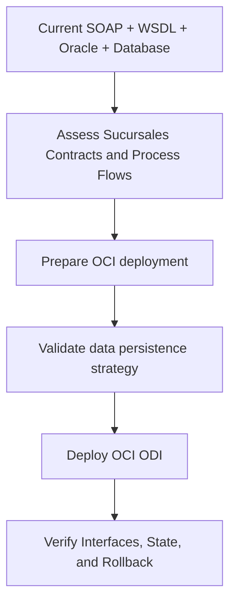

# Migration Strategy: Sucursales

🏠 [Delivery Home](../../../README.md) | 📘 [Delivery Summary](../../../ANALYSIS_COMPLETE.md) | 🌊 [Migration Waves](../../../strategic-analysis/MIGRATION_WAVES.md) | 🗺️ [Roadmap](../../../modernization-roadmap/Sucursales/roadmap.md) | 📄 [Analysis](../../../app-by-app-analysis/Sucursales/analysis.md) | ☁️ [To-Be](./to-be.md) | 🤝 [Co-Living](../../../coliving-strategy/app-by-app/Sucursales/coliving-strategy.md) | 🧪 [Migration Spec](../../../migration-spec/Sucursales/spec.md)

**Target Stack:** OCI ODI
**Target Platform:** OCI
**Target Runtime:** Running on OCI ODI
**Deployment Model:** OCI deployment
**Source Stack:** SOAP + WSDL + Oracle + Database
**Wave:** Wave 1
**Canonical Version:** Unversioned
**Confidence:** Medium-High
**Profile Source:** <target-profile>/target-architecture-profile.json
**Wave Description:** Enterprise Services workload implemented as Source Module

## 1. Migration Objective
Move `Sucursales` into the explicitly selected target architecture. This strategy is bound to the same target profile used for `to-be.md` and should be regenerated if the target architecture changes.

## 2. Implementation Scope
| Area | Target Direction | Notes |
|---|---|---|
| Runtime | Running on OCI ODI | Do not substitute a different runtime without updating the target profile |
| Platform | OCI | Execution environment is explicit, not inferred |
| Deployment | OCI deployment | Packaging and release flow must align to this model |
| Data | Not specified | Confirm coexistence, migration, reconciliation, and rollback |
| Integration | Not specified | Preserve external contract compatibility until cutover completes |
| Eventing | Not specified | Apply only where async processing is real |
| Security | Not specified | Identity, secrets, and policy boundaries must be explicit |
| Observability | Not specified | Must exist before production cutover |

## 2A. Migration Pattern Basis
**Detected origin profile:** SOAP or contract-first integration workload

**Pattern family:** Contract preservation with progressive runtime replacement

**Registry key:** `soap`

**Documentation references reflected in this migration pattern:**
- [Microservices.io: Anti-Corruption Layer](https://microservices.io/patterns/refactoring/anti-corruption-layer.html)
- [Martin Fowler: Strangler Fig Application](https://martinfowler.com/bliki/StranglerFigApplication.html)
- [Spring on Kubernetes](https://spring.io/guides/topicals/spring-on-kubernetes)

**Per-app migration pattern inserts:**
- Lock the contract surface: Treat schemas, WSDLs, and partner expectations as the migration boundary before changing runtime or deployment behavior.
- Move hosting separately from consumer change: Use adapters or gateways so OCI ODI using Running on OCI ODI via OCI deployment can be introduced without a full client-side cutover.
- Retire bridge layers only after parity is proven: Keep mediation in place until telemetry and replay testing prove the new runtime fully matches consumer expectations.

## 3. Ordered Migration Work

- [ ] Step 01: Confirm the target architecture in chat before implementation starts. Do not proceed on a guessed platform, runtime, or deployment model.
- [ ] Step 02: Baseline current behavior, interfaces, and state transitions against target runtime `Running on OCI ODI` and target platform `OCI`.
- [ ] Step 03: Enumerate all input/output contracts, payload schemas, synchronous interfaces, asynchronous flows, and process boundaries.
- [ ] Step 04: Define packaging and promotion flow for deployment model `OCI deployment`.
- [ ] Step 05: Design persistence and coexistence around `the selected data platform` including reconciliation and rollback.
- [ ] Step 06: Define ingress and compatibility handling through `the selected integration boundary`.
- [ ] Step 07: Implement security, configuration, and secrets handling using `the selected security model`.
- [ ] Step 08: Implement logs, metrics, tracing, health checks, and alerts using `the selected observability model` before non-dev rollout.
- [ ] Step 09: Run progressive validation, cutover rehearsal, rollback rehearsal, and business-signoff checks before production cutover.

## 4. Processing Logic and Verification Focus
- Validate each business flow and orchestration path against the selected runtime model before implementation.
- Preserve interface shape, payload semantics, and state transitions until downstream consumers are proven migrated.
- Treat persistence migration as a controlled coexistence and reconciliation problem, not a single cutover event.
- Tie rollout gates to observable technical and business validation, not to assumed schedules.
- Regenerate this document if any target-profile field changes.

## 5. Validation Gate
- [ ] Target architecture profile confirmed by architecture and delivery owners
- [ ] All interfaces and payload contracts inventoried and validated
- [ ] Deployment model, configuration, and secrets sources defined
- [ ] Data migration, reconciliation, and rollback strategy documented
- [ ] Operational readiness, observability, and support ownership confirmed

## 6. Assumptions and Open Questions
**Assumptions**
- The target architecture profile supplied for Stage 06 is authoritative for Stage 07 planning.

**Open Questions**
- Confirm interface-level compatibility and cutover sequencing with downstream consumers.

## 7. Metadata
- analysis date: 2026-07-22
- analyst / agent: GPS Code Introspector
- target stack: OCI ODI
- target platform: OCI
- target runtime: Running on OCI ODI
- deployment model: OCI deployment
- profile source: <target-profile>/target-architecture-profile.json
