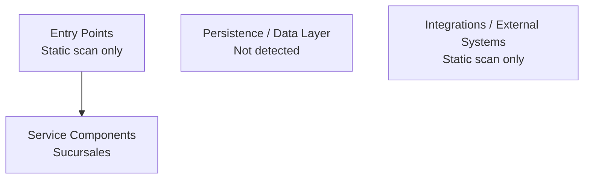

# Code Architecture Analysis — Sucursales

## 1. Overview
- **Module**: `Sucursales`
- **Type**: **Source Module**
- **Domain**: Enterprise Services
- **Source Root**: `<source-root>/Sucursales`
- **Artifact Counts**: source=6, xml=0, wsdl=0, sql=0, properties=0, yaml=0
- **Tech Signals**: None detected

## 2. Architecture Analysis

| Concern | Finding | Evidence |
|---|---|---|
| Entry points | 0 candidate entry classes | `Not detected` |
| Integration boundaries | Static scan only; data=Not detected | Source annotation + keyword scan |
| Runtime platform | Pentaho Data Integration / Kettle runtime | Dependency scan |

## 3. Business Operations

- No service/controller classes detected in static scan.

## 4. Database Integration

- Data access style: Not detected
- Direct relational access sites: 0
- SQL statements: 0
- ORM/entities/models: 0
- Stored procs: 0

## 5. Technical Debt & Anti-Patterns

- No modern DI/runtime framework detected

## 6. Security Assessment

- No static findings. Manual pen-test recommended.

## 7. Configuration Management

- Properties files: 0
- YAML config files: 0
- JSON config files: 0
- XML descriptors: 0
- Spring profiles: None detected

## 8. Modernization Signals

- No strong modernization accelerators or blockers detected from static analysis

## 9. Recommendations

### Deterministic (from static analysis)

- Add environment-specific profiles (application-prod.yml, etc.)

### Deterministic Architecture Readout

- **Runtime posture**: Pentaho Data Integration / Kettle runtime
- **Primary framework signal**: Pentaho Data Integration (Kettle)
- **Integration posture**: Static scan only
- **Data posture**: Not detected with 0 direct access site(s)
- **Primary risks**: No major static-scan risk beyond migration validation and test coverage
- **Action**: Use this architecture analysis as the baseline input for downstream modernization, target-state, and migration outputs. If the target stack is still undecided, the skill should ask in chat before Stage 06/07 generation.

*Generated: 2026-07-22*
*Evidence Base: Programmatic static analysis + configuration scan*
