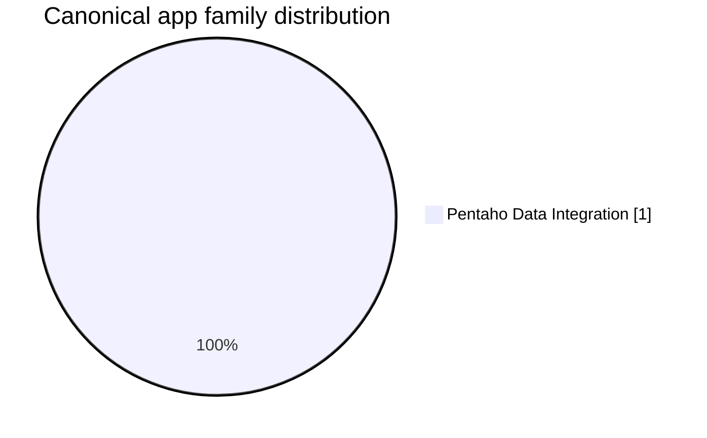

# Canonical Apps Migration List — Complete Portfolio

**Generated:** 2026-07-22

📦 [App Inventory](./APP_INVENTORY.md) | 📋 [Canonical App Inventory](./CANONICAL_APPS_MIGRATION_LIST.md) | 🌊 [Migration Waves](./MIGRATION_WAVES.md) | 🧩 [Deduplication Detail](./DEDUPLICATION.md) | 🏛️ [CTO / CIO Brief](./PORTFOLIO_CTO_CIO.md) | 🧭 [Senior Management Brief](./PORTFOLIO_SENIOR_MGMT.md) | 🛠️ [Engineering Brief](./PORTFOLIO_ENGINEERING.md) | 🤝 [Co-Living Overview](../coliving-strategy/README.md)

## Executive Summary

This document is the authoritative canonical migration inventory for the scanned portfolio slice.

| Metric | Count |
|---|---|
| Canonical apps | 1 |
| Pentaho Data Integration apps | 1 |

## Canonical Applications

| # | App ID | Family | Proxy Services | Business Services | Relationship | Variant | Retired | Description | To-Be |
|---|---|---|---|---|---|---|---|---|---|
| 1 | [Sucursales](../modernization-roadmap/Sucursales/roadmap.md) | Pentaho Data Integration | - | - | - | Unversioned | 0 | Enterprise Services workload implemented as Source Module | [To-Be](../cloud-native-architecture/canonical-app-to-be/Sucursales/to-be.md) |