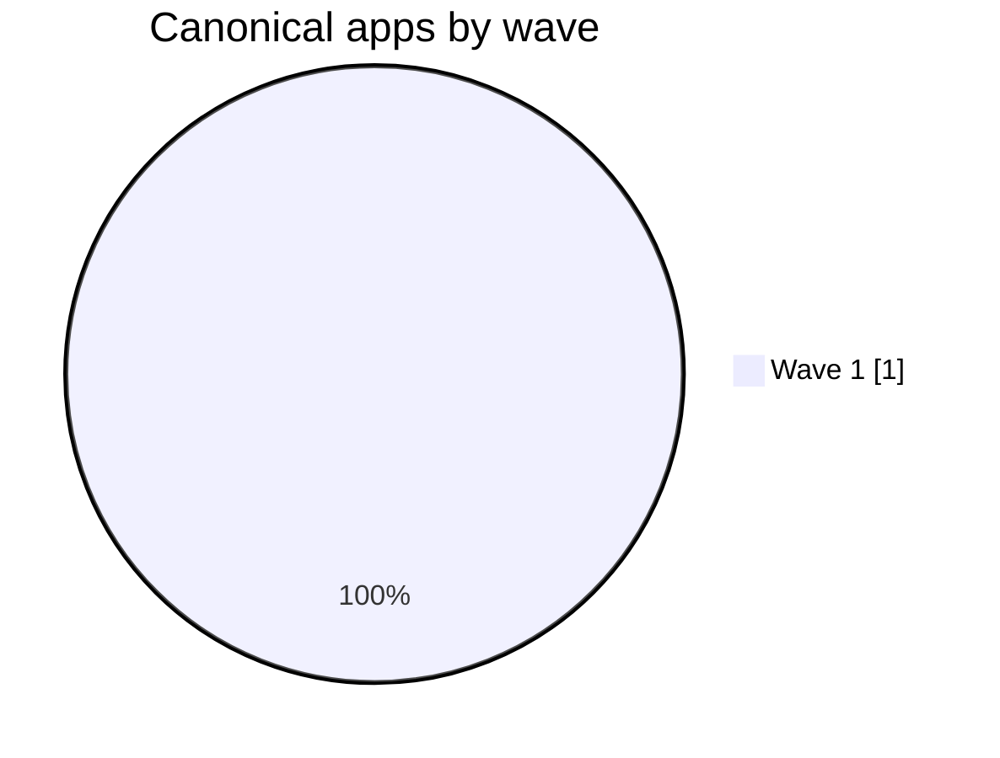

# Migration Waves — Canonical Apps by Wave

**Generated:** 2026-07-22

📦 [App Inventory](./APP_INVENTORY.md) | 📋 [Canonical App Inventory](./CANONICAL_APPS_MIGRATION_LIST.md) | 🌊 [Migration Waves](./MIGRATION_WAVES.md) | 🧩 [Deduplication Detail](./DEDUPLICATION.md) | 🏛️ [CTO / CIO Brief](./PORTFOLIO_CTO_CIO.md) | 🧭 [Senior Management Brief](./PORTFOLIO_SENIOR_MGMT.md) | 🛠️ [Engineering Brief](./PORTFOLIO_ENGINEERING.md) | 🤝 [Co-Living Overview](../coliving-strategy/README.md)

## Executive Summary

| Wave | Total Apps | Family Breakdown | Planning Intent |
|---|---|---|---|
| **Wave 1** | 1 | Pentaho Data Integration: 1 | Highest dependency intensity and hardest-to-move workloads first |

## Wave 1

| # | App Name | Type | Proxy Services | Business Services | Relationship | Variant | Retired | Description |
|---|---|---|---|---|---|---|---|---|
| 1 | [Sucursales](../modernization-roadmap/Sucursales/roadmap.md) | Pentaho Data Integration | - | - | - | Unversioned | 0 | Enterprise Services workload implemented as Source Module |