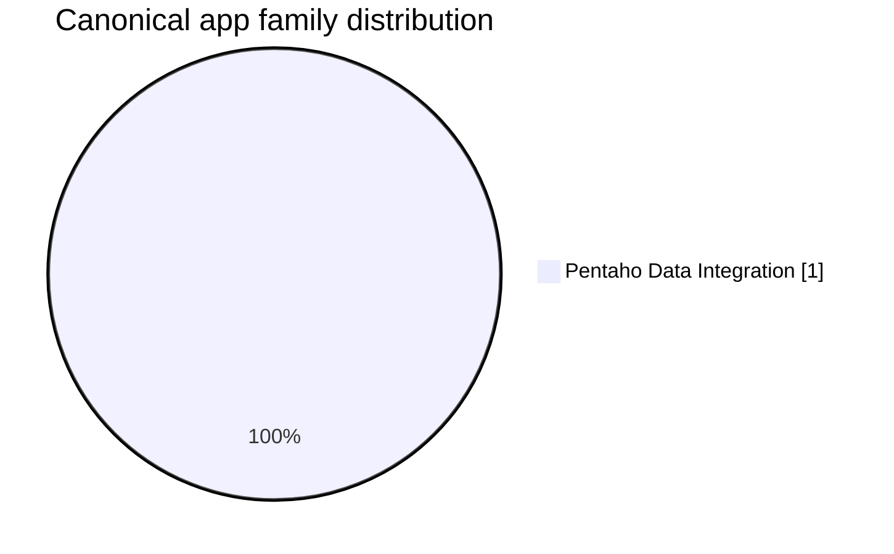

# Portfolio Executive Brief
## Audience: CTO / CIO

**Generated:** 2026-07-22

📦 [App Inventory](./APP_INVENTORY.md) | 📋 [Canonical App Inventory](./CANONICAL_APPS_MIGRATION_LIST.md) | 🌊 [Migration Waves](./MIGRATION_WAVES.md) | 🧩 [Deduplication Detail](./DEDUPLICATION.md) | 🏛️ [CTO / CIO Brief](./PORTFOLIO_CTO_CIO.md) | 🧭 [Senior Management Brief](./PORTFOLIO_SENIOR_MGMT.md) | 🛠️ [Engineering Brief](./PORTFOLIO_ENGINEERING.md) | 🤝 [Co-Living Overview](../coliving-strategy/README.md)

## Executive Posture

- Raw scanned estate: **1** modules
- Canonical migration scope: **1** applications
- Redundant variants removed from active scope: **0**
- Early execution concentration: **1** canonical apps in the first two waves

## Decision Dashboard

| Decision Area | Portfolio Signal | Executive Meaning |
|---|---|---|
| Investment baseline | 1 canonical apps | Fund against the canonical scope, not raw scan count |
| Portfolio concentration | Wave 1 carries 1 apps | The first wave is the program risk concentration point |
| Estate simplification | 0 retired variants | Deduplication reduces duplicated migration spend |
| Architecture mix | Pentaho Data Integration: 1 | The portfolio is not a single migration pattern |

## Executive Recommendations

- Approve the migration baseline against canonical applications only, then hold downstream scope to that list.
- Treat the first two waves as the main risk and funding gate because they contain the dependency-heavy and harder-to-move workloads.
- Use family mix to avoid assuming one destination pattern fits all portfolio slices.
- Require target-state decisions before Stage 06 or Stage 07 so architecture and implementation outputs do not diverge.

## Business-Level Composition

| Family | Canonical Apps |
|---|---|
| Pentaho Data Integration | 1 |

## Core References

- [CANONICAL_APPS_MIGRATION_LIST.md](./CANONICAL_APPS_MIGRATION_LIST.md) for the authoritative migration scope
- [MIGRATION_WAVES.md](./MIGRATION_WAVES.md) for sequencing and concentration by wave
- [DEDUPLICATION.md](./DEDUPLICATION.md) for retired-variant traceability