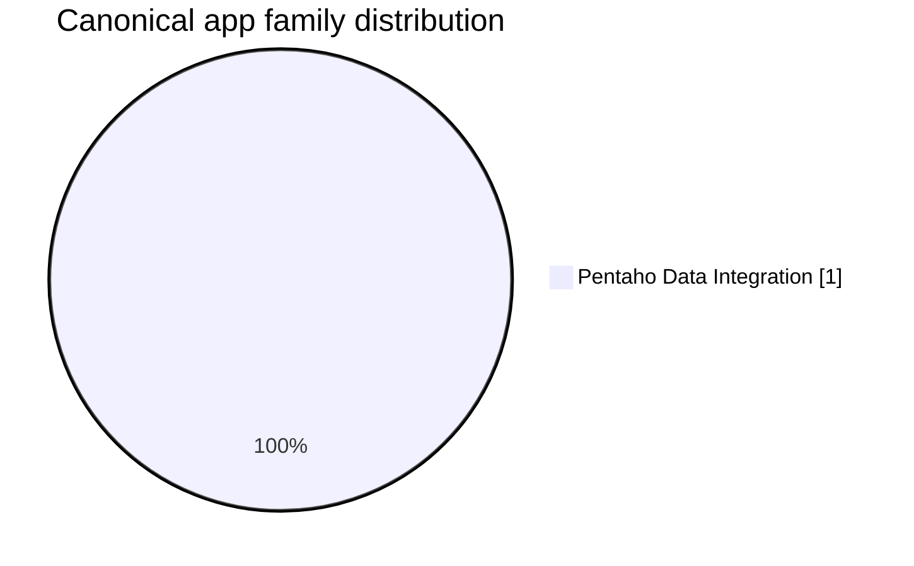

# Portfolio Engineering Brief
## Audience: Engineering

**Generated:** 2026-07-22

📦 [App Inventory](./APP_INVENTORY.md) | 📋 [Canonical App Inventory](./CANONICAL_APPS_MIGRATION_LIST.md) | 🌊 [Migration Waves](./MIGRATION_WAVES.md) | 🧩 [Deduplication Detail](./DEDUPLICATION.md) | 🏛️ [CTO / CIO Brief](./PORTFOLIO_CTO_CIO.md) | 🧭 [Senior Management Brief](./PORTFOLIO_SENIOR_MGMT.md) | 🛠️ [Engineering Brief](./PORTFOLIO_ENGINEERING.md) | 🤝 [Co-Living Overview](../coliving-strategy/README.md)

## Engineering Scope

- Canonical apps: **1**
- Deduplicated variants retained for reference: **0**
- Distinct migration waves: **1**

## Technical Estate Distribution

| Family | Count |
|---|---|
| Pentaho Data Integration | 1 |

## Wave-by-Wave Engineering Backlog

| App | Wave | Family | Priority Tier | Complexity Score | Retired Variants |
|---|---|---|---|---|---|
| [Sucursales](../modernization-roadmap/Sucursales/roadmap.md) | Wave 1 | Pentaho Data Integration | T3 – STANDARD | 9 | 0 |

## Highest-Complexity Canonical Apps

| App | Wave | Family | Complexity Score | Description |
|---|---|---|---|---|
| [Sucursales](../modernization-roadmap/Sucursales/roadmap.md) | Wave 1 | Pentaho Data Integration | 9 | Enterprise Services workload implemented as Source Module |

## Engineering Guidance

- Treat canonical versions as the source of truth for downstream architecture and implementation stages.
- Keep redundant variants visible as regression and compatibility obligations until decommissioning is complete.
- Use roadmap-linked apps and wave placement to assign implementation order and dependency validation work.

## Core References

- [APP_INVENTORY.md](./APP_INVENTORY.md) for discovered current-state technology distribution
- [CANONICAL_APPS_MIGRATION_LIST.md](./CANONICAL_APPS_MIGRATION_LIST.md) for canonical app scope
- [MIGRATION_WAVES.md](./MIGRATION_WAVES.md) for sequence and wave membership
- [DEDUPLICATION.md](./DEDUPLICATION.md) for canonical selection rationale