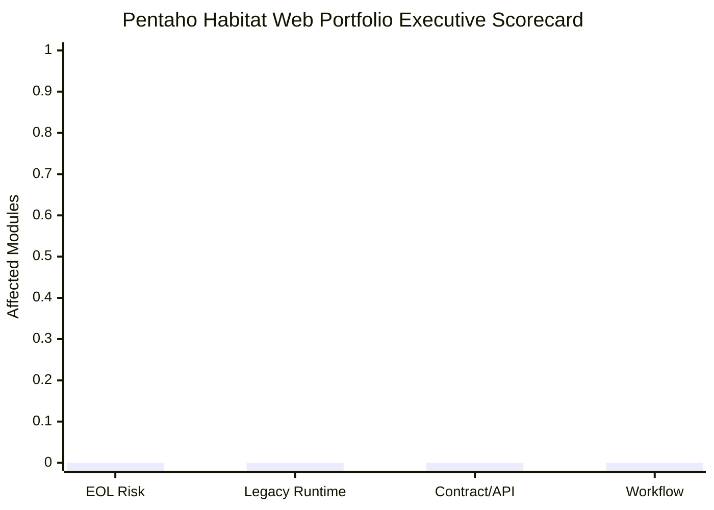

# Portfolio Module Index — Pentaho Habitat Web Platform Analysis

**Scope**: 1 modules | Programmatic evidence-first analysis
**Date**: 2026-07-22

---

> **HOW TO USE THIS DOCUMENT**
>
> | Audience | Go To | Reading Time |
> |----------|-------|--------------|
> | **CIO / CTO** | [Executive Dashboard](#layer-1--executive-dashboard-ciocto) | 3 minutes |
> | **Senior Management** | [Management Program View](#layer-2--management-program-view) | 10 minutes |
> | **Engineering Teams** | [Technical Module Index](#layer-3--technical-module-index) | Reference |

---

# LAYER 1 — Executive Dashboard (CIO/CTO)

## Portfolio Health Scorecard

| Dimension | Status | Headline |
|---|---|---|
| EOL Dependency Risk | 🟢 LOW | 0% apps affected |
| Legacy Runtime Coupling | 🟢 LOW | 0% app-server bound |
| Contract/API Footprint | 🟢 LOW | 0 exposed apps |
| Workflow Footprint | 🟢 LOW | 0 orchestration apps |

| Metric | Value |
|--------|-------|
| Total modules | 1 |
| Total source files | 8 |
| Total NLOC | 0 |
| EOL dependency risk | 0 apps |
| Legacy app-server modules | 0 |
| Exposed contract/API services | 0 |
| Workflow/orchestration modules | 0 |
| PHP applications | 0 |
| .NET applications | 0 |
| Oracle Tuxedo services | 0 |

---

# LAYER 2 — Management Program View

## Priority Breakdown

| Priority | Apps | Criteria |
|---|---|---|
| Tier 1 — EOL Risk | None | EOL JARs detected |
| Tier 2 — Legacy Runtime | None | App-server-specific lifecycle |
| Tier 3 — API Contracts | None | SOAP or REST entry points |
| Tier 4 — Workflow | None | Orchestration artifacts |
| Tier 5 — PHP Runtime | None | PHP runtime/framework evidence |
| Tier 6 — .NET Runtime | None | ASP.NET / .NET runtime evidence |
| Tier 7 — Oracle Tuxedo | None | ATMI / Tuxedo middleware evidence |

---

# LAYER 3 — Technical Module Index

## Module Listing

| Module | Type | Domain | Source Files | Tech Signals | Analysis |
|---|---|---|---|---|---|
| [Web](Web/analysis.md) | Source Module | Enterprise Services | 8 | Unknown | [analysis](Web/analysis.md) [deep-dive](Web/deep-dive.md) |

---

*Generated by programmatic-pipeline | 2026-07-22*
