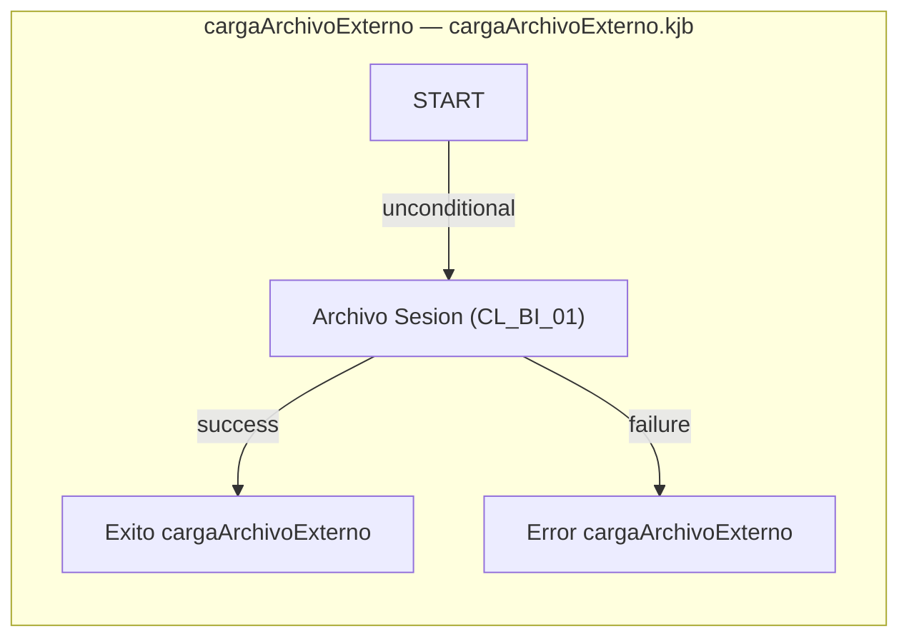

# Web — Deep Dive (Stage B)

📄 [Back to Analysis](./analysis.md) | 🗺️ [Modernization Roadmap](../../modernization-roadmap/Web/roadmap.md)

**Type:** Pentaho Data Integration Workflow

## B0. Evidence Index (anchors)

| Artifact | Source-relative path | Role | Evidence |
|---|---|---|---|
| Kettle job | `cargaArchivoExterno.kjb` | Primary orchestration | 4 entries; 3 hops; references Not evidenced; inferred path(s) `START -> Archivo Sesion (CL_BI_01) -> Exito cargaArchivoExterno`, `START -> Archivo Sesion (CL_BI_01) -> Error cargaArchivoExterno` |
| Kettle transformation | `transf_CONFIGURACION_EQUIPO_MESA_TDS.ktr` | Primary transformation | 2 steps; 1 hops; inferred anchors `Crea Archivo CONFIGURACION_EQUIPO_MESA [output]`, `Extraer Datos (Planilla Modelo Configuracion) [input]` |
| Kettle transformation | `transf_CONFIGURACION_EQUIPO_USUARIO_TDS.ktr` | Primary transformation | 13 steps; 12 hops; inferred anchors `Add constants [processing]`, `CONFIGURACION_EQUIPO_USUARIO.csv [output]`, `Concatenar Fecha y Hora [transformation]`, `Extrae Fecha Archivo [processing]`, `Formato Fecha y Hora [transformation]`, `If field value is null [processing]`, `Obtiene Fecha Cierre [transformation]`, `Split Fields Hora Sesion 1 (,) [processing]`, `Split Fields Hora Sesion 1 (:) [processing]`, `Split Fields Hora Sesion 2 (,) [processing]`, `Split Fields Hora Sesion 2 (:) [processing]`, `Split Fields Mapping [transformation]`, `bi_TAMXX_XX-DD-MM-YYYY [input]` |
| Kettle transformation | `transf_OPC_OPCION_TDS.ktr` | Primary transformation | 2 steps; 1 hops; inferred anchors `Crea Archivo OPC_OPCION [output]`, `Leer tabla OPC_OPCION [input]` |
| Kettle transformation | `transf_SEC_SECCION_TDS.ktr` | Primary transformation | 2 steps; 1 hops; inferred anchors `Crea Archivo SEC_SECCION [output]`, `Leer tabla SEC_SECCION [input]` |
| Kettle transformation | `transf_SUB_SUBSECCION_TDS.ktr` | Primary transformation | 2 steps; 1 hops; inferred anchors `Crea Archivo SUB_SUBSECCION [output]`, `Leer tabla SUB_SUBSECCION [input]` |
| Kettle transformation | `transf_TB_LOG_SISTEMA_TDS.ktr` | Primary transformation | 4 steps; 3 hops; inferred anchors `Crea Archivo TB_LOG_SISTEMA [output]`, `Informacion Fechas a extraer [input]`, `Leer tabla TB_LOG_SISTEMA [input]`, `Log-INFO [processing]` |
| Kettle transformation | `transf_TB_SUB_SISTEMA_SERVICIO_TDS.ktr` | Primary transformation | 2 steps; 1 hops; inferred anchors `Crea Archivo TB_SUB_SISTEMA_SERVICIO [output]`, `Leer tabla TB_SUB_SISTEMA_SERVICIO [input]` |

- **Corpus files:** 8 (7 KTR, 1 KJB).
- **Primary transformations:** 7; backup/variant transformations: 0.
- **Embedded fragments:** 6; migration units: 8.

## B1. Job Entry Points and Nested Workflow Contracts

| Job | Source | Entry | Type | Referenced workflow |
|---|---|---|---|---|
| `cargaArchivoExterno` | `cargaArchivoExterno.kjb` | `Archivo Sesion (CL_BI_01)` | `SHELL` | `${tranWeb.ruta.shell}guardarArchivoAcceso.sh` |
| `cargaArchivoExterno` | `cargaArchivoExterno.kjb` | `Exito cargaArchivoExterno` | `SUCCESS` | `` |
| `cargaArchivoExterno` | `cargaArchivoExterno.kjb` | `Error cargaArchivoExterno` | `ABORT` | `` |
| `cargaArchivoExterno` | `cargaArchivoExterno.kjb` | `START` | `SPECIAL` | `` |

## B2. Job Orchestration, Conditions, and Error Paths

| Job / Source | Transition | Outcome | Condition |
|---|---|---|---|
| `cargaArchivoExterno` / `cargaArchivoExterno.kjb` | START -> Archivo Sesion (CL_BI_01) (unconditional) | `unconditional` | always continue |
| `cargaArchivoExterno` / `cargaArchivoExterno.kjb` | Archivo Sesion (CL_BI_01) -> Exito cargaArchivoExterno (success) | `success` | previous entry succeeded |
| `cargaArchivoExterno` / `cargaArchivoExterno.kjb` | Archivo Sesion (CL_BI_01) -> Error cargaArchivoExterno (failure) | `failure` | previous entry failed or evaluated false |

## B3. Runtime, Database, and Embedded-Code Dependencies

- **Database connections:** `AgileBI`, `Bonobo`, `cnTower`, `FUGA`, `Kettle`, `MsSQLServer_JNDI@TotalPack(Datawarehouse)`, `MySQL5`, `MySQL_JNDI@SGC(Datawarehouse)`, `Oracle_JDBC@DESA_RTP(Datawarehouse)`, `Oracle_JDBC@DESA_RTP(IPINCHEI)`, `Oracle_JNDI@DESA_RTP(IPINCHEI)`, `Oracle_JNDI@DOCUWARE(Datawarehouse)`.
- **Nested workflows:** Not evidenced.
- **Embedded analyzers:** `plsql`.

| Step type | Count | Migration significance |
|---|---:|---|
| `TextFileOutput` | 7 | Published flat-file contract |
| `TableInput` | 6 | Database query contract |
| `FieldSplitter` | 4 | Transformation behavior |
| `Formula` | 2 | Transformation behavior |
| `SelectValues` | 2 | Transformation behavior |
| `ExcelInput` | 1 | Spreadsheet input contract |
| `Constant` | 1 | Transformation behavior |
| `ReplaceString` | 1 | Transformation behavior |
| `IfNull` | 1 | Transformation behavior |
| `TextFileInput` | 1 | Transformation behavior |
| `WriteToLog` | 1 | Transformation behavior |

## B4. Structural Complexity Profile

- **Jobs / transformations:** 1 / 7.
- **Transformation steps / hops:** 27 / 20.
- **Job entries / hops:** 4 / 3.
- **Most frequent step types:** `TextFileOutput` (7), `TableInput` (6), `FieldSplitter` (4), `Formula` (2), `SelectValues` (2), `ExcelInput` (1), `Constant` (1), `ReplaceString` (1), `IfNull` (1), `TextFileInput` (1).
- **Decision/error evidence:** 2 evaluated job branch(es); 1 failure branch(es).
- NLOC/cyclomatic metrics are not meaningful for Kettle XML; migration sizing uses workflow nodes, hops, embedded code, I/O contracts, and branch count.

## B5. Modernization Impact Deltas (Evidence-based)

| Legacy feature | Current evidence | Required migration treatment | Key parity risk |
|---|---|---|---|
| Kettle orchestration | 1 KJB job(s), 3 job hops | Recreate entry order, nested calls, and branch semantics | Unconditional and failure branches drift |
| Embedded rules | 0 ScriptValueMod; 0 ExecSQL | Port through delegated language/SQL pipelines with step provenance | Hidden field/default logic changes |
| Database access | Connections `AgileBI`, `Bonobo`, `cnTower`, `FUGA`, `Kettle`, `MsSQLServer_JNDI@TotalPack(Datawarehouse)`, `MySQL5`, `MySQL_JNDI@SGC(Datawarehouse)`; TableInput/DBLookup/TableOutput | Rebind credentials and preserve SQL/read/write contracts | SQL Server dialect and transaction differences |
| File and spreadsheet I/O | TextFileOutput, ExcelInput/ExcelWriter evidence | Preserve layouts, names, encodings, ordering, and control totals | Consumer incompatibility or reconciliation mismatch |
| Variables and operational control | 0 SetVariable step(s); mail/evaluation/abort entries | Model explicit state and failure handling | Silent continuation or missed notification |
| Backup variants | 0 transformation(s) under `respaldo` | Compare, then classify as current, obsolete, or rollback-only | Duplicate migration scope |

## B6. Deep-Dive Recommendations (Next Actions)

1. **Workflow owner:** confirm the inferred entry paths for `cargaArchivoExterno` and classify every TRANS/JOB reference plus backup/variant evidence.
2. **Data engineer:** baseline source queries, lookup keys, output fields, fixed-width/text layouts, spreadsheets, and database write reconciliation totals.
3. **Developer:** port each ScriptValueMod and ExecSQL fragment through its delegated analyzer while retaining source file and step traceability.
4. **QA:** execute path tests for unconditional transitions, evaluated success paths, every failure branch, mail notification, and Abort job behavior.
5. **Security/operations:** recreate connection references through managed secrets; never migrate embedded password values from Kettle XML.

## B7. Software Requirements Specification (SRS)

### Functional Requirements

| ID | Evidence-backed requirement | Priority | Source evidence |
|---|---|---|---|
| FR-PDI-001 | Execute `cargaArchivoExterno` through inferred path(s) `START -> Archivo Sesion (CL_BI_01) -> Exito cargaArchivoExterno`, `START -> Archivo Sesion (CL_BI_01) -> Error cargaArchivoExterno`; preserve transition outcomes `START -> Archivo Sesion (CL_BI_01) (unconditional)`, `Archivo Sesion (CL_BI_01) -> Exito cargaArchivoExterno (success)`, `Archivo Sesion (CL_BI_01) -> Error cargaArchivoExterno (failure)`. | HIGH | `cargaArchivoExterno.kjb` |
| FR-PDI-002 | Preserve `transf_CONFIGURACION_EQUIPO_MESA_TDS` as `Crea Archivo CONFIGURACION_EQUIPO_MESA [output]`, `Extraer Datos (Planilla Modelo Configuracion) [input]`; retain fields `ip_xls`, `equipo_xls`, `mesa_xls`, `codigoSucursal_xls`, `sucursal_xls`, `audpor_xls`, `audcreac_xls`, `audmod_xls`, `audfecmod_xls`. | HIGH | `transf_CONFIGURACION_EQUIPO_MESA_TDS.ktr` |
| FR-PDI-003 | Preserve `transf_CONFIGURACION_EQUIPO_USUARIO_TDS` as `Add constants [processing]`, `CONFIGURACION_EQUIPO_USUARIO.csv [output]`, `Concatenar Fecha y Hora [transformation]`, `Extrae Fecha Archivo [processing]`, `Formato Fecha y Hora [transformation]`, `If field value is null [processing]`, `Obtiene Fecha Cierre [transformation]`, `Split Fields Hora Sesion 1 (,) [processing]`, `Split Fields Hora Sesion 1 (:) [processing]`, `Split Fields Hora Sesion 2 (,) [processing]`, `Split Fields Hora Sesion 2 (:) [processing]`, `Split Fields Mapping [transformation]`, `bi_TAMXX_XX-DD-MM-YYYY [input]`; retain fields `AUD_CREADO_POR`, `AUD_MODIF_POR`, `AUD_FEC_MODIF`, `FEC_INI_RELOJ`, `FEC_FIN_RELOJ`, `FEC_FIN_TABLET`, `NombreTablet`, `Usuario`, `FechaHoraSesion`, `FechaCreacion`, `Hora1`, `Minuto1`, `Segundo1`, `Hora2`, `Minuto2`, `Segundo2`, `HoraSesion1`, `MilisegundoSesion1`, `HoraSesion2`, `MilisegundoSesion2`, `InicioSesion`, `FechaSesion`, `HoraSesion1Str`, `HoraSesion2Str`. | HIGH | `transf_CONFIGURACION_EQUIPO_USUARIO_TDS.ktr` |
| FR-PDI-004 | Preserve `transf_OPC_OPCION_TDS` as `Crea Archivo OPC_OPCION [output]`, `Leer tabla OPC_OPCION [input]`; retain fields `OPC_ID`, `OPC_SUB_ID`, `OPC_NOMBRE`, `OPC_URL`, `OPC_ORDEN`, `OPC_ROLES`, `OPC_DEFAULT`, `OPC_EXPANDIDO`, `OPC_ACTIVO`, `OPC_VISIBLE`, `OPC_ALIAS`, `OPC_TIENE_INFO_CLI`, `OPC_COD_SUPER`. | HIGH | `transf_OPC_OPCION_TDS.ktr` |
| FR-PDI-005 | Preserve `transf_SEC_SECCION_TDS` as `Crea Archivo SEC_SECCION [output]`, `Leer tabla SEC_SECCION [input]`; retain fields `SEC_ID`, `SEC_MEN_ID`, `SEC_NOMBRE`, `SEC_ORDEN`, `SEC_NOMBRE_EXTRA`, `SEC_DEFAULT`. | HIGH | `transf_SEC_SECCION_TDS.ktr` |
| FR-PDI-006 | Preserve `transf_SUB_SUBSECCION_TDS` as `Crea Archivo SUB_SUBSECCION [output]`, `Leer tabla SUB_SUBSECCION [input]`; retain fields `SUB_ID`, `SUB_SEC_ID`, `SUB_NOMBRE`, `SUB_ORDEN`, `SUB_DEFAULT`. | HIGH | `transf_SUB_SUBSECCION_TDS.ktr` |
| FR-PDI-007 | Preserve `transf_TB_LOG_SISTEMA_TDS` as `Crea Archivo TB_LOG_SISTEMA [output]`, `Informacion Fechas a extraer [input]`, `Leer tabla TB_LOG_SISTEMA [input]`, `Log-INFO [processing]`; retain fields `fechaCierre`, `ID_LOG`, `CODIGO_SISTEMA`, `CODIGO_OPERACION`, `USUARIO`, `RUT`, `DV`, `FECHAHORA`, `SUCURSAL`, `CANAL`, `MODULO`, `DATOS2`, `URL`, `EXITO`, `UUID`, `fechaInicio`, `fechaTermino`. | HIGH | `transf_TB_LOG_SISTEMA_TDS.ktr` |
| FR-PDI-008 | Preserve `transf_TB_SUB_SISTEMA_SERVICIO_TDS` as `Crea Archivo TB_SUB_SISTEMA_SERVICIO [output]`, `Leer tabla TB_SUB_SISTEMA_SERVICIO [input]`; retain fields `ID_SUB_SISTEMA`, `ID_SERVICIO`, `FECINI`, `ID_CLASE_SERVICIO`, `ID_TIPO_OPERACION`, `ID_NIVEL_SEGURIDAD`, `ID_TIPO_SERVICIO`, `DESCRIPCION`, `COD_OPER_TERMINAL`, `CODIGO_SERVICIO`, `OPC_COD_SUPER`, `COD_OPER_ERROR`. | HIGH | `transf_TB_SUB_SISTEMA_SERVICIO_TDS.ktr` |

### Operation Contracts

| Operation | Contract facet | Evidence-backed behavior |
|---|---|---|
| `cargaArchivoExterno` | Trigger / preconditions | `START -> Archivo Sesion (CL_BI_01) (unconditional)`; execute source-ordered anchors `START`, `Archivo Sesion (CL_BI_01)`, `Exito cargaArchivoExterno`, `Error cargaArchivoExterno`. |
| `cargaArchivoExterno` | Processing / outcomes | Preserve `START -> Archivo Sesion (CL_BI_01) (unconditional)`, `Archivo Sesion (CL_BI_01) -> Exito cargaArchivoExterno (success)`, `Archivo Sesion (CL_BI_01) -> Error cargaArchivoExterno (failure)` and keep success, failure, notification, cleanup, and decision roles observable when evidenced. |
| `transf_CONFIGURACION_EQUIPO_MESA_TDS` | Inputs / processing / outputs | Execute `Crea Archivo CONFIGURACION_EQUIPO_MESA [output]`, `Extraer Datos (Planilla Modelo Configuracion) [input]` in inferred path order `Extraer Datos (Planilla Modelo Configuracion) -> Crea Archivo CONFIGURACION_EQUIPO_MESA`; preserve fields `ip_xls`, `equipo_xls`, `mesa_xls`, `codigoSucursal_xls`, `sucursal_xls`, `audpor_xls`, `audcreac_xls`, `audmod_xls`, `audfecmod_xls`. |
| `transf_CONFIGURACION_EQUIPO_USUARIO_TDS` | Inputs / processing / outputs | Execute `Add constants [processing]`, `CONFIGURACION_EQUIPO_USUARIO.csv [output]`, `Concatenar Fecha y Hora [transformation]`, `Extrae Fecha Archivo [processing]`, `Formato Fecha y Hora [transformation]`, `If field value is null [processing]`, `Obtiene Fecha Cierre [transformation]`, `Split Fields Hora Sesion 1 (,) [processing]`, `Split Fields Hora Sesion 1 (:) [processing]`, `Split Fields Hora Sesion 2 (,) [processing]`, `Split Fields Hora Sesion 2 (:) [processing]`, `Split Fields Mapping [transformation]`, `bi_TAMXX_XX-DD-MM-YYYY [input]` in inferred path order `bi_TAMXX_XX-DD-MM-YYYY -> Extrae Fecha Archivo -> Obtiene Fecha Cierre -> Split Fields Hora Sesion 1 (,) -> Split Fields Hora Sesion 1 (:) -> Split Fields Hora Sesion 2 (,) -> Split Fields Hora Sesion 2 (:) -> Split Fields Mapping -> If field value is null -> Concatenar Fecha y Hora -> Formato Fecha y Hora -> Add constants -> CONFIGURACION_EQUIPO_USUARIO.csv`; preserve fields `AUD_CREADO_POR`, `AUD_MODIF_POR`, `AUD_FEC_MODIF`, `FEC_INI_RELOJ`, `FEC_FIN_RELOJ`, `FEC_FIN_TABLET`, `NombreTablet`, `Usuario`, `FechaHoraSesion`, `FechaCreacion`, `Hora1`, `Minuto1`, `Segundo1`, `Hora2`, `Minuto2`, `Segundo2`, `HoraSesion1`, `MilisegundoSesion1`, `HoraSesion2`, `MilisegundoSesion2`, `InicioSesion`, `FechaSesion`, `HoraSesion1Str`, `HoraSesion2Str`. |
| `transf_OPC_OPCION_TDS` | Inputs / processing / outputs | Execute `Crea Archivo OPC_OPCION [output]`, `Leer tabla OPC_OPCION [input]` in inferred path order `Leer tabla OPC_OPCION -> Crea Archivo OPC_OPCION`; preserve fields `OPC_ID`, `OPC_SUB_ID`, `OPC_NOMBRE`, `OPC_URL`, `OPC_ORDEN`, `OPC_ROLES`, `OPC_DEFAULT`, `OPC_EXPANDIDO`, `OPC_ACTIVO`, `OPC_VISIBLE`, `OPC_ALIAS`, `OPC_TIENE_INFO_CLI`, `OPC_COD_SUPER`. |
| `transf_SEC_SECCION_TDS` | Inputs / processing / outputs | Execute `Crea Archivo SEC_SECCION [output]`, `Leer tabla SEC_SECCION [input]` in inferred path order `Leer tabla SEC_SECCION -> Crea Archivo SEC_SECCION`; preserve fields `SEC_ID`, `SEC_MEN_ID`, `SEC_NOMBRE`, `SEC_ORDEN`, `SEC_NOMBRE_EXTRA`, `SEC_DEFAULT`. |
| `transf_SUB_SUBSECCION_TDS` | Inputs / processing / outputs | Execute `Crea Archivo SUB_SUBSECCION [output]`, `Leer tabla SUB_SUBSECCION [input]` in inferred path order `Leer tabla SUB_SUBSECCION -> Crea Archivo SUB_SUBSECCION`; preserve fields `SUB_ID`, `SUB_SEC_ID`, `SUB_NOMBRE`, `SUB_ORDEN`, `SUB_DEFAULT`. |
| `transf_TB_LOG_SISTEMA_TDS` | Inputs / processing / outputs | Execute `Crea Archivo TB_LOG_SISTEMA [output]`, `Informacion Fechas a extraer [input]`, `Leer tabla TB_LOG_SISTEMA [input]`, `Log-INFO [processing]` in inferred path order `Informacion Fechas a extraer -> Log-INFO -> Leer tabla TB_LOG_SISTEMA -> Crea Archivo TB_LOG_SISTEMA`; preserve fields `fechaCierre`, `ID_LOG`, `CODIGO_SISTEMA`, `CODIGO_OPERACION`, `USUARIO`, `RUT`, `DV`, `FECHAHORA`, `SUCURSAL`, `CANAL`, `MODULO`, `DATOS2`, `URL`, `EXITO`, `UUID`, `fechaInicio`, `fechaTermino`. |
| `transf_TB_SUB_SISTEMA_SERVICIO_TDS` | Inputs / processing / outputs | Execute `Crea Archivo TB_SUB_SISTEMA_SERVICIO [output]`, `Leer tabla TB_SUB_SISTEMA_SERVICIO [input]` in inferred path order `Leer tabla TB_SUB_SISTEMA_SERVICIO -> Crea Archivo TB_SUB_SISTEMA_SERVICIO`; preserve fields `ID_SUB_SISTEMA`, `ID_SERVICIO`, `FECINI`, `ID_CLASE_SERVICIO`, `ID_TIPO_OPERACION`, `ID_NIVEL_SEGURIDAD`, `ID_TIPO_SERVICIO`, `DESCRIPCION`, `COD_OPER_TERMINAL`, `CODIGO_SERVICIO`, `OPC_COD_SUPER`, `COD_OPER_ERROR`. |

### Non-Functional Requirements

- **Determinism:** identical source inputs and parameters must produce reconciliation-equivalent database, text, and spreadsheet outputs.
- **Traceability:** migrated components must retain source KJB/KTR, step, field, SQL/script, and hop provenance.
- **Security:** credentials must be supplied by the target secret mechanism; source password values must not appear in reports or generated artifacts.
- **Observability:** every job/transformation start, completion, row count, failure branch, notification, and abort must be externally observable.
- **Performance:** establish throughput and runtime baselines from production evidence; no unsupported request-concurrency or SLA value is inferred from static workflows.

## B8. Architecture & Data Flow Diagram

The deep dive keeps the job-led control flow compact. Use the interactive HTML for full transformation drill-down.

### Transformation drill-down index

| Transformation | Source | Steps | Hops | Role |
|---|---|---:|---:|---|
| `transf_CONFIGURACION_EQUIPO_MESA_TDS` | `transf_CONFIGURACION_EQUIPO_MESA_TDS.ktr` | 2 | 1 | primary |
| `transf_CONFIGURACION_EQUIPO_USUARIO_TDS` | `transf_CONFIGURACION_EQUIPO_USUARIO_TDS.ktr` | 13 | 12 | primary |
| `transf_OPC_OPCION_TDS` | `transf_OPC_OPCION_TDS.ktr` | 2 | 1 | primary |
| `transf_SEC_SECCION_TDS` | `transf_SEC_SECCION_TDS.ktr` | 2 | 1 | primary |
| `transf_SUB_SUBSECCION_TDS` | `transf_SUB_SUBSECCION_TDS.ktr` | 2 | 1 | primary |
| `transf_TB_LOG_SISTEMA_TDS` | `transf_TB_LOG_SISTEMA_TDS.ktr` | 4 | 3 | primary |
| `transf_TB_SUB_SISTEMA_SERVICIO_TDS` | `transf_TB_SUB_SISTEMA_SERVICIO_TDS.ktr` | 2 | 1 | primary |

[Open interactive Pentaho workflow graph](pentaho-flow.html)

## B9. Data Flow & Processing Logic (Detailed)

### Overview

`Web` is a Kettle workflow set with 1 orchestration job(s), 7 transformations, 27 steps, 23 hops, and 6 delegated code fragment(s).

### SOURCE EVIDENCE ANCHORS

- Jobs: `cargaArchivoExterno.kjb`.
- Primary transformations: `transf_CONFIGURACION_EQUIPO_MESA_TDS.ktr`, `transf_CONFIGURACION_EQUIPO_USUARIO_TDS.ktr`, `transf_OPC_OPCION_TDS.ktr`, `transf_SEC_SECCION_TDS.ktr`, `transf_SUB_SUBSECCION_TDS.ktr`, `transf_TB_LOG_SISTEMA_TDS.ktr`, `transf_TB_SUB_SISTEMA_SERVICIO_TDS.ktr`.
- Backup/variant transformations: Not evidenced.

### ENTRY CONTRACTS / OPERATIONS

- `cargaArchivoExterno` in `cargaArchivoExterno.kjb` starts the control flow and invokes Not evidenced.

### INPUT DATA

| Parameter | Type | Description | Sample Data |
|---|---|---|---|
| `Extraer Datos (Planilla Modelo Configuracion)` | `ExcelInput` | transf_CONFIGURACION_EQUIPO_MESA_TDS: fields `ip_xls`, `equipo_xls`, `mesa_xls`, `codigoSucursal_xls`, `sucursal_xls`, `audpor_xls`, `audcreac_xls`, `audmod_xls`, `audfecmod_xls`; header=Y; file.name=${ruta.tds.planillas}PlanillaConfiguracionEquipoMesa.xls; format=#; format=yyyy-MM-dd HH:mm:ss | `transf_CONFIGURACION_EQUIPO_MESA_TDS.ktr` |
| `bi_TAMXX_XX-DD-MM-YYYY` | `TextFileInput` | transf_CONFIGURACION_EQUIPO_USUARIO_TDS: fields `InicioSesion`, `NombreTablet`, `Usuario`, `FechaSesion`, `HoraSesion1Str`, `HoraSesion2Str`; enclosure="; header=N; footer=N; format=Unix; encoding=ISO-8859-1; file.name=${tranWeb.ruta.archivo.equiposesion}; format=dd-MM-yyyy | `transf_CONFIGURACION_EQUIPO_USUARIO_TDS.ktr` |
| `Leer tabla OPC_OPCION` | `TableInput` | transf_OPC_OPCION_TDS: SQL `SELECT OPC_ID , OPC_SUB_ID , OPC_NOMBRE , OPC_URL , OPC_ORDEN , OPC_ROLES , OPC_DEFAULT , OPC_EXPANDIDO , OPC_ACTIVO , OPC_VISIBLE , OPC_ALIAS , OPC_TIENE_INFO_CLI , OPC_COD_SUPER FROM EXP_INFRAMENU.OPC_OPCION`; connection=Oracle_JNDI@PROD11G(Datawarehouse) | `transf_OPC_OPCION_TDS.ktr` |
| `Leer tabla SEC_SECCION` | `TableInput` | transf_SEC_SECCION_TDS: SQL `SELECT SEC_ID , SEC_MEN_ID , SEC_NOMBRE , SEC_ORDEN , SEC_NOMBRE_EXTRA , SEC_DEFAULT FROM EXP_INFRAMENU.SEC_SECCION`; connection=Oracle_JNDI@PROD11G(Datawarehouse) | `transf_SEC_SECCION_TDS.ktr` |
| `Leer tabla SUB_SUBSECCION` | `TableInput` | transf_SUB_SUBSECCION_TDS: SQL `SELECT SUB_ID , SUB_SEC_ID , SUB_NOMBRE , SUB_ORDEN , SUB_DEFAULT FROM EXP_INFRAMENU.SUB_SUBSECCION`; connection=Oracle_JNDI@PROD11G(Datawarehouse) | `transf_SUB_SUBSECCION_TDS.ktr` |
| `Informacion Fechas a extraer` | `TableInput` | transf_TB_LOG_SISTEMA_TDS: SQL `SELECT (DATEFORMAT(a.fecha, 'YYYY-MM-DD') \|\| ' 00:00:00') AS fechaInicio, (DATEFORMAT(a.fecha, 'YYYY-MM-DD') \|\| ' 23:59:59') AS fechaTermino FROM (SELECT a.fecha FROM DMGestion.DimFecha a INNER JOIN DMGestion.DimPeriodoInformado b ON (a`; fields `fechaInicio`, `fechaTermino`; connection=SybaseIQ_JNDI@habitat(TDS) | `transf_TB_LOG_SISTEMA_TDS.ktr` |
| `Leer tabla TB_LOG_SISTEMA` | `TableInput` | transf_TB_LOG_SISTEMA_TDS: SQL `SELECT TRUNC(FECHAHORA) AS fechaCierre , ID_LOG , CODIGO_SISTEMA , CODIGO_OPERACION , USUARIO , RUT , DV , FECHAHORA , SUCURSAL , CANAL , MODULO , CASE CODIGO_OPERACION WHEN 19400 THEN DATOS ELSE NULL END AS DATOS2 , URL , EXITO , UUID FROM`; connection=Oracle_JNDI@RTCHabitat(Datawarehouse) | `transf_TB_LOG_SISTEMA_TDS.ktr` |
| `Leer tabla TB_SUB_SISTEMA_SERVICIO` | `TableInput` | transf_TB_SUB_SISTEMA_SERVICIO_TDS: SQL `SELECT ID_SUB_SISTEMA , ID_SERVICIO , FECINI , ID_CLASE_SERVICIO , ID_TIPO_OPERACION , ID_NIVEL_SEGURIDAD , ID_TIPO_SERVICIO , DESCRIPCION , COD_OPER_TERMINAL , CODIGO_SERVICIO , OPC_COD_SUPER , COD_OPER_ERROR FROM SISINT.TB_SUB_SISTEMA_SER`; connection=Oracle_JNDI@RTCHabitat(Datawarehouse) | `transf_TB_SUB_SISTEMA_SERVICIO_TDS.ktr` |

### PROCESSING LOGIC

#### Job control flow

- **cargaArchivoExterno** (`cargaArchivoExterno.kjb`):
  - START -> Archivo Sesion (CL_BI_01) (unconditional) — always continue.
  - Archivo Sesion (CL_BI_01) -> Exito cargaArchivoExterno (success) — previous entry succeeded.
  - Archivo Sesion (CL_BI_01) -> Error cargaArchivoExterno (failure) — previous entry failed or evaluated false.

#### Transformation data flow

- **transf_CONFIGURACION_EQUIPO_MESA_TDS** (`transf_CONFIGURACION_EQUIPO_MESA_TDS.ktr`): Extraer Datos (Planilla Modelo Configuracion) -> Crea Archivo CONFIGURACION_EQUIPO_MESA (flow).
- **transf_CONFIGURACION_EQUIPO_USUARIO_TDS** (`transf_CONFIGURACION_EQUIPO_USUARIO_TDS.ktr`): Add constants -> CONFIGURACION_EQUIPO_USUARIO.csv (flow); Concatenar Fecha y Hora -> Formato Fecha y Hora (flow); Formato Fecha y Hora -> Add constants (flow); Split Fields Hora Sesion 2 (:) -> Split Fields Mapping (flow); Split Fields Hora Sesion 1 (,) -> Split Fields Hora Sesion 1 (:) (flow); Split Fields Hora Sesion 1 (:) -> Split Fields Hora Sesion 2 (,) (flow); Split Fields Hora Sesion 2 (,) -> Split Fields Hora Sesion 2 (:) (flow); Extrae Fecha Archivo -> Obtiene Fecha Cierre (flow); Obtiene Fecha Cierre -> Split Fields Hora Sesion 1 (,) (flow); bi_TAMXX_XX-DD-MM-YYYY -> Extrae Fecha Archivo (flow); Split Fields Mapping -> If field value is null (flow); If field value is null -> Concatenar Fecha y Hora (flow).
- **transf_OPC_OPCION_TDS** (`transf_OPC_OPCION_TDS.ktr`): Leer tabla OPC_OPCION -> Crea Archivo OPC_OPCION (flow).
- **transf_SEC_SECCION_TDS** (`transf_SEC_SECCION_TDS.ktr`): Leer tabla SEC_SECCION -> Crea Archivo SEC_SECCION (flow).
- **transf_SUB_SUBSECCION_TDS** (`transf_SUB_SUBSECCION_TDS.ktr`): Leer tabla SUB_SUBSECCION -> Crea Archivo SUB_SUBSECCION (flow).
- **transf_TB_LOG_SISTEMA_TDS** (`transf_TB_LOG_SISTEMA_TDS.ktr`): Leer tabla TB_LOG_SISTEMA -> Crea Archivo TB_LOG_SISTEMA (flow); Informacion Fechas a extraer -> Log-INFO (flow); Log-INFO -> Leer tabla TB_LOG_SISTEMA (flow).
- **transf_TB_SUB_SISTEMA_SERVICIO_TDS** (`transf_TB_SUB_SISTEMA_SERVICIO_TDS.ktr`): Leer tabla TB_SUB_SISTEMA_SERVICIO -> Crea Archivo TB_SUB_SISTEMA_SERVICIO (flow).

#### Embedded and migration-critical logic

- transf_CONFIGURACION_EQUIPO_MESA_TDS.ktr: database connection name=AgileBI; type=MONETDB; access=Native; server=localhost; database=pentaho-instaview; port=50000; username=monetdb
- transf_CONFIGURACION_EQUIPO_MESA_TDS.ktr: database connection name=Bonobo; type=MYSQL; access=Native; server=localhost; database=bonobo; port=3306; username=root
- transf_CONFIGURACION_EQUIPO_MESA_TDS.ktr: database connection name=cnTower; type=MSSQL; access=Native; server=PDTOWH1; database=WMP_HABITAT; port=1433; username=DATAWAREHOUSE
- transf_CONFIGURACION_EQUIPO_MESA_TDS.ktr: database connection name=FUGA; type=ORACLE; access=Native; server=lnxdbplan12c.afphabitat.cl; database=PRODWINV; port=1521; username=fdelcamp[FUGA]
- transf_CONFIGURACION_EQUIPO_MESA_TDS.ktr: database connection name=Kettle; type=ORACLE; access=Native; server=192.168.10.63; database=expl10g2; port=1521; username=kettle
- transf_CONFIGURACION_EQUIPO_MESA_TDS.ktr: database connection name=MsSQLServer_JNDI@TotalPack(Datawarehouse); type=ORACLE; access=JNDI; database=TotalPack; port=1521
- transf_CONFIGURACION_EQUIPO_MESA_TDS.ktr: database connection name=MySQL5; type=MYSQL; access=Native; server=localhost; database=testPentaho; port=3306; username=root
- transf_CONFIGURACION_EQUIPO_MESA_TDS.ktr: database connection name=MySQL_JNDI@SGC(Datawarehouse); type=MYSQL; access=JNDI; server=192.168.200.130; database=SGC; port=3306
- transf_CONFIGURACION_EQUIPO_MESA_TDS.ktr: database connection name=Oracle_JDBC@DESA_RTP(Datawarehouse); type=ORACLE; access=Native; database=(DESCRIPTION=(FAILOVER=on)(LOAD_BALANCE=yes)(ADDRESS_LIST=(ADDRESS=(PROTOCOL=TCP)(HOST=dbdete10g-rac1.afphabitat.cl)(PORT=1532)))(CONNECT_DATA=(FAILOVER_MODE=(TYPE=select)(METHOD=basic))(SERVER=dedicated)(SERVICE_NAME=DESARTP))); port=-1; username=CZAVALET
- transf_CONFIGURACION_EQUIPO_MESA_TDS.ktr: database connection name=Oracle_JDBC@DESA_RTP(IPINCHEI); type=ORACLE; access=Native; database=(DESCRIPTION=(FAILOVER=on)(LOAD_BALANCE=yes)(ADDRESS_LIST=(ADDRESS=(PROTOCOL=TCP)(HOST=dbdete10g-rac1.afphabitat.cl)(PORT=1532)))(CONNECT_DATA=(FAILOVER_MODE=(TYPE=select)(METHOD=basic))(SERVER=dedicated)(SERVICE_NAME=DESARTP))); port=-1; username=ipinchei[exp_enfermoterminal]
- transf_CONFIGURACION_EQUIPO_MESA_TDS.ktr: database connection name=Oracle_JNDI@DESA_RTP(IPINCHEI); type=ORACLE; access=Native; database=(DESCRIPTION=(FAILOVER=on)(LOAD_BALANCE=yes)(ADDRESS_LIST=(ADDRESS=(PROTOCOL=TCP)(HOST=dbdete10g-rac1.afphabitat.cl)(PORT=1532)))(CONNECT_DATA=(FAILOVER_MODE=(TYPE=select)(METHOD=basic))(SERVER=dedicated)(SERVICE_NAME=DESARTP))); port=-1; username=ipinchei[exp_enfermoterminal]
- transf_CONFIGURACION_EQUIPO_MESA_TDS.ktr: database connection name=Oracle_JNDI@DOCUWARE(Datawarehouse); type=ORACLE; access=JNDI; database=DOCUWARE; port=1521
- transf_CONFIGURACION_EQUIPO_MESA_TDS.ktr: database connection name=Oracle_JNDI@EXPL10G2(Datawarehouse); type=ORACLE; access=JNDI; server=192.168.10.63; database=EXPL10G2; port=1521
- transf_CONFIGURACION_EQUIPO_MESA_TDS.ktr: database connection name=Oracle_JNDI@FINPRD(Datawarehouse); type=ORACLE; access=JNDI; database=FINPRD; port=1521
- transf_CONFIGURACION_EQUIPO_MESA_TDS.ktr: database connection name=Oracle_JNDI@HABITAT(Cierre_Mes); type=ORACLE; access=JNDI; server=${ServidorCierreMes}; database=CIERRE_MES; port=${puerto.base.Oracle}
- transf_CONFIGURACION_EQUIPO_MESA_TDS.ktr: database connection name=Oracle_JNDI@PRDINV(Datawarehouse); type=ORACLE; access=JNDI; database=PRDINV; port=1521
- transf_CONFIGURACION_EQUIPO_MESA_TDS.ktr: database connection name=Oracle_JNDI@PROD11G(Datawarehouse); type=ORACLE; access=JNDI; database=PROD11G; port=-1
- transf_CONFIGURACION_EQUIPO_MESA_TDS.ktr: database connection name=Oracle_JNDI@PRODAFP(Datawarehouse); type=ORACLE; access=JNDI; database=PRODAFP; port=1521
- transf_CONFIGURACION_EQUIPO_MESA_TDS.ktr: database connection name=Oracle_JNDI@PRODWINV(Datawarehouse); type=ORACLE; access=JNDI; server=lnxdbplan12c.afphabitat.cl; database=PRODWINV; port=1521
- transf_CONFIGURACION_EQUIPO_MESA_TDS.ktr: database connection name=Oracle_JNDI@RTCHabitat(Datawarehouse); type=ORACLE; access=JNDI; server=qa-rac2-vip.afphabitat.cl; database=RTCHabitat; port=1521
- transf_CONFIGURACION_EQUIPO_MESA_TDS.ktr: database connection name=OracleJDBC@CERTRTC(Datawarehouse); type=ORACLE; access=Native; database=(DESCRIPTION=(FAILOVER=on)(LOAD_BALANCE=yes)(ADDRESS_LIST=(ADDRESS=(PROTOCOL=TCP)(HOST=dbcert10g-rac1-vip)(PORT=1531))(ADDRESS=(PROTOCOL=TCP)(HOST=dbcert10g-rac2-vip)(PORT=1531)))(CONNECT_DATA=(FAILOVER_MODE=(TYPE=select)(METHOD=basic))(SER; port=-1; username=DATAWAREHOUSE
- transf_CONFIGURACION_EQUIPO_MESA_TDS.ktr: database connection name=OracleJDBC@CERTRTP(Datawarehouse); type=ORACLE; access=Native; database=(DESCRIPTION=(FAILOVER=on)(LOAD_BALANCE=yes)(ADDRESS_LIST=(ADDRESS=(PROTOCOL=TCP)(HOST=dbcert10g-rac1-vip)(PORT=1532)))(CONNECT_DATA=(FAILOVER_MODE=(TYPE=select)(METHOD=basic))(SERVER=dedicated)(SERVICE_NAME=CERTRTP))); port=-1; username=datawarehouse
- transf_CONFIGURACION_EQUIPO_MESA_TDS.ktr: database connection name=OracleJDBC@DESARTC(Datawarehouse); type=ORACLE; access=Native; database=(DESCRIPTION=(FAILOVER=on)(LOAD_BALANCE=yes)(ADDRESS_LIST=(ADDRESS=(PROTOCOL=TCP)(HOST=dbdete10g-rac1.afphabitat.cl)(PORT=1531)))(CONNECT_DATA=(FAILOVER_MODE=(TYPE=select)(METHOD=basic))(SERVER=dedicated)(SERVICE_NAME=DESARTC))); port=-1; username=CZAVALET
- transf_CONFIGURACION_EQUIPO_MESA_TDS.ktr: database connection name=OracleJDBC@DESARTP(Datawarehouse); type=ORACLE; access=Native; database=(DESCRIPTION=(FAILOVER=on)(LOAD_BALANCE=yes)(ADDRESS_LIST=(ADDRESS=(PROTOCOL=TCP)(HOST=dbdete10g-rac1.afphabitat.cl)(PORT=1532)))(CONNECT_DATA=(FAILOVER_MODE=(TYPE=select)(METHOD=basic))(SERVER=dedicated)(SERVICE_NAME=DESARTP))); port=-1; username=czavalet
- transf_CONFIGURACION_EQUIPO_MESA_TDS.ktr: database connection name=OracleJDBC@DESARTP(OWN_TRIBUTARIO); type=ORACLE; access=Native; database=(DESCRIPTION=(FAILOVER=on)(LOAD_BALANCE=yes)(ADDRESS_LIST=(ADDRESS=(PROTOCOL=TCP)(HOST=dbdete10g-rac1.afphabitat.cl)(PORT=1532)))(CONNECT_DATA=(FAILOVER_MODE=(TYPE=select)(METHOD=basic))(SERVER=dedicated)(SERVICE_NAME=DESARTP))); port=-1; username=czavalet
- transf_CONFIGURACION_EQUIPO_MESA_TDS.ktr: database connection name=OracleJDBC@PRODCAR(AHERMOSI); type=ORACLE; access=Native; database=(DESCRIPTION=(FAILOVER=on)(LOAD_BALANCE=yes)(ADDRESS_LIST=(ADDRESS=(PROTOCOL=TCP)(HOST=lnxdbprod11g-rac1-vip.afphabitat.cl)(PORT=1523))(ADDRESS=(PROTOCOL=TCP)(HOST=lnxdbprod11g-rac2-vip.afphabitat.cl)(PORT=1523)))(CONNECT_DATA=(FAILOVER_MOD; port=-1; username=AHERMOSI
- transf_CONFIGURACION_EQUIPO_MESA_TDS.ktr: database connection name=PostgreSQL_JNDI@JiraLEAN(bigdata); type=POSTGRESQL; access=JNDI; server=atlprdh1.afphabitat.cl; database=LEAN; port=45432
- transf_CONFIGURACION_EQUIPO_MESA_TDS.ktr: database connection name=SampleData; type=HYPERSONIC; access=Native; server=localhost; database=SampleData; port=9001; username=pentaho_user
- transf_CONFIGURACION_EQUIPO_MESA_TDS.ktr: database connection name=SybaseIQ_JDBC@habitat(DMGestion); type=SYBASEIQ; access=Native; server=192.168.10.247; database=habitat; port=2638; username=DMGestion
- transf_CONFIGURACION_EQUIPO_MESA_TDS.ktr: database connection name=SybaseIQ_JNDI@habitat(AFC); type=SYBASEIQ; access=JNDI; server=192.168.10.247; database=AFC; port=2638
- transf_CONFIGURACION_EQUIPO_MESA_TDS.ktr: database connection name=SybaseIQ_JNDI@habitat(Auditoria); type=SYBASEIQ; access=JNDI; database=Auditoria; port=1521
- transf_CONFIGURACION_EQUIPO_MESA_TDS.ktr: database connection name=SybaseIQ_JNDI@habitat(BonoCargoFiscal); type=SYBASEIQ; access=JNDI; database=BonoCargoFiscal; port=1521
- transf_CONFIGURACION_EQUIPO_MESA_TDS.ktr: database connection name=SybaseIQ_JNDI@habitat(Circular119); type=SYBASEIQ; access=JNDI; database=Circular119; port=1521
- transf_CONFIGURACION_EQUIPO_MESA_TDS.ktr: database connection name=SybaseIQ_JNDI@habitat(Circular1509); type=SYBASEIQ; access=JNDI; server=${ServidorSybaseIQ}; database=Circular1509; port=${puerto.SybaseIQ}
- transf_CONFIGURACION_EQUIPO_MESA_TDS.ktr: database connection name=SybaseIQ_JNDI@habitat(Circular1532); type=SYBASEIQ; access=JNDI; database=Circular1532; port=1521
- transf_CONFIGURACION_EQUIPO_MESA_TDS.ktr: database connection name=SybaseIQ_JNDI@habitat(Circular1536); type=SYBASEIQ; access=JNDI; server=${ServidorSybaseIQ}; database=Circular1536; port=${puerto.SybaseIQ}
- transf_CONFIGURACION_EQUIPO_MESA_TDS.ktr: database connection name=SybaseIQ_JNDI@habitat(Circular1661V1); type=SYBASEIQ; access=JNDI; server=${ServidorSybaseIQ}; database=Circular1661V1; port=${puerto.SybaseIQ}
- transf_CONFIGURACION_EQUIPO_MESA_TDS.ktr: database connection name=SybaseIQ_JNDI@habitat(ControlProcesos); type=SYBASEIQ; access=JNDI; database=ControlProcesos; port=1521
- transf_CONFIGURACION_EQUIPO_MESA_TDS.ktr: database connection name=SybaseIQ_JNDI@habitat(Datawarehouse); type=SYBASEIQ; access=JNDI; server=iqprod16; database=Datawarehouse; port=2638
- transf_CONFIGURACION_EQUIPO_MESA_TDS.ktr: database connection name=SybaseIQ_JNDI@habitat(DDS); type=GENERIC; access=JNDI; server=192.168.10.247; database=DDS; port=2638
- transf_CONFIGURACION_EQUIPO_MESA_TDS.ktr: database connection name=SybaseIQ_JNDI@habitat(DMGestion); type=SYBASEIQ; access=JNDI; server=iqprod16; database=DMGestion; port=2638
- transf_CONFIGURACION_EQUIPO_MESA_TDS.ktr: database connection name=SybaseIQ_JNDI@habitat(Interfaz); type=SYBASEIQ; access=JNDI; database=DMGestion; port=1521
- transf_CONFIGURACION_EQUIPO_MESA_TDS.ktr: database connection name=SybaseIQ_JNDI@habitat(LavadoActivos); type=SYBASEIQ; access=JNDI; database=LavadoActivos; port=1521
- transf_CONFIGURACION_EQUIPO_MESA_TDS.ktr: database connection name=SybaseIQ_JNDI@habitat(MAC); type=SYBASEIQ; access=JNDI; server=${ServidorSybaseIQ}; database=MAC; port=${puerto.SybaseIQ}
- transf_CONFIGURACION_EQUIPO_MESA_TDS.ktr: database connection name=SybaseIQ_JNDI@habitat(PAET); type=SYBASEIQ; access=JNDI; database=PAET; port=1521
- transf_CONFIGURACION_EQUIPO_MESA_TDS.ktr: database connection name=SybaseIQ_JNDI@habitat(PowerBI); type=SYBASEIQ; access=JNDI; database=PowerBI; port=1521
- transf_CONFIGURACION_EQUIPO_MESA_TDS.ktr: database connection name=SybaseIQ_JNDI@habitat(Retiro10); type=SYBASEIQ; access=JNDI; database=Retiro10; port=1521
- transf_CONFIGURACION_EQUIPO_MESA_TDS.ktr: database connection name=SybaseIQ_JNDI@habitat(SalesForce); type=SYBASEIQ; access=JNDI; database=DMGestion; port=1521
- transf_CONFIGURACION_EQUIPO_MESA_TDS.ktr: database connection name=SybaseIQ_JNDI@habitat(TDS); type=SYBASEIQ; access=JNDI; database=TDS; port=1521
- transf_CONFIGURACION_EQUIPO_MESA_TDS.ktr: database connection name=testOracle@HABITAT; type=ORACLE; access=Native; database=(DESCRIPTION=(FAILOVER=on)(LOAD_BALANCE=yes)(ADDRESS_LIST=(ADDRESS=(PROTOCOL=TCP)(HOST=habitatvip1.afphabitat.cl)(PORT=1521))(ADDRESS=(PROTOCOL=TCP)(HOST=habitatvip2.afphabitat.cl)(PORT=1521)))(CONNECT_DATA=(FAILOVER_MODE=(TYPE=select)(METH; port=-1; username=datawarehouse
- transf_CONFIGURACION_EQUIPO_MESA_TDS.ktr: database connection name=testOracle@PRODAFP; type=ORACLE; access=Native; database=(DESCRIPTION=(FAILOVER=on)(LOAD_BALANCE=on)(ADDRESS_LIST=(ADDRESS=(PROTOCOL=TCP)(HOST=prodafpvip1.afphabitat.cl)(PORT=1522))(ADDRESS=(PROTOCOL=TCP)(HOST=prodafpvip2.afphabitat.cl)(PORT=1522)))(CONNECT_DATA=(FAILOVER_MODE=(TYPE=select)(METHO; port=-1; username=czavalet
- transf_CONFIGURACION_EQUIPO_MESA_TDS.ktr: database connection name=testSybase@IQProd; type=SYBASEIQ; access=Native; server=192.168.10.247; database=habitat; port=2638; username=DMGestion
- transf_CONFIGURACION_EQUIPO_MESA_TDS.ktr: database connection name=testSybase@IQProd(16.1); type=SYBASEIQ; access=Native; server=192.168.10.32; database=iq_habitat; port=2638; username=DMGestion
- transf_CONFIGURACION_EQUIPO_MESA_TDS.ktr: database connection name=TotalPackV24; type=MSSQL; access=Native; server=NET-SQL01; database=modeltotalpack; port=1433; username=DATAWAREHOUSE
- transf_CONFIGURACION_EQUIPO_USUARIO_TDS.ktr: database connection name=AgileBI; type=MONETDB; access=Native; server=localhost; database=pentaho-instaview; port=50000; username=monetdb
- transf_CONFIGURACION_EQUIPO_USUARIO_TDS.ktr: database connection name=Bonobo; type=MYSQL; access=Native; server=localhost; database=bonobo; port=3306; username=root
- transf_CONFIGURACION_EQUIPO_USUARIO_TDS.ktr: database connection name=cnTower; type=MSSQL; access=Native; server=PDTOWH1; database=WMP_HABITAT; port=1433; username=DATAWAREHOUSE
- transf_CONFIGURACION_EQUIPO_USUARIO_TDS.ktr: database connection name=FUGA; type=ORACLE; access=Native; server=lnxdbplan12c.afphabitat.cl; database=PRODWINV; port=1521; username=fdelcamp[FUGA]
- transf_CONFIGURACION_EQUIPO_USUARIO_TDS.ktr: database connection name=Kettle; type=ORACLE; access=Native; server=192.168.10.63; database=expl10g2; port=1521; username=kettle
- transf_CONFIGURACION_EQUIPO_USUARIO_TDS.ktr: database connection name=MsSQLServer_JNDI@TotalPack(Datawarehouse); type=ORACLE; access=JNDI; database=TotalPack; port=1521
- transf_CONFIGURACION_EQUIPO_USUARIO_TDS.ktr: database connection name=MySQL5; type=MYSQL; access=Native; server=localhost; database=testPentaho; port=3306; username=root
- transf_CONFIGURACION_EQUIPO_USUARIO_TDS.ktr: database connection name=MySQL_JNDI@SGC(Datawarehouse); type=MYSQL; access=JNDI; server=192.168.200.130; database=SGC; port=3306
- transf_CONFIGURACION_EQUIPO_USUARIO_TDS.ktr: database connection name=Oracle_JDBC@DESA_RTP(Datawarehouse); type=ORACLE; access=Native; database=(DESCRIPTION=(FAILOVER=on)(LOAD_BALANCE=yes)(ADDRESS_LIST=(ADDRESS=(PROTOCOL=TCP)(HOST=dbdete10g-rac1.afphabitat.cl)(PORT=1532)))(CONNECT_DATA=(FAILOVER_MODE=(TYPE=select)(METHOD=basic))(SERVER=dedicated)(SERVICE_NAME=DESARTP))); port=-1; username=CZAVALET
- transf_CONFIGURACION_EQUIPO_USUARIO_TDS.ktr: database connection name=Oracle_JDBC@DESA_RTP(IPINCHEI); type=ORACLE; access=Native; database=(DESCRIPTION=(FAILOVER=on)(LOAD_BALANCE=yes)(ADDRESS_LIST=(ADDRESS=(PROTOCOL=TCP)(HOST=dbdete10g-rac1.afphabitat.cl)(PORT=1532)))(CONNECT_DATA=(FAILOVER_MODE=(TYPE=select)(METHOD=basic))(SERVER=dedicated)(SERVICE_NAME=DESARTP))); port=-1; username=ipinchei[exp_enfermoterminal]
- transf_CONFIGURACION_EQUIPO_USUARIO_TDS.ktr: database connection name=Oracle_JNDI@DESA_RTP(IPINCHEI); type=ORACLE; access=Native; database=(DESCRIPTION=(FAILOVER=on)(LOAD_BALANCE=yes)(ADDRESS_LIST=(ADDRESS=(PROTOCOL=TCP)(HOST=dbdete10g-rac1.afphabitat.cl)(PORT=1532)))(CONNECT_DATA=(FAILOVER_MODE=(TYPE=select)(METHOD=basic))(SERVER=dedicated)(SERVICE_NAME=DESARTP))); port=-1; username=ipinchei[exp_enfermoterminal]
- transf_CONFIGURACION_EQUIPO_USUARIO_TDS.ktr: database connection name=Oracle_JNDI@DOCUWARE(Datawarehouse); type=ORACLE; access=JNDI; database=DOCUWARE; port=1521
- transf_CONFIGURACION_EQUIPO_USUARIO_TDS.ktr: database connection name=Oracle_JNDI@EXPL10G2(Datawarehouse); type=ORACLE; access=JNDI; server=192.168.10.63; database=EXPL10G2; port=1521
- transf_CONFIGURACION_EQUIPO_USUARIO_TDS.ktr: database connection name=Oracle_JNDI@FINPRD(Datawarehouse); type=ORACLE; access=JNDI; database=FINPRD; port=1521
- transf_CONFIGURACION_EQUIPO_USUARIO_TDS.ktr: database connection name=Oracle_JNDI@HABITAT(Cierre_Mes); type=ORACLE; access=JNDI; server=${ServidorCierreMes}; database=CIERRE_MES; port=${puerto.base.Oracle}
- transf_CONFIGURACION_EQUIPO_USUARIO_TDS.ktr: database connection name=Oracle_JNDI@PRDINV(Datawarehouse); type=ORACLE; access=JNDI; database=PRDINV; port=1521
- transf_CONFIGURACION_EQUIPO_USUARIO_TDS.ktr: database connection name=Oracle_JNDI@PROD11G(Datawarehouse); type=ORACLE; access=JNDI; database=PROD11G; port=-1
- transf_CONFIGURACION_EQUIPO_USUARIO_TDS.ktr: database connection name=Oracle_JNDI@PRODAFP(Datawarehouse); type=ORACLE; access=JNDI; database=PRODAFP; port=1521
- transf_CONFIGURACION_EQUIPO_USUARIO_TDS.ktr: database connection name=Oracle_JNDI@PRODWINV(Datawarehouse); type=ORACLE; access=JNDI; server=lnxdbplan12c.afphabitat.cl; database=PRODWINV; port=1521
- transf_CONFIGURACION_EQUIPO_USUARIO_TDS.ktr: database connection name=Oracle_JNDI@RTCHabitat(Datawarehouse); type=ORACLE; access=JNDI; server=qa-rac2-vip.afphabitat.cl; database=RTCHabitat; port=1521
- transf_CONFIGURACION_EQUIPO_USUARIO_TDS.ktr: database connection name=OracleJDBC@CERTRTC(Datawarehouse); type=ORACLE; access=Native; database=(DESCRIPTION=(FAILOVER=on)(LOAD_BALANCE=yes)(ADDRESS_LIST=(ADDRESS=(PROTOCOL=TCP)(HOST=dbcert10g-rac1-vip)(PORT=1531))(ADDRESS=(PROTOCOL=TCP)(HOST=dbcert10g-rac2-vip)(PORT=1531)))(CONNECT_DATA=(FAILOVER_MODE=(TYPE=select)(METHOD=basic))(SER; port=-1; username=DATAWAREHOUSE
- transf_CONFIGURACION_EQUIPO_USUARIO_TDS.ktr: database connection name=OracleJDBC@CERTRTP(Datawarehouse); type=ORACLE; access=Native; database=(DESCRIPTION=(FAILOVER=on)(LOAD_BALANCE=yes)(ADDRESS_LIST=(ADDRESS=(PROTOCOL=TCP)(HOST=dbcert10g-rac1-vip)(PORT=1532)))(CONNECT_DATA=(FAILOVER_MODE=(TYPE=select)(METHOD=basic))(SERVER=dedicated)(SERVICE_NAME=CERTRTP))); port=-1; username=datawarehouse
- transf_CONFIGURACION_EQUIPO_USUARIO_TDS.ktr: database connection name=OracleJDBC@DESARTC(Datawarehouse); type=ORACLE; access=Native; database=(DESCRIPTION=(FAILOVER=on)(LOAD_BALANCE=yes)(ADDRESS_LIST=(ADDRESS=(PROTOCOL=TCP)(HOST=dbdete10g-rac1.afphabitat.cl)(PORT=1531)))(CONNECT_DATA=(FAILOVER_MODE=(TYPE=select)(METHOD=basic))(SERVER=dedicated)(SERVICE_NAME=DESARTC))); port=-1; username=CZAVALET
- transf_CONFIGURACION_EQUIPO_USUARIO_TDS.ktr: database connection name=OracleJDBC@DESARTP(Datawarehouse); type=ORACLE; access=Native; database=(DESCRIPTION=(FAILOVER=on)(LOAD_BALANCE=yes)(ADDRESS_LIST=(ADDRESS=(PROTOCOL=TCP)(HOST=dbdete10g-rac1.afphabitat.cl)(PORT=1532)))(CONNECT_DATA=(FAILOVER_MODE=(TYPE=select)(METHOD=basic))(SERVER=dedicated)(SERVICE_NAME=DESARTP))); port=-1; username=czavalet
- transf_CONFIGURACION_EQUIPO_USUARIO_TDS.ktr: database connection name=OracleJDBC@DESARTP(OWN_TRIBUTARIO); type=ORACLE; access=Native; database=(DESCRIPTION=(FAILOVER=on)(LOAD_BALANCE=yes)(ADDRESS_LIST=(ADDRESS=(PROTOCOL=TCP)(HOST=dbdete10g-rac1.afphabitat.cl)(PORT=1532)))(CONNECT_DATA=(FAILOVER_MODE=(TYPE=select)(METHOD=basic))(SERVER=dedicated)(SERVICE_NAME=DESARTP))); port=-1; username=czavalet
- transf_CONFIGURACION_EQUIPO_USUARIO_TDS.ktr: database connection name=OracleJDBC@PRODCAR(AHERMOSI); type=ORACLE; access=Native; database=(DESCRIPTION=(FAILOVER=on)(LOAD_BALANCE=yes)(ADDRESS_LIST=(ADDRESS=(PROTOCOL=TCP)(HOST=lnxdbprod11g-rac1-vip.afphabitat.cl)(PORT=1523))(ADDRESS=(PROTOCOL=TCP)(HOST=lnxdbprod11g-rac2-vip.afphabitat.cl)(PORT=1523)))(CONNECT_DATA=(FAILOVER_MOD; port=-1; username=AHERMOSI
- transf_CONFIGURACION_EQUIPO_USUARIO_TDS.ktr: database connection name=PostgreSQL_JNDI@JiraLEAN(bigdata); type=POSTGRESQL; access=JNDI; server=atlprdh1.afphabitat.cl; database=LEAN; port=45432
- transf_CONFIGURACION_EQUIPO_USUARIO_TDS.ktr: database connection name=SampleData; type=HYPERSONIC; access=Native; server=localhost; database=SampleData; port=9001; username=pentaho_user
- transf_CONFIGURACION_EQUIPO_USUARIO_TDS.ktr: database connection name=SybaseIQ_JDBC@habitat(DMGestion); type=SYBASEIQ; access=Native; server=192.168.10.247; database=habitat; port=2638; username=DMGestion
- transf_CONFIGURACION_EQUIPO_USUARIO_TDS.ktr: database connection name=SybaseIQ_JNDI@habitat(AFC); type=SYBASEIQ; access=JNDI; server=192.168.10.247; database=AFC; port=2638
- transf_CONFIGURACION_EQUIPO_USUARIO_TDS.ktr: database connection name=SybaseIQ_JNDI@habitat(Auditoria); type=SYBASEIQ; access=JNDI; database=Auditoria; port=1521
- transf_CONFIGURACION_EQUIPO_USUARIO_TDS.ktr: database connection name=SybaseIQ_JNDI@habitat(BonoCargoFiscal); type=SYBASEIQ; access=JNDI; database=BonoCargoFiscal; port=1521
- transf_CONFIGURACION_EQUIPO_USUARIO_TDS.ktr: database connection name=SybaseIQ_JNDI@habitat(Circular119); type=SYBASEIQ; access=JNDI; database=Circular119; port=1521
- transf_CONFIGURACION_EQUIPO_USUARIO_TDS.ktr: database connection name=SybaseIQ_JNDI@habitat(Circular1509); type=SYBASEIQ; access=JNDI; server=${ServidorSybaseIQ}; database=Circular1509; port=${puerto.SybaseIQ}
- transf_CONFIGURACION_EQUIPO_USUARIO_TDS.ktr: database connection name=SybaseIQ_JNDI@habitat(Circular1532); type=SYBASEIQ; access=JNDI; database=Circular1532; port=1521
- transf_CONFIGURACION_EQUIPO_USUARIO_TDS.ktr: database connection name=SybaseIQ_JNDI@habitat(Circular1536); type=SYBASEIQ; access=JNDI; server=${ServidorSybaseIQ}; database=Circular1536; port=${puerto.SybaseIQ}
- transf_CONFIGURACION_EQUIPO_USUARIO_TDS.ktr: database connection name=SybaseIQ_JNDI@habitat(Circular1661V1); type=SYBASEIQ; access=JNDI; server=${ServidorSybaseIQ}; database=Circular1661V1; port=${puerto.SybaseIQ}
- transf_CONFIGURACION_EQUIPO_USUARIO_TDS.ktr: database connection name=SybaseIQ_JNDI@habitat(ControlProcesos); type=SYBASEIQ; access=JNDI; database=ControlProcesos; port=1521
- transf_CONFIGURACION_EQUIPO_USUARIO_TDS.ktr: database connection name=SybaseIQ_JNDI@habitat(Datawarehouse); type=SYBASEIQ; access=JNDI; server=iqprod16; database=Datawarehouse; port=2638
- transf_CONFIGURACION_EQUIPO_USUARIO_TDS.ktr: database connection name=SybaseIQ_JNDI@habitat(DDS); type=GENERIC; access=JNDI; server=192.168.10.247; database=DDS; port=2638
- transf_CONFIGURACION_EQUIPO_USUARIO_TDS.ktr: database connection name=SybaseIQ_JNDI@habitat(DMGestion); type=SYBASEIQ; access=JNDI; server=iqprod16; database=DMGestion; port=2638
- transf_CONFIGURACION_EQUIPO_USUARIO_TDS.ktr: database connection name=SybaseIQ_JNDI@habitat(Interfaz); type=SYBASEIQ; access=JNDI; database=DMGestion; port=1521
- transf_CONFIGURACION_EQUIPO_USUARIO_TDS.ktr: database connection name=SybaseIQ_JNDI@habitat(LavadoActivos); type=SYBASEIQ; access=JNDI; database=LavadoActivos; port=1521
- transf_CONFIGURACION_EQUIPO_USUARIO_TDS.ktr: database connection name=SybaseIQ_JNDI@habitat(MAC); type=SYBASEIQ; access=JNDI; server=${ServidorSybaseIQ}; database=MAC; port=${puerto.SybaseIQ}
- transf_CONFIGURACION_EQUIPO_USUARIO_TDS.ktr: database connection name=SybaseIQ_JNDI@habitat(PAET); type=SYBASEIQ; access=JNDI; database=PAET; port=1521
- transf_CONFIGURACION_EQUIPO_USUARIO_TDS.ktr: database connection name=SybaseIQ_JNDI@habitat(PowerBI); type=SYBASEIQ; access=JNDI; database=PowerBI; port=1521
- transf_CONFIGURACION_EQUIPO_USUARIO_TDS.ktr: database connection name=SybaseIQ_JNDI@habitat(Retiro10); type=SYBASEIQ; access=JNDI; database=Retiro10; port=1521
- transf_CONFIGURACION_EQUIPO_USUARIO_TDS.ktr: database connection name=SybaseIQ_JNDI@habitat(SalesForce); type=SYBASEIQ; access=JNDI; database=DMGestion; port=1521
- transf_CONFIGURACION_EQUIPO_USUARIO_TDS.ktr: database connection name=SybaseIQ_JNDI@habitat(TDS); type=SYBASEIQ; access=JNDI; database=TDS; port=1521
- transf_CONFIGURACION_EQUIPO_USUARIO_TDS.ktr: database connection name=testOracle@HABITAT; type=ORACLE; access=Native; database=(DESCRIPTION=(FAILOVER=on)(LOAD_BALANCE=yes)(ADDRESS_LIST=(ADDRESS=(PROTOCOL=TCP)(HOST=habitatvip1.afphabitat.cl)(PORT=1521))(ADDRESS=(PROTOCOL=TCP)(HOST=habitatvip2.afphabitat.cl)(PORT=1521)))(CONNECT_DATA=(FAILOVER_MODE=(TYPE=select)(METH; port=-1; username=datawarehouse
- transf_CONFIGURACION_EQUIPO_USUARIO_TDS.ktr: database connection name=testOracle@PRODAFP; type=ORACLE; access=Native; database=(DESCRIPTION=(FAILOVER=on)(LOAD_BALANCE=on)(ADDRESS_LIST=(ADDRESS=(PROTOCOL=TCP)(HOST=prodafpvip1.afphabitat.cl)(PORT=1522))(ADDRESS=(PROTOCOL=TCP)(HOST=prodafpvip2.afphabitat.cl)(PORT=1522)))(CONNECT_DATA=(FAILOVER_MODE=(TYPE=select)(METHO; port=-1; username=czavalet
- transf_CONFIGURACION_EQUIPO_USUARIO_TDS.ktr: database connection name=testSybase@IQProd; type=SYBASEIQ; access=Native; server=192.168.10.247; database=habitat; port=2638; username=DMGestion
- transf_CONFIGURACION_EQUIPO_USUARIO_TDS.ktr: database connection name=testSybase@IQProd(16.1); type=SYBASEIQ; access=Native; server=192.168.10.32; database=iq_habitat; port=2638; username=DMGestion
- transf_CONFIGURACION_EQUIPO_USUARIO_TDS.ktr: database connection name=TotalPackV24; type=MSSQL; access=Native; server=NET-SQL01; database=modeltotalpack; port=1433; username=DATAWAREHOUSE
- transf_OPC_OPCION_TDS.ktr: database connection name=AgileBI; type=MONETDB; access=Native; server=localhost; database=pentaho-instaview; port=50000; username=monetdb
- transf_OPC_OPCION_TDS.ktr: database connection name=Bonobo; type=MYSQL; access=Native; server=localhost; database=bonobo; port=3306; username=root
- transf_OPC_OPCION_TDS.ktr: database connection name=cnTower; type=MSSQL; access=Native; server=PDTOWH1; database=WMP_HABITAT; port=1433; username=DATAWAREHOUSE
- transf_OPC_OPCION_TDS.ktr: database connection name=FUGA; type=ORACLE; access=Native; server=lnxdbplan12c.afphabitat.cl; database=PRODWINV; port=1521; username=fdelcamp[FUGA]
- transf_OPC_OPCION_TDS.ktr: database connection name=Kettle; type=ORACLE; access=Native; server=192.168.10.63; database=expl10g2; port=1521; username=kettle
- transf_OPC_OPCION_TDS.ktr: database connection name=MsSQLServer_JNDI@TotalPack(Datawarehouse); type=ORACLE; access=JNDI; database=TotalPack; port=1521
- transf_OPC_OPCION_TDS.ktr: database connection name=MySQL5; type=MYSQL; access=Native; server=localhost; database=testPentaho; port=3306; username=root
- transf_OPC_OPCION_TDS.ktr: database connection name=MySQL_JNDI@SGC(Datawarehouse); type=MYSQL; access=JNDI; server=192.168.200.130; database=SGC; port=3306
- transf_OPC_OPCION_TDS.ktr: database connection name=Oracle_JDBC@DESA_RTP(Datawarehouse); type=ORACLE; access=Native; database=(DESCRIPTION=(FAILOVER=on)(LOAD_BALANCE=yes)(ADDRESS_LIST=(ADDRESS=(PROTOCOL=TCP)(HOST=dbdete10g-rac1.afphabitat.cl)(PORT=1532)))(CONNECT_DATA=(FAILOVER_MODE=(TYPE=select)(METHOD=basic))(SERVER=dedicated)(SERVICE_NAME=DESARTP))); port=-1; username=CZAVALET
- transf_OPC_OPCION_TDS.ktr: database connection name=Oracle_JDBC@DESA_RTP(IPINCHEI); type=ORACLE; access=Native; database=(DESCRIPTION=(FAILOVER=on)(LOAD_BALANCE=yes)(ADDRESS_LIST=(ADDRESS=(PROTOCOL=TCP)(HOST=dbdete10g-rac1.afphabitat.cl)(PORT=1532)))(CONNECT_DATA=(FAILOVER_MODE=(TYPE=select)(METHOD=basic))(SERVER=dedicated)(SERVICE_NAME=DESARTP))); port=-1; username=ipinchei[exp_enfermoterminal]
- transf_OPC_OPCION_TDS.ktr: database connection name=Oracle_JNDI@DESA_RTP(IPINCHEI); type=ORACLE; access=Native; database=(DESCRIPTION=(FAILOVER=on)(LOAD_BALANCE=yes)(ADDRESS_LIST=(ADDRESS=(PROTOCOL=TCP)(HOST=dbdete10g-rac1.afphabitat.cl)(PORT=1532)))(CONNECT_DATA=(FAILOVER_MODE=(TYPE=select)(METHOD=basic))(SERVER=dedicated)(SERVICE_NAME=DESARTP))); port=-1; username=ipinchei[exp_enfermoterminal]
- transf_OPC_OPCION_TDS.ktr: database connection name=Oracle_JNDI@DOCUWARE(Datawarehouse); type=ORACLE; access=JNDI; database=DOCUWARE; port=1521
- transf_OPC_OPCION_TDS.ktr: database connection name=Oracle_JNDI@EXPL10G2(Datawarehouse); type=ORACLE; access=JNDI; server=192.168.10.63; database=EXPL10G2; port=1521
- transf_OPC_OPCION_TDS.ktr: database connection name=Oracle_JNDI@FINPRD(Datawarehouse); type=ORACLE; access=JNDI; database=FINPRD; port=1521
- transf_OPC_OPCION_TDS.ktr: database connection name=Oracle_JNDI@HABITAT(Cierre_Mes); type=ORACLE; access=JNDI; server=${ServidorCierreMes}; database=CIERRE_MES; port=${puerto.base.Oracle}
- transf_OPC_OPCION_TDS.ktr: database connection name=Oracle_JNDI@PRDINV(Datawarehouse); type=ORACLE; access=JNDI; database=PRDINV; port=1521
- transf_OPC_OPCION_TDS.ktr: database connection name=Oracle_JNDI@PROD11G(Datawarehouse); type=ORACLE; access=JNDI; database=PROD11G; port=-1
- transf_OPC_OPCION_TDS.ktr: database connection name=Oracle_JNDI@PRODAFP(Datawarehouse); type=ORACLE; access=JNDI; database=PRODAFP; port=1521
- transf_OPC_OPCION_TDS.ktr: database connection name=Oracle_JNDI@PRODWINV(Datawarehouse); type=ORACLE; access=JNDI; server=lnxdbplan12c.afphabitat.cl; database=PRODWINV; port=1521
- transf_OPC_OPCION_TDS.ktr: database connection name=Oracle_JNDI@RTCHabitat(Datawarehouse); type=ORACLE; access=JNDI; server=qa-rac2-vip.afphabitat.cl; database=RTCHabitat; port=1521
- transf_OPC_OPCION_TDS.ktr: database connection name=OracleJDBC@CERTRTC(Datawarehouse); type=ORACLE; access=Native; database=(DESCRIPTION=(FAILOVER=on)(LOAD_BALANCE=yes)(ADDRESS_LIST=(ADDRESS=(PROTOCOL=TCP)(HOST=dbcert10g-rac1-vip)(PORT=1531))(ADDRESS=(PROTOCOL=TCP)(HOST=dbcert10g-rac2-vip)(PORT=1531)))(CONNECT_DATA=(FAILOVER_MODE=(TYPE=select)(METHOD=basic))(SER; port=-1; username=DATAWAREHOUSE
- transf_OPC_OPCION_TDS.ktr: database connection name=OracleJDBC@CERTRTP(Datawarehouse); type=ORACLE; access=Native; database=(DESCRIPTION=(FAILOVER=on)(LOAD_BALANCE=yes)(ADDRESS_LIST=(ADDRESS=(PROTOCOL=TCP)(HOST=dbcert10g-rac1-vip)(PORT=1532)))(CONNECT_DATA=(FAILOVER_MODE=(TYPE=select)(METHOD=basic))(SERVER=dedicated)(SERVICE_NAME=CERTRTP))); port=-1; username=datawarehouse
- transf_OPC_OPCION_TDS.ktr: database connection name=OracleJDBC@DESARTC(Datawarehouse); type=ORACLE; access=Native; database=(DESCRIPTION=(FAILOVER=on)(LOAD_BALANCE=yes)(ADDRESS_LIST=(ADDRESS=(PROTOCOL=TCP)(HOST=dbdete10g-rac1.afphabitat.cl)(PORT=1531)))(CONNECT_DATA=(FAILOVER_MODE=(TYPE=select)(METHOD=basic))(SERVER=dedicated)(SERVICE_NAME=DESARTC))); port=-1; username=CZAVALET
- transf_OPC_OPCION_TDS.ktr: database connection name=OracleJDBC@DESARTP(Datawarehouse); type=ORACLE; access=Native; database=(DESCRIPTION=(FAILOVER=on)(LOAD_BALANCE=yes)(ADDRESS_LIST=(ADDRESS=(PROTOCOL=TCP)(HOST=dbdete10g-rac1.afphabitat.cl)(PORT=1532)))(CONNECT_DATA=(FAILOVER_MODE=(TYPE=select)(METHOD=basic))(SERVER=dedicated)(SERVICE_NAME=DESARTP))); port=-1; username=czavalet
- transf_OPC_OPCION_TDS.ktr: database connection name=OracleJDBC@DESARTP(OWN_TRIBUTARIO); type=ORACLE; access=Native; database=(DESCRIPTION=(FAILOVER=on)(LOAD_BALANCE=yes)(ADDRESS_LIST=(ADDRESS=(PROTOCOL=TCP)(HOST=dbdete10g-rac1.afphabitat.cl)(PORT=1532)))(CONNECT_DATA=(FAILOVER_MODE=(TYPE=select)(METHOD=basic))(SERVER=dedicated)(SERVICE_NAME=DESARTP))); port=-1; username=czavalet
- transf_OPC_OPCION_TDS.ktr: database connection name=OracleJDBC@PRODCAR(AHERMOSI); type=ORACLE; access=Native; database=(DESCRIPTION=(FAILOVER=on)(LOAD_BALANCE=yes)(ADDRESS_LIST=(ADDRESS=(PROTOCOL=TCP)(HOST=lnxdbprod11g-rac1-vip.afphabitat.cl)(PORT=1523))(ADDRESS=(PROTOCOL=TCP)(HOST=lnxdbprod11g-rac2-vip.afphabitat.cl)(PORT=1523)))(CONNECT_DATA=(FAILOVER_MOD; port=-1; username=AHERMOSI
- transf_OPC_OPCION_TDS.ktr: database connection name=PostgreSQL_JNDI@JiraLEAN(bigdata); type=POSTGRESQL; access=JNDI; server=atlprdh1.afphabitat.cl; database=LEAN; port=45432
- transf_OPC_OPCION_TDS.ktr: database connection name=SampleData; type=HYPERSONIC; access=Native; server=localhost; database=SampleData; port=9001; username=pentaho_user
- transf_OPC_OPCION_TDS.ktr: database connection name=SybaseIQ_JDBC@habitat(DMGestion); type=SYBASEIQ; access=Native; server=192.168.10.247; database=habitat; port=2638; username=DMGestion
- transf_OPC_OPCION_TDS.ktr: database connection name=SybaseIQ_JNDI@habitat(AFC); type=SYBASEIQ; access=JNDI; server=192.168.10.247; database=AFC; port=2638
- transf_OPC_OPCION_TDS.ktr: database connection name=SybaseIQ_JNDI@habitat(Auditoria); type=SYBASEIQ; access=JNDI; database=Auditoria; port=1521
- transf_OPC_OPCION_TDS.ktr: database connection name=SybaseIQ_JNDI@habitat(BonoCargoFiscal); type=SYBASEIQ; access=JNDI; database=BonoCargoFiscal; port=1521
- transf_OPC_OPCION_TDS.ktr: database connection name=SybaseIQ_JNDI@habitat(Circular119); type=SYBASEIQ; access=JNDI; database=Circular119; port=1521
- transf_OPC_OPCION_TDS.ktr: database connection name=SybaseIQ_JNDI@habitat(Circular1509); type=SYBASEIQ; access=JNDI; server=${ServidorSybaseIQ}; database=Circular1509; port=${puerto.SybaseIQ}
- transf_OPC_OPCION_TDS.ktr: database connection name=SybaseIQ_JNDI@habitat(Circular1532); type=SYBASEIQ; access=JNDI; database=Circular1532; port=1521
- transf_OPC_OPCION_TDS.ktr: database connection name=SybaseIQ_JNDI@habitat(Circular1536); type=SYBASEIQ; access=JNDI; server=${ServidorSybaseIQ}; database=Circular1536; port=${puerto.SybaseIQ}
- transf_OPC_OPCION_TDS.ktr: database connection name=SybaseIQ_JNDI@habitat(Circular1661V1); type=SYBASEIQ; access=JNDI; server=${ServidorSybaseIQ}; database=Circular1661V1; port=${puerto.SybaseIQ}
- transf_OPC_OPCION_TDS.ktr: database connection name=SybaseIQ_JNDI@habitat(ControlProcesos); type=SYBASEIQ; access=JNDI; database=ControlProcesos; port=1521
- transf_OPC_OPCION_TDS.ktr: database connection name=SybaseIQ_JNDI@habitat(Datawarehouse); type=SYBASEIQ; access=JNDI; server=iqprod16; database=Datawarehouse; port=2638
- transf_OPC_OPCION_TDS.ktr: database connection name=SybaseIQ_JNDI@habitat(DDS); type=GENERIC; access=JNDI; server=192.168.10.247; database=DDS; port=2638
- transf_OPC_OPCION_TDS.ktr: database connection name=SybaseIQ_JNDI@habitat(DMGestion); type=SYBASEIQ; access=JNDI; server=iqprod16; database=DMGestion; port=2638
- transf_OPC_OPCION_TDS.ktr: database connection name=SybaseIQ_JNDI@habitat(Interfaz); type=SYBASEIQ; access=JNDI; database=DMGestion; port=1521
- transf_OPC_OPCION_TDS.ktr: database connection name=SybaseIQ_JNDI@habitat(LavadoActivos); type=SYBASEIQ; access=JNDI; database=LavadoActivos; port=1521
- transf_OPC_OPCION_TDS.ktr: database connection name=SybaseIQ_JNDI@habitat(MAC); type=SYBASEIQ; access=JNDI; server=${ServidorSybaseIQ}; database=MAC; port=${puerto.SybaseIQ}
- transf_OPC_OPCION_TDS.ktr: database connection name=SybaseIQ_JNDI@habitat(PAET); type=SYBASEIQ; access=JNDI; database=PAET; port=1521
- transf_OPC_OPCION_TDS.ktr: database connection name=SybaseIQ_JNDI@habitat(PowerBI); type=SYBASEIQ; access=JNDI; database=PowerBI; port=1521
- transf_OPC_OPCION_TDS.ktr: database connection name=SybaseIQ_JNDI@habitat(Retiro10); type=SYBASEIQ; access=JNDI; database=Retiro10; port=1521
- transf_OPC_OPCION_TDS.ktr: database connection name=SybaseIQ_JNDI@habitat(SalesForce); type=SYBASEIQ; access=JNDI; database=DMGestion; port=1521
- transf_OPC_OPCION_TDS.ktr: database connection name=SybaseIQ_JNDI@habitat(TDS); type=SYBASEIQ; access=JNDI; database=TDS; port=1521
- transf_OPC_OPCION_TDS.ktr: database connection name=testOracle@HABITAT; type=ORACLE; access=Native; database=(DESCRIPTION=(FAILOVER=on)(LOAD_BALANCE=yes)(ADDRESS_LIST=(ADDRESS=(PROTOCOL=TCP)(HOST=habitatvip1.afphabitat.cl)(PORT=1521))(ADDRESS=(PROTOCOL=TCP)(HOST=habitatvip2.afphabitat.cl)(PORT=1521)))(CONNECT_DATA=(FAILOVER_MODE=(TYPE=select)(METH; port=-1; username=datawarehouse
- transf_OPC_OPCION_TDS.ktr: database connection name=testOracle@PRODAFP; type=ORACLE; access=Native; database=(DESCRIPTION=(FAILOVER=on)(LOAD_BALANCE=on)(ADDRESS_LIST=(ADDRESS=(PROTOCOL=TCP)(HOST=prodafpvip1.afphabitat.cl)(PORT=1522))(ADDRESS=(PROTOCOL=TCP)(HOST=prodafpvip2.afphabitat.cl)(PORT=1522)))(CONNECT_DATA=(FAILOVER_MODE=(TYPE=select)(METHO; port=-1; username=czavalet
- transf_OPC_OPCION_TDS.ktr: database connection name=testSybase@IQProd; type=SYBASEIQ; access=Native; server=192.168.10.247; database=habitat; port=2638; username=DMGestion
- transf_OPC_OPCION_TDS.ktr: database connection name=testSybase@IQProd(16.1); type=SYBASEIQ; access=Native; server=192.168.10.32; database=iq_habitat; port=2638; username=DMGestion
- transf_OPC_OPCION_TDS.ktr: database connection name=TotalPackV24; type=MSSQL; access=Native; server=NET-SQL01; database=modeltotalpack; port=1433; username=DATAWAREHOUSE
- transf_SEC_SECCION_TDS.ktr: database connection name=AgileBI; type=MONETDB; access=Native; server=localhost; database=pentaho-instaview; port=50000; username=monetdb
- transf_SEC_SECCION_TDS.ktr: database connection name=Bonobo; type=MYSQL; access=Native; server=localhost; database=bonobo; port=3306; username=root
- transf_SEC_SECCION_TDS.ktr: database connection name=cnTower; type=MSSQL; access=Native; server=PDTOWH1; database=WMP_HABITAT; port=1433; username=DATAWAREHOUSE
- transf_SEC_SECCION_TDS.ktr: database connection name=FUGA; type=ORACLE; access=Native; server=lnxdbplan12c.afphabitat.cl; database=PRODWINV; port=1521; username=fdelcamp[FUGA]
- transf_SEC_SECCION_TDS.ktr: database connection name=Kettle; type=ORACLE; access=Native; server=192.168.10.63; database=expl10g2; port=1521; username=kettle
- transf_SEC_SECCION_TDS.ktr: database connection name=MsSQLServer_JNDI@TotalPack(Datawarehouse); type=ORACLE; access=JNDI; database=TotalPack; port=1521
- transf_SEC_SECCION_TDS.ktr: database connection name=MySQL5; type=MYSQL; access=Native; server=localhost; database=testPentaho; port=3306; username=root
- transf_SEC_SECCION_TDS.ktr: database connection name=MySQL_JNDI@SGC(Datawarehouse); type=MYSQL; access=JNDI; server=192.168.200.130; database=SGC; port=3306
- transf_SEC_SECCION_TDS.ktr: database connection name=Oracle_JDBC@DESA_RTP(Datawarehouse); type=ORACLE; access=Native; database=(DESCRIPTION=(FAILOVER=on)(LOAD_BALANCE=yes)(ADDRESS_LIST=(ADDRESS=(PROTOCOL=TCP)(HOST=dbdete10g-rac1.afphabitat.cl)(PORT=1532)))(CONNECT_DATA=(FAILOVER_MODE=(TYPE=select)(METHOD=basic))(SERVER=dedicated)(SERVICE_NAME=DESARTP))); port=-1; username=CZAVALET
- transf_SEC_SECCION_TDS.ktr: database connection name=Oracle_JDBC@DESA_RTP(IPINCHEI); type=ORACLE; access=Native; database=(DESCRIPTION=(FAILOVER=on)(LOAD_BALANCE=yes)(ADDRESS_LIST=(ADDRESS=(PROTOCOL=TCP)(HOST=dbdete10g-rac1.afphabitat.cl)(PORT=1532)))(CONNECT_DATA=(FAILOVER_MODE=(TYPE=select)(METHOD=basic))(SERVER=dedicated)(SERVICE_NAME=DESARTP))); port=-1; username=ipinchei[exp_enfermoterminal]
- transf_SEC_SECCION_TDS.ktr: database connection name=Oracle_JNDI@DESA_RTP(IPINCHEI); type=ORACLE; access=Native; database=(DESCRIPTION=(FAILOVER=on)(LOAD_BALANCE=yes)(ADDRESS_LIST=(ADDRESS=(PROTOCOL=TCP)(HOST=dbdete10g-rac1.afphabitat.cl)(PORT=1532)))(CONNECT_DATA=(FAILOVER_MODE=(TYPE=select)(METHOD=basic))(SERVER=dedicated)(SERVICE_NAME=DESARTP))); port=-1; username=ipinchei[exp_enfermoterminal]
- transf_SEC_SECCION_TDS.ktr: database connection name=Oracle_JNDI@DOCUWARE(Datawarehouse); type=ORACLE; access=JNDI; database=DOCUWARE; port=1521
- transf_SEC_SECCION_TDS.ktr: database connection name=Oracle_JNDI@EXPL10G2(Datawarehouse); type=ORACLE; access=JNDI; server=192.168.10.63; database=EXPL10G2; port=1521
- transf_SEC_SECCION_TDS.ktr: database connection name=Oracle_JNDI@FINPRD(Datawarehouse); type=ORACLE; access=JNDI; database=FINPRD; port=1521
- transf_SEC_SECCION_TDS.ktr: database connection name=Oracle_JNDI@HABITAT(Cierre_Mes); type=ORACLE; access=JNDI; server=${ServidorCierreMes}; database=CIERRE_MES; port=${puerto.base.Oracle}
- transf_SEC_SECCION_TDS.ktr: database connection name=Oracle_JNDI@PRDINV(Datawarehouse); type=ORACLE; access=JNDI; database=PRDINV; port=1521
- transf_SEC_SECCION_TDS.ktr: database connection name=Oracle_JNDI@PROD11G(Datawarehouse); type=ORACLE; access=JNDI; database=PROD11G; port=-1
- transf_SEC_SECCION_TDS.ktr: database connection name=Oracle_JNDI@PRODAFP(Datawarehouse); type=ORACLE; access=JNDI; database=PRODAFP; port=1521
- transf_SEC_SECCION_TDS.ktr: database connection name=Oracle_JNDI@PRODWINV(Datawarehouse); type=ORACLE; access=JNDI; server=lnxdbplan12c.afphabitat.cl; database=PRODWINV; port=1521
- transf_SEC_SECCION_TDS.ktr: database connection name=Oracle_JNDI@RTCHabitat(Datawarehouse); type=ORACLE; access=JNDI; server=qa-rac2-vip.afphabitat.cl; database=RTCHabitat; port=1521
- transf_SEC_SECCION_TDS.ktr: database connection name=OracleJDBC@CERTRTC(Datawarehouse); type=ORACLE; access=Native; database=(DESCRIPTION=(FAILOVER=on)(LOAD_BALANCE=yes)(ADDRESS_LIST=(ADDRESS=(PROTOCOL=TCP)(HOST=dbcert10g-rac1-vip)(PORT=1531))(ADDRESS=(PROTOCOL=TCP)(HOST=dbcert10g-rac2-vip)(PORT=1531)))(CONNECT_DATA=(FAILOVER_MODE=(TYPE=select)(METHOD=basic))(SER; port=-1; username=DATAWAREHOUSE
- transf_SEC_SECCION_TDS.ktr: database connection name=OracleJDBC@CERTRTP(Datawarehouse); type=ORACLE; access=Native; database=(DESCRIPTION=(FAILOVER=on)(LOAD_BALANCE=yes)(ADDRESS_LIST=(ADDRESS=(PROTOCOL=TCP)(HOST=dbcert10g-rac1-vip)(PORT=1532)))(CONNECT_DATA=(FAILOVER_MODE=(TYPE=select)(METHOD=basic))(SERVER=dedicated)(SERVICE_NAME=CERTRTP))); port=-1; username=datawarehouse
- transf_SEC_SECCION_TDS.ktr: database connection name=OracleJDBC@DESARTC(Datawarehouse); type=ORACLE; access=Native; database=(DESCRIPTION=(FAILOVER=on)(LOAD_BALANCE=yes)(ADDRESS_LIST=(ADDRESS=(PROTOCOL=TCP)(HOST=dbdete10g-rac1.afphabitat.cl)(PORT=1531)))(CONNECT_DATA=(FAILOVER_MODE=(TYPE=select)(METHOD=basic))(SERVER=dedicated)(SERVICE_NAME=DESARTC))); port=-1; username=CZAVALET
- transf_SEC_SECCION_TDS.ktr: database connection name=OracleJDBC@DESARTP(Datawarehouse); type=ORACLE; access=Native; database=(DESCRIPTION=(FAILOVER=on)(LOAD_BALANCE=yes)(ADDRESS_LIST=(ADDRESS=(PROTOCOL=TCP)(HOST=dbdete10g-rac1.afphabitat.cl)(PORT=1532)))(CONNECT_DATA=(FAILOVER_MODE=(TYPE=select)(METHOD=basic))(SERVER=dedicated)(SERVICE_NAME=DESARTP))); port=-1; username=czavalet
- transf_SEC_SECCION_TDS.ktr: database connection name=OracleJDBC@DESARTP(OWN_TRIBUTARIO); type=ORACLE; access=Native; database=(DESCRIPTION=(FAILOVER=on)(LOAD_BALANCE=yes)(ADDRESS_LIST=(ADDRESS=(PROTOCOL=TCP)(HOST=dbdete10g-rac1.afphabitat.cl)(PORT=1532)))(CONNECT_DATA=(FAILOVER_MODE=(TYPE=select)(METHOD=basic))(SERVER=dedicated)(SERVICE_NAME=DESARTP))); port=-1; username=czavalet
- transf_SEC_SECCION_TDS.ktr: database connection name=OracleJDBC@PRODCAR(AHERMOSI); type=ORACLE; access=Native; database=(DESCRIPTION=(FAILOVER=on)(LOAD_BALANCE=yes)(ADDRESS_LIST=(ADDRESS=(PROTOCOL=TCP)(HOST=lnxdbprod11g-rac1-vip.afphabitat.cl)(PORT=1523))(ADDRESS=(PROTOCOL=TCP)(HOST=lnxdbprod11g-rac2-vip.afphabitat.cl)(PORT=1523)))(CONNECT_DATA=(FAILOVER_MOD; port=-1; username=AHERMOSI
- transf_SEC_SECCION_TDS.ktr: database connection name=PostgreSQL_JNDI@JiraLEAN(bigdata); type=POSTGRESQL; access=JNDI; server=atlprdh1.afphabitat.cl; database=LEAN; port=45432
- transf_SEC_SECCION_TDS.ktr: database connection name=SampleData; type=HYPERSONIC; access=Native; server=localhost; database=SampleData; port=9001; username=pentaho_user
- transf_SEC_SECCION_TDS.ktr: database connection name=SybaseIQ_JDBC@habitat(DMGestion); type=SYBASEIQ; access=Native; server=192.168.10.247; database=habitat; port=2638; username=DMGestion
- transf_SEC_SECCION_TDS.ktr: database connection name=SybaseIQ_JNDI@habitat(AFC); type=SYBASEIQ; access=JNDI; server=192.168.10.247; database=AFC; port=2638
- transf_SEC_SECCION_TDS.ktr: database connection name=SybaseIQ_JNDI@habitat(Auditoria); type=SYBASEIQ; access=JNDI; database=Auditoria; port=1521
- transf_SEC_SECCION_TDS.ktr: database connection name=SybaseIQ_JNDI@habitat(BonoCargoFiscal); type=SYBASEIQ; access=JNDI; database=BonoCargoFiscal; port=1521
- transf_SEC_SECCION_TDS.ktr: database connection name=SybaseIQ_JNDI@habitat(Circular119); type=SYBASEIQ; access=JNDI; database=Circular119; port=1521
- transf_SEC_SECCION_TDS.ktr: database connection name=SybaseIQ_JNDI@habitat(Circular1509); type=SYBASEIQ; access=JNDI; server=${ServidorSybaseIQ}; database=Circular1509; port=${puerto.SybaseIQ}
- transf_SEC_SECCION_TDS.ktr: database connection name=SybaseIQ_JNDI@habitat(Circular1532); type=SYBASEIQ; access=JNDI; database=Circular1532; port=1521
- transf_SEC_SECCION_TDS.ktr: database connection name=SybaseIQ_JNDI@habitat(Circular1536); type=SYBASEIQ; access=JNDI; server=${ServidorSybaseIQ}; database=Circular1536; port=${puerto.SybaseIQ}
- transf_SEC_SECCION_TDS.ktr: database connection name=SybaseIQ_JNDI@habitat(Circular1661V1); type=SYBASEIQ; access=JNDI; server=${ServidorSybaseIQ}; database=Circular1661V1; port=${puerto.SybaseIQ}
- transf_SEC_SECCION_TDS.ktr: database connection name=SybaseIQ_JNDI@habitat(ControlProcesos); type=SYBASEIQ; access=JNDI; database=ControlProcesos; port=1521
- transf_SEC_SECCION_TDS.ktr: database connection name=SybaseIQ_JNDI@habitat(Datawarehouse); type=SYBASEIQ; access=JNDI; server=iqprod16; database=Datawarehouse; port=2638
- transf_SEC_SECCION_TDS.ktr: database connection name=SybaseIQ_JNDI@habitat(DDS); type=GENERIC; access=JNDI; server=192.168.10.247; database=DDS; port=2638
- transf_SEC_SECCION_TDS.ktr: database connection name=SybaseIQ_JNDI@habitat(DMGestion); type=SYBASEIQ; access=JNDI; server=iqprod16; database=DMGestion; port=2638
- transf_SEC_SECCION_TDS.ktr: database connection name=SybaseIQ_JNDI@habitat(Interfaz); type=SYBASEIQ; access=JNDI; database=DMGestion; port=1521
- transf_SEC_SECCION_TDS.ktr: database connection name=SybaseIQ_JNDI@habitat(LavadoActivos); type=SYBASEIQ; access=JNDI; database=LavadoActivos; port=1521
- transf_SEC_SECCION_TDS.ktr: database connection name=SybaseIQ_JNDI@habitat(MAC); type=SYBASEIQ; access=JNDI; server=${ServidorSybaseIQ}; database=MAC; port=${puerto.SybaseIQ}
- transf_SEC_SECCION_TDS.ktr: database connection name=SybaseIQ_JNDI@habitat(PAET); type=SYBASEIQ; access=JNDI; database=PAET; port=1521
- transf_SEC_SECCION_TDS.ktr: database connection name=SybaseIQ_JNDI@habitat(PowerBI); type=SYBASEIQ; access=JNDI; database=PowerBI; port=1521
- transf_SEC_SECCION_TDS.ktr: database connection name=SybaseIQ_JNDI@habitat(Retiro10); type=SYBASEIQ; access=JNDI; database=Retiro10; port=1521
- transf_SEC_SECCION_TDS.ktr: database connection name=SybaseIQ_JNDI@habitat(SalesForce); type=SYBASEIQ; access=JNDI; database=DMGestion; port=1521
- transf_SEC_SECCION_TDS.ktr: database connection name=SybaseIQ_JNDI@habitat(TDS); type=SYBASEIQ; access=JNDI; database=TDS; port=1521
- transf_SEC_SECCION_TDS.ktr: database connection name=testOracle@HABITAT; type=ORACLE; access=Native; database=(DESCRIPTION=(FAILOVER=on)(LOAD_BALANCE=yes)(ADDRESS_LIST=(ADDRESS=(PROTOCOL=TCP)(HOST=habitatvip1.afphabitat.cl)(PORT=1521))(ADDRESS=(PROTOCOL=TCP)(HOST=habitatvip2.afphabitat.cl)(PORT=1521)))(CONNECT_DATA=(FAILOVER_MODE=(TYPE=select)(METH; port=-1; username=datawarehouse
- transf_SEC_SECCION_TDS.ktr: database connection name=testOracle@PRODAFP; type=ORACLE; access=Native; database=(DESCRIPTION=(FAILOVER=on)(LOAD_BALANCE=on)(ADDRESS_LIST=(ADDRESS=(PROTOCOL=TCP)(HOST=prodafpvip1.afphabitat.cl)(PORT=1522))(ADDRESS=(PROTOCOL=TCP)(HOST=prodafpvip2.afphabitat.cl)(PORT=1522)))(CONNECT_DATA=(FAILOVER_MODE=(TYPE=select)(METHO; port=-1; username=czavalet
- transf_SEC_SECCION_TDS.ktr: database connection name=testSybase@IQProd; type=SYBASEIQ; access=Native; server=192.168.10.247; database=habitat; port=2638; username=DMGestion
- transf_SEC_SECCION_TDS.ktr: database connection name=testSybase@IQProd(16.1); type=SYBASEIQ; access=Native; server=192.168.10.32; database=iq_habitat; port=2638; username=DMGestion
- transf_SEC_SECCION_TDS.ktr: database connection name=TotalPackV24; type=MSSQL; access=Native; server=NET-SQL01; database=modeltotalpack; port=1433; username=DATAWAREHOUSE
- transf_SUB_SUBSECCION_TDS.ktr: database connection name=AgileBI; type=MONETDB; access=Native; server=localhost; database=pentaho-instaview; port=50000; username=monetdb
- transf_SUB_SUBSECCION_TDS.ktr: database connection name=Bonobo; type=MYSQL; access=Native; server=localhost; database=bonobo; port=3306; username=root
- transf_SUB_SUBSECCION_TDS.ktr: database connection name=cnTower; type=MSSQL; access=Native; server=PDTOWH1; database=WMP_HABITAT; port=1433; username=DATAWAREHOUSE
- transf_SUB_SUBSECCION_TDS.ktr: database connection name=FUGA; type=ORACLE; access=Native; server=lnxdbplan12c.afphabitat.cl; database=PRODWINV; port=1521; username=fdelcamp[FUGA]
- transf_SUB_SUBSECCION_TDS.ktr: database connection name=Kettle; type=ORACLE; access=Native; server=192.168.10.63; database=expl10g2; port=1521; username=kettle
- transf_SUB_SUBSECCION_TDS.ktr: database connection name=MsSQLServer_JNDI@TotalPack(Datawarehouse); type=ORACLE; access=JNDI; database=TotalPack; port=1521
- transf_SUB_SUBSECCION_TDS.ktr: database connection name=MySQL5; type=MYSQL; access=Native; server=localhost; database=testPentaho; port=3306; username=root
- transf_SUB_SUBSECCION_TDS.ktr: database connection name=MySQL_JNDI@SGC(Datawarehouse); type=MYSQL; access=JNDI; server=192.168.200.130; database=SGC; port=3306
- transf_SUB_SUBSECCION_TDS.ktr: database connection name=Oracle_JDBC@DESA_RTP(Datawarehouse); type=ORACLE; access=Native; database=(DESCRIPTION=(FAILOVER=on)(LOAD_BALANCE=yes)(ADDRESS_LIST=(ADDRESS=(PROTOCOL=TCP)(HOST=dbdete10g-rac1.afphabitat.cl)(PORT=1532)))(CONNECT_DATA=(FAILOVER_MODE=(TYPE=select)(METHOD=basic))(SERVER=dedicated)(SERVICE_NAME=DESARTP))); port=-1; username=CZAVALET
- transf_SUB_SUBSECCION_TDS.ktr: database connection name=Oracle_JDBC@DESA_RTP(IPINCHEI); type=ORACLE; access=Native; database=(DESCRIPTION=(FAILOVER=on)(LOAD_BALANCE=yes)(ADDRESS_LIST=(ADDRESS=(PROTOCOL=TCP)(HOST=dbdete10g-rac1.afphabitat.cl)(PORT=1532)))(CONNECT_DATA=(FAILOVER_MODE=(TYPE=select)(METHOD=basic))(SERVER=dedicated)(SERVICE_NAME=DESARTP))); port=-1; username=ipinchei[exp_enfermoterminal]
- transf_SUB_SUBSECCION_TDS.ktr: database connection name=Oracle_JNDI@DESA_RTP(IPINCHEI); type=ORACLE; access=Native; database=(DESCRIPTION=(FAILOVER=on)(LOAD_BALANCE=yes)(ADDRESS_LIST=(ADDRESS=(PROTOCOL=TCP)(HOST=dbdete10g-rac1.afphabitat.cl)(PORT=1532)))(CONNECT_DATA=(FAILOVER_MODE=(TYPE=select)(METHOD=basic))(SERVER=dedicated)(SERVICE_NAME=DESARTP))); port=-1; username=ipinchei[exp_enfermoterminal]
- transf_SUB_SUBSECCION_TDS.ktr: database connection name=Oracle_JNDI@DOCUWARE(Datawarehouse); type=ORACLE; access=JNDI; database=DOCUWARE; port=1521
- transf_SUB_SUBSECCION_TDS.ktr: database connection name=Oracle_JNDI@EXPL10G2(Datawarehouse); type=ORACLE; access=JNDI; server=192.168.10.63; database=EXPL10G2; port=1521
- transf_SUB_SUBSECCION_TDS.ktr: database connection name=Oracle_JNDI@FINPRD(Datawarehouse); type=ORACLE; access=JNDI; database=FINPRD; port=1521
- transf_SUB_SUBSECCION_TDS.ktr: database connection name=Oracle_JNDI@HABITAT(Cierre_Mes); type=ORACLE; access=JNDI; server=${ServidorCierreMes}; database=CIERRE_MES; port=${puerto.base.Oracle}
- transf_SUB_SUBSECCION_TDS.ktr: database connection name=Oracle_JNDI@PRDINV(Datawarehouse); type=ORACLE; access=JNDI; database=PRDINV; port=1521
- transf_SUB_SUBSECCION_TDS.ktr: database connection name=Oracle_JNDI@PROD11G(Datawarehouse); type=ORACLE; access=JNDI; database=PROD11G; port=-1
- transf_SUB_SUBSECCION_TDS.ktr: database connection name=Oracle_JNDI@PRODAFP(Datawarehouse); type=ORACLE; access=JNDI; database=PRODAFP; port=1521
- transf_SUB_SUBSECCION_TDS.ktr: database connection name=Oracle_JNDI@PRODWINV(Datawarehouse); type=ORACLE; access=JNDI; server=lnxdbplan12c.afphabitat.cl; database=PRODWINV; port=1521
- transf_SUB_SUBSECCION_TDS.ktr: database connection name=Oracle_JNDI@RTCHabitat(Datawarehouse); type=ORACLE; access=JNDI; server=qa-rac2-vip.afphabitat.cl; database=RTCHabitat; port=1521
- transf_SUB_SUBSECCION_TDS.ktr: database connection name=OracleJDBC@CERTRTC(Datawarehouse); type=ORACLE; access=Native; database=(DESCRIPTION=(FAILOVER=on)(LOAD_BALANCE=yes)(ADDRESS_LIST=(ADDRESS=(PROTOCOL=TCP)(HOST=dbcert10g-rac1-vip)(PORT=1531))(ADDRESS=(PROTOCOL=TCP)(HOST=dbcert10g-rac2-vip)(PORT=1531)))(CONNECT_DATA=(FAILOVER_MODE=(TYPE=select)(METHOD=basic))(SER; port=-1; username=DATAWAREHOUSE
- transf_SUB_SUBSECCION_TDS.ktr: database connection name=OracleJDBC@CERTRTP(Datawarehouse); type=ORACLE; access=Native; database=(DESCRIPTION=(FAILOVER=on)(LOAD_BALANCE=yes)(ADDRESS_LIST=(ADDRESS=(PROTOCOL=TCP)(HOST=dbcert10g-rac1-vip)(PORT=1532)))(CONNECT_DATA=(FAILOVER_MODE=(TYPE=select)(METHOD=basic))(SERVER=dedicated)(SERVICE_NAME=CERTRTP))); port=-1; username=datawarehouse
- transf_SUB_SUBSECCION_TDS.ktr: database connection name=OracleJDBC@DESARTC(Datawarehouse); type=ORACLE; access=Native; database=(DESCRIPTION=(FAILOVER=on)(LOAD_BALANCE=yes)(ADDRESS_LIST=(ADDRESS=(PROTOCOL=TCP)(HOST=dbdete10g-rac1.afphabitat.cl)(PORT=1531)))(CONNECT_DATA=(FAILOVER_MODE=(TYPE=select)(METHOD=basic))(SERVER=dedicated)(SERVICE_NAME=DESARTC))); port=-1; username=CZAVALET
- transf_SUB_SUBSECCION_TDS.ktr: database connection name=OracleJDBC@DESARTP(Datawarehouse); type=ORACLE; access=Native; database=(DESCRIPTION=(FAILOVER=on)(LOAD_BALANCE=yes)(ADDRESS_LIST=(ADDRESS=(PROTOCOL=TCP)(HOST=dbdete10g-rac1.afphabitat.cl)(PORT=1532)))(CONNECT_DATA=(FAILOVER_MODE=(TYPE=select)(METHOD=basic))(SERVER=dedicated)(SERVICE_NAME=DESARTP))); port=-1; username=czavalet
- transf_SUB_SUBSECCION_TDS.ktr: database connection name=OracleJDBC@DESARTP(OWN_TRIBUTARIO); type=ORACLE; access=Native; database=(DESCRIPTION=(FAILOVER=on)(LOAD_BALANCE=yes)(ADDRESS_LIST=(ADDRESS=(PROTOCOL=TCP)(HOST=dbdete10g-rac1.afphabitat.cl)(PORT=1532)))(CONNECT_DATA=(FAILOVER_MODE=(TYPE=select)(METHOD=basic))(SERVER=dedicated)(SERVICE_NAME=DESARTP))); port=-1; username=czavalet
- transf_SUB_SUBSECCION_TDS.ktr: database connection name=OracleJDBC@PRODCAR(AHERMOSI); type=ORACLE; access=Native; database=(DESCRIPTION=(FAILOVER=on)(LOAD_BALANCE=yes)(ADDRESS_LIST=(ADDRESS=(PROTOCOL=TCP)(HOST=lnxdbprod11g-rac1-vip.afphabitat.cl)(PORT=1523))(ADDRESS=(PROTOCOL=TCP)(HOST=lnxdbprod11g-rac2-vip.afphabitat.cl)(PORT=1523)))(CONNECT_DATA=(FAILOVER_MOD; port=-1; username=AHERMOSI
- transf_SUB_SUBSECCION_TDS.ktr: database connection name=PostgreSQL_JNDI@JiraLEAN(bigdata); type=POSTGRESQL; access=JNDI; server=atlprdh1.afphabitat.cl; database=LEAN; port=45432
- transf_SUB_SUBSECCION_TDS.ktr: database connection name=SampleData; type=HYPERSONIC; access=Native; server=localhost; database=SampleData; port=9001; username=pentaho_user
- transf_SUB_SUBSECCION_TDS.ktr: database connection name=SybaseIQ_JDBC@habitat(DMGestion); type=SYBASEIQ; access=Native; server=192.168.10.247; database=habitat; port=2638; username=DMGestion
- transf_SUB_SUBSECCION_TDS.ktr: database connection name=SybaseIQ_JNDI@habitat(AFC); type=SYBASEIQ; access=JNDI; server=192.168.10.247; database=AFC; port=2638
- transf_SUB_SUBSECCION_TDS.ktr: database connection name=SybaseIQ_JNDI@habitat(Auditoria); type=SYBASEIQ; access=JNDI; database=Auditoria; port=1521
- transf_SUB_SUBSECCION_TDS.ktr: database connection name=SybaseIQ_JNDI@habitat(BonoCargoFiscal); type=SYBASEIQ; access=JNDI; database=BonoCargoFiscal; port=1521
- transf_SUB_SUBSECCION_TDS.ktr: database connection name=SybaseIQ_JNDI@habitat(Circular119); type=SYBASEIQ; access=JNDI; database=Circular119; port=1521
- transf_SUB_SUBSECCION_TDS.ktr: database connection name=SybaseIQ_JNDI@habitat(Circular1509); type=SYBASEIQ; access=JNDI; server=${ServidorSybaseIQ}; database=Circular1509; port=${puerto.SybaseIQ}
- transf_SUB_SUBSECCION_TDS.ktr: database connection name=SybaseIQ_JNDI@habitat(Circular1532); type=SYBASEIQ; access=JNDI; database=Circular1532; port=1521
- transf_SUB_SUBSECCION_TDS.ktr: database connection name=SybaseIQ_JNDI@habitat(Circular1536); type=SYBASEIQ; access=JNDI; server=${ServidorSybaseIQ}; database=Circular1536; port=${puerto.SybaseIQ}
- transf_SUB_SUBSECCION_TDS.ktr: database connection name=SybaseIQ_JNDI@habitat(Circular1661V1); type=SYBASEIQ; access=JNDI; server=${ServidorSybaseIQ}; database=Circular1661V1; port=${puerto.SybaseIQ}
- transf_SUB_SUBSECCION_TDS.ktr: database connection name=SybaseIQ_JNDI@habitat(ControlProcesos); type=SYBASEIQ; access=JNDI; database=ControlProcesos; port=1521
- transf_SUB_SUBSECCION_TDS.ktr: database connection name=SybaseIQ_JNDI@habitat(Datawarehouse); type=SYBASEIQ; access=JNDI; server=iqprod16; database=Datawarehouse; port=2638
- transf_SUB_SUBSECCION_TDS.ktr: database connection name=SybaseIQ_JNDI@habitat(DDS); type=GENERIC; access=JNDI; server=192.168.10.247; database=DDS; port=2638
- transf_SUB_SUBSECCION_TDS.ktr: database connection name=SybaseIQ_JNDI@habitat(DMGestion); type=SYBASEIQ; access=JNDI; server=iqprod16; database=DMGestion; port=2638
- transf_SUB_SUBSECCION_TDS.ktr: database connection name=SybaseIQ_JNDI@habitat(Interfaz); type=SYBASEIQ; access=JNDI; database=DMGestion; port=1521
- transf_SUB_SUBSECCION_TDS.ktr: database connection name=SybaseIQ_JNDI@habitat(LavadoActivos); type=SYBASEIQ; access=JNDI; database=LavadoActivos; port=1521
- transf_SUB_SUBSECCION_TDS.ktr: database connection name=SybaseIQ_JNDI@habitat(MAC); type=SYBASEIQ; access=JNDI; server=${ServidorSybaseIQ}; database=MAC; port=${puerto.SybaseIQ}
- transf_SUB_SUBSECCION_TDS.ktr: database connection name=SybaseIQ_JNDI@habitat(PAET); type=SYBASEIQ; access=JNDI; database=PAET; port=1521
- transf_SUB_SUBSECCION_TDS.ktr: database connection name=SybaseIQ_JNDI@habitat(PowerBI); type=SYBASEIQ; access=JNDI; database=PowerBI; port=1521
- transf_SUB_SUBSECCION_TDS.ktr: database connection name=SybaseIQ_JNDI@habitat(Retiro10); type=SYBASEIQ; access=JNDI; database=Retiro10; port=1521
- transf_SUB_SUBSECCION_TDS.ktr: database connection name=SybaseIQ_JNDI@habitat(SalesForce); type=SYBASEIQ; access=JNDI; database=DMGestion; port=1521
- transf_SUB_SUBSECCION_TDS.ktr: database connection name=SybaseIQ_JNDI@habitat(TDS); type=SYBASEIQ; access=JNDI; database=TDS; port=1521
- transf_SUB_SUBSECCION_TDS.ktr: database connection name=testOracle@HABITAT; type=ORACLE; access=Native; database=(DESCRIPTION=(FAILOVER=on)(LOAD_BALANCE=yes)(ADDRESS_LIST=(ADDRESS=(PROTOCOL=TCP)(HOST=habitatvip1.afphabitat.cl)(PORT=1521))(ADDRESS=(PROTOCOL=TCP)(HOST=habitatvip2.afphabitat.cl)(PORT=1521)))(CONNECT_DATA=(FAILOVER_MODE=(TYPE=select)(METH; port=-1; username=datawarehouse
- transf_SUB_SUBSECCION_TDS.ktr: database connection name=testOracle@PRODAFP; type=ORACLE; access=Native; database=(DESCRIPTION=(FAILOVER=on)(LOAD_BALANCE=on)(ADDRESS_LIST=(ADDRESS=(PROTOCOL=TCP)(HOST=prodafpvip1.afphabitat.cl)(PORT=1522))(ADDRESS=(PROTOCOL=TCP)(HOST=prodafpvip2.afphabitat.cl)(PORT=1522)))(CONNECT_DATA=(FAILOVER_MODE=(TYPE=select)(METHO; port=-1; username=czavalet
- transf_SUB_SUBSECCION_TDS.ktr: database connection name=testSybase@IQProd; type=SYBASEIQ; access=Native; server=192.168.10.247; database=habitat; port=2638; username=DMGestion
- transf_SUB_SUBSECCION_TDS.ktr: database connection name=testSybase@IQProd(16.1); type=SYBASEIQ; access=Native; server=192.168.10.32; database=iq_habitat; port=2638; username=DMGestion
- transf_SUB_SUBSECCION_TDS.ktr: database connection name=TotalPackV24; type=MSSQL; access=Native; server=NET-SQL01; database=modeltotalpack; port=1433; username=DATAWAREHOUSE
- transf_TB_LOG_SISTEMA_TDS.ktr: database connection name=AgileBI; type=MONETDB; access=Native; server=localhost; database=pentaho-instaview; port=50000; username=monetdb
- transf_TB_LOG_SISTEMA_TDS.ktr: database connection name=Bonobo; type=MYSQL; access=Native; server=localhost; database=bonobo; port=3306; username=root
- transf_TB_LOG_SISTEMA_TDS.ktr: database connection name=cnTower; type=MSSQL; access=Native; server=PDTOWH1; database=WMP_HABITAT; port=1433; username=DATAWAREHOUSE
- transf_TB_LOG_SISTEMA_TDS.ktr: database connection name=FUGA; type=ORACLE; access=Native; server=lnxdbplan12c.afphabitat.cl; database=PRODWINV; port=1521; username=fdelcamp[FUGA]
- transf_TB_LOG_SISTEMA_TDS.ktr: database connection name=Kettle; type=ORACLE; access=Native; server=192.168.10.63; database=expl10g2; port=1521; username=kettle
- transf_TB_LOG_SISTEMA_TDS.ktr: database connection name=MsSQLServer_JNDI@TotalPack(Datawarehouse); type=ORACLE; access=JNDI; database=TotalPack; port=1521
- transf_TB_LOG_SISTEMA_TDS.ktr: database connection name=MySQL5; type=MYSQL; access=Native; server=localhost; database=testPentaho; port=3306; username=root
- transf_TB_LOG_SISTEMA_TDS.ktr: database connection name=MySQL_JNDI@SGC(Datawarehouse); type=MYSQL; access=JNDI; server=192.168.200.130; database=SGC; port=3306
- transf_TB_LOG_SISTEMA_TDS.ktr: database connection name=Oracle_JDBC@DESA_RTP(Datawarehouse); type=ORACLE; access=Native; database=(DESCRIPTION=(FAILOVER=on)(LOAD_BALANCE=yes)(ADDRESS_LIST=(ADDRESS=(PROTOCOL=TCP)(HOST=dbdete10g-rac1.afphabitat.cl)(PORT=1532)))(CONNECT_DATA=(FAILOVER_MODE=(TYPE=select)(METHOD=basic))(SERVER=dedicated)(SERVICE_NAME=DESARTP))); port=-1; username=CZAVALET
- transf_TB_LOG_SISTEMA_TDS.ktr: database connection name=Oracle_JDBC@DESA_RTP(IPINCHEI); type=ORACLE; access=Native; database=(DESCRIPTION=(FAILOVER=on)(LOAD_BALANCE=yes)(ADDRESS_LIST=(ADDRESS=(PROTOCOL=TCP)(HOST=dbdete10g-rac1.afphabitat.cl)(PORT=1532)))(CONNECT_DATA=(FAILOVER_MODE=(TYPE=select)(METHOD=basic))(SERVER=dedicated)(SERVICE_NAME=DESARTP))); port=-1; username=ipinchei[exp_enfermoterminal]
- transf_TB_LOG_SISTEMA_TDS.ktr: database connection name=Oracle_JNDI@DESA_RTP(IPINCHEI); type=ORACLE; access=Native; database=(DESCRIPTION=(FAILOVER=on)(LOAD_BALANCE=yes)(ADDRESS_LIST=(ADDRESS=(PROTOCOL=TCP)(HOST=dbdete10g-rac1.afphabitat.cl)(PORT=1532)))(CONNECT_DATA=(FAILOVER_MODE=(TYPE=select)(METHOD=basic))(SERVER=dedicated)(SERVICE_NAME=DESARTP))); port=-1; username=ipinchei[exp_enfermoterminal]
- transf_TB_LOG_SISTEMA_TDS.ktr: database connection name=Oracle_JNDI@DOCUWARE(Datawarehouse); type=ORACLE; access=JNDI; database=DOCUWARE; port=1521
- transf_TB_LOG_SISTEMA_TDS.ktr: database connection name=Oracle_JNDI@EXPL10G2(Datawarehouse); type=ORACLE; access=JNDI; server=192.168.10.63; database=EXPL10G2; port=1521
- transf_TB_LOG_SISTEMA_TDS.ktr: database connection name=Oracle_JNDI@FINPRD(Datawarehouse); type=ORACLE; access=JNDI; database=FINPRD; port=1521
- transf_TB_LOG_SISTEMA_TDS.ktr: database connection name=Oracle_JNDI@HABITAT(Cierre_Mes); type=ORACLE; access=JNDI; server=${ServidorCierreMes}; database=CIERRE_MES; port=${puerto.base.Oracle}
- transf_TB_LOG_SISTEMA_TDS.ktr: database connection name=Oracle_JNDI@PRDINV(Datawarehouse); type=ORACLE; access=JNDI; database=PRDINV; port=1521
- transf_TB_LOG_SISTEMA_TDS.ktr: database connection name=Oracle_JNDI@PROD11G(Datawarehouse); type=ORACLE; access=JNDI; database=PROD11G; port=-1
- transf_TB_LOG_SISTEMA_TDS.ktr: database connection name=Oracle_JNDI@PRODAFP(Datawarehouse); type=ORACLE; access=JNDI; database=PRODAFP; port=1521
- transf_TB_LOG_SISTEMA_TDS.ktr: database connection name=Oracle_JNDI@PRODWINV(Datawarehouse); type=ORACLE; access=JNDI; server=lnxdbplan12c.afphabitat.cl; database=PRODWINV; port=1521
- transf_TB_LOG_SISTEMA_TDS.ktr: database connection name=Oracle_JNDI@RTCHabitat(Datawarehouse); type=ORACLE; access=JNDI; server=qa-rac2-vip.afphabitat.cl; database=RTCHabitat; port=1521
- transf_TB_LOG_SISTEMA_TDS.ktr: database connection name=OracleJDBC@CERTRTC(Datawarehouse); type=ORACLE; access=Native; database=(DESCRIPTION=(FAILOVER=on)(LOAD_BALANCE=yes)(ADDRESS_LIST=(ADDRESS=(PROTOCOL=TCP)(HOST=dbcert10g-rac1-vip)(PORT=1531))(ADDRESS=(PROTOCOL=TCP)(HOST=dbcert10g-rac2-vip)(PORT=1531)))(CONNECT_DATA=(FAILOVER_MODE=(TYPE=select)(METHOD=basic))(SER; port=-1; username=DATAWAREHOUSE
- transf_TB_LOG_SISTEMA_TDS.ktr: database connection name=OracleJDBC@CERTRTP(Datawarehouse); type=ORACLE; access=Native; database=(DESCRIPTION=(FAILOVER=on)(LOAD_BALANCE=yes)(ADDRESS_LIST=(ADDRESS=(PROTOCOL=TCP)(HOST=dbcert10g-rac1-vip)(PORT=1532)))(CONNECT_DATA=(FAILOVER_MODE=(TYPE=select)(METHOD=basic))(SERVER=dedicated)(SERVICE_NAME=CERTRTP))); port=-1; username=datawarehouse
- transf_TB_LOG_SISTEMA_TDS.ktr: database connection name=OracleJDBC@DESARTC(Datawarehouse); type=ORACLE; access=Native; database=(DESCRIPTION=(FAILOVER=on)(LOAD_BALANCE=yes)(ADDRESS_LIST=(ADDRESS=(PROTOCOL=TCP)(HOST=dbdete10g-rac1.afphabitat.cl)(PORT=1531)))(CONNECT_DATA=(FAILOVER_MODE=(TYPE=select)(METHOD=basic))(SERVER=dedicated)(SERVICE_NAME=DESARTC))); port=-1; username=CZAVALET
- transf_TB_LOG_SISTEMA_TDS.ktr: database connection name=OracleJDBC@DESARTP(Datawarehouse); type=ORACLE; access=Native; database=(DESCRIPTION=(FAILOVER=on)(LOAD_BALANCE=yes)(ADDRESS_LIST=(ADDRESS=(PROTOCOL=TCP)(HOST=dbdete10g-rac1.afphabitat.cl)(PORT=1532)))(CONNECT_DATA=(FAILOVER_MODE=(TYPE=select)(METHOD=basic))(SERVER=dedicated)(SERVICE_NAME=DESARTP))); port=-1; username=czavalet
- transf_TB_LOG_SISTEMA_TDS.ktr: database connection name=OracleJDBC@DESARTP(OWN_TRIBUTARIO); type=ORACLE; access=Native; database=(DESCRIPTION=(FAILOVER=on)(LOAD_BALANCE=yes)(ADDRESS_LIST=(ADDRESS=(PROTOCOL=TCP)(HOST=dbdete10g-rac1.afphabitat.cl)(PORT=1532)))(CONNECT_DATA=(FAILOVER_MODE=(TYPE=select)(METHOD=basic))(SERVER=dedicated)(SERVICE_NAME=DESARTP))); port=-1; username=czavalet
- transf_TB_LOG_SISTEMA_TDS.ktr: database connection name=OracleJDBC@PRODCAR(AHERMOSI); type=ORACLE; access=Native; database=(DESCRIPTION=(FAILOVER=on)(LOAD_BALANCE=yes)(ADDRESS_LIST=(ADDRESS=(PROTOCOL=TCP)(HOST=lnxdbprod11g-rac1-vip.afphabitat.cl)(PORT=1523))(ADDRESS=(PROTOCOL=TCP)(HOST=lnxdbprod11g-rac2-vip.afphabitat.cl)(PORT=1523)))(CONNECT_DATA=(FAILOVER_MOD; port=-1; username=AHERMOSI
- transf_TB_LOG_SISTEMA_TDS.ktr: database connection name=PostgreSQL_JNDI@JiraLEAN(bigdata); type=POSTGRESQL; access=JNDI; server=atlprdh1.afphabitat.cl; database=LEAN; port=45432
- transf_TB_LOG_SISTEMA_TDS.ktr: database connection name=SampleData; type=HYPERSONIC; access=Native; server=localhost; database=SampleData; port=9001; username=pentaho_user
- transf_TB_LOG_SISTEMA_TDS.ktr: database connection name=SybaseIQ_JDBC@habitat(DMGestion); type=SYBASEIQ; access=Native; server=192.168.10.247; database=habitat; port=2638; username=DMGestion
- transf_TB_LOG_SISTEMA_TDS.ktr: database connection name=SybaseIQ_JNDI@habitat(AFC); type=SYBASEIQ; access=JNDI; server=192.168.10.247; database=AFC; port=2638
- transf_TB_LOG_SISTEMA_TDS.ktr: database connection name=SybaseIQ_JNDI@habitat(Auditoria); type=SYBASEIQ; access=JNDI; database=Auditoria; port=1521
- transf_TB_LOG_SISTEMA_TDS.ktr: database connection name=SybaseIQ_JNDI@habitat(BonoCargoFiscal); type=SYBASEIQ; access=JNDI; database=BonoCargoFiscal; port=1521
- transf_TB_LOG_SISTEMA_TDS.ktr: database connection name=SybaseIQ_JNDI@habitat(Circular119); type=SYBASEIQ; access=JNDI; database=Circular119; port=1521
- transf_TB_LOG_SISTEMA_TDS.ktr: database connection name=SybaseIQ_JNDI@habitat(Circular1509); type=SYBASEIQ; access=JNDI; server=${ServidorSybaseIQ}; database=Circular1509; port=${puerto.SybaseIQ}
- transf_TB_LOG_SISTEMA_TDS.ktr: database connection name=SybaseIQ_JNDI@habitat(Circular1532); type=SYBASEIQ; access=JNDI; database=Circular1532; port=1521
- transf_TB_LOG_SISTEMA_TDS.ktr: database connection name=SybaseIQ_JNDI@habitat(Circular1536); type=SYBASEIQ; access=JNDI; server=${ServidorSybaseIQ}; database=Circular1536; port=${puerto.SybaseIQ}
- transf_TB_LOG_SISTEMA_TDS.ktr: database connection name=SybaseIQ_JNDI@habitat(Circular1661V1); type=SYBASEIQ; access=JNDI; server=${ServidorSybaseIQ}; database=Circular1661V1; port=${puerto.SybaseIQ}
- transf_TB_LOG_SISTEMA_TDS.ktr: database connection name=SybaseIQ_JNDI@habitat(ControlProcesos); type=SYBASEIQ; access=JNDI; database=ControlProcesos; port=1521
- transf_TB_LOG_SISTEMA_TDS.ktr: database connection name=SybaseIQ_JNDI@habitat(Datawarehouse); type=SYBASEIQ; access=JNDI; server=iqprod16; database=Datawarehouse; port=2638
- transf_TB_LOG_SISTEMA_TDS.ktr: database connection name=SybaseIQ_JNDI@habitat(DDS); type=GENERIC; access=JNDI; server=192.168.10.247; database=DDS; port=2638
- transf_TB_LOG_SISTEMA_TDS.ktr: database connection name=SybaseIQ_JNDI@habitat(DMGestion); type=SYBASEIQ; access=JNDI; server=iqprod16; database=DMGestion; port=2638
- transf_TB_LOG_SISTEMA_TDS.ktr: database connection name=SybaseIQ_JNDI@habitat(Interfaz); type=SYBASEIQ; access=JNDI; database=DMGestion; port=1521
- transf_TB_LOG_SISTEMA_TDS.ktr: database connection name=SybaseIQ_JNDI@habitat(LavadoActivos); type=SYBASEIQ; access=JNDI; database=LavadoActivos; port=1521
- transf_TB_LOG_SISTEMA_TDS.ktr: database connection name=SybaseIQ_JNDI@habitat(MAC); type=SYBASEIQ; access=JNDI; server=${ServidorSybaseIQ}; database=MAC; port=${puerto.SybaseIQ}
- transf_TB_LOG_SISTEMA_TDS.ktr: database connection name=SybaseIQ_JNDI@habitat(PAET); type=SYBASEIQ; access=JNDI; database=PAET; port=1521
- transf_TB_LOG_SISTEMA_TDS.ktr: database connection name=SybaseIQ_JNDI@habitat(PowerBI); type=SYBASEIQ; access=JNDI; database=PowerBI; port=1521
- transf_TB_LOG_SISTEMA_TDS.ktr: database connection name=SybaseIQ_JNDI@habitat(Retiro10); type=SYBASEIQ; access=JNDI; database=Retiro10; port=1521
- transf_TB_LOG_SISTEMA_TDS.ktr: database connection name=SybaseIQ_JNDI@habitat(SalesForce); type=SYBASEIQ; access=JNDI; database=DMGestion; port=1521
- transf_TB_LOG_SISTEMA_TDS.ktr: database connection name=SybaseIQ_JNDI@habitat(TDS); type=SYBASEIQ; access=JNDI; database=TDS; port=1521
- transf_TB_LOG_SISTEMA_TDS.ktr: database connection name=testOracle@HABITAT; type=ORACLE; access=Native; database=(DESCRIPTION=(FAILOVER=on)(LOAD_BALANCE=yes)(ADDRESS_LIST=(ADDRESS=(PROTOCOL=TCP)(HOST=habitatvip1.afphabitat.cl)(PORT=1521))(ADDRESS=(PROTOCOL=TCP)(HOST=habitatvip2.afphabitat.cl)(PORT=1521)))(CONNECT_DATA=(FAILOVER_MODE=(TYPE=select)(METH; port=-1; username=datawarehouse
- transf_TB_LOG_SISTEMA_TDS.ktr: database connection name=testOracle@PRODAFP; type=ORACLE; access=Native; database=(DESCRIPTION=(FAILOVER=on)(LOAD_BALANCE=on)(ADDRESS_LIST=(ADDRESS=(PROTOCOL=TCP)(HOST=prodafpvip1.afphabitat.cl)(PORT=1522))(ADDRESS=(PROTOCOL=TCP)(HOST=prodafpvip2.afphabitat.cl)(PORT=1522)))(CONNECT_DATA=(FAILOVER_MODE=(TYPE=select)(METHO; port=-1; username=czavalet
- transf_TB_LOG_SISTEMA_TDS.ktr: database connection name=testSybase@IQProd; type=SYBASEIQ; access=Native; server=192.168.10.247; database=habitat; port=2638; username=DMGestion
- transf_TB_LOG_SISTEMA_TDS.ktr: database connection name=testSybase@IQProd(16.1); type=SYBASEIQ; access=Native; server=192.168.10.32; database=iq_habitat; port=2638; username=DMGestion
- transf_TB_LOG_SISTEMA_TDS.ktr: database connection name=TotalPackV24; type=MSSQL; access=Native; server=NET-SQL01; database=modeltotalpack; port=1433; username=DATAWAREHOUSE
- transf_TB_SUB_SISTEMA_SERVICIO_TDS.ktr: database connection name=AgileBI; type=MONETDB; access=Native; server=localhost; database=pentaho-instaview; port=50000; username=monetdb
- transf_TB_SUB_SISTEMA_SERVICIO_TDS.ktr: database connection name=Bonobo; type=MYSQL; access=Native; server=localhost; database=bonobo; port=3306; username=root
- transf_TB_SUB_SISTEMA_SERVICIO_TDS.ktr: database connection name=cnTower; type=MSSQL; access=Native; server=PDTOWH1; database=WMP_HABITAT; port=1433; username=DATAWAREHOUSE
- transf_TB_SUB_SISTEMA_SERVICIO_TDS.ktr: database connection name=FUGA; type=ORACLE; access=Native; server=lnxdbplan12c.afphabitat.cl; database=PRODWINV; port=1521; username=fdelcamp[FUGA]
- transf_TB_SUB_SISTEMA_SERVICIO_TDS.ktr: database connection name=Kettle; type=ORACLE; access=Native; server=192.168.10.63; database=expl10g2; port=1521; username=kettle
- transf_TB_SUB_SISTEMA_SERVICIO_TDS.ktr: database connection name=MsSQLServer_JNDI@TotalPack(Datawarehouse); type=ORACLE; access=JNDI; database=TotalPack; port=1521
- transf_TB_SUB_SISTEMA_SERVICIO_TDS.ktr: database connection name=MySQL5; type=MYSQL; access=Native; server=localhost; database=testPentaho; port=3306; username=root
- transf_TB_SUB_SISTEMA_SERVICIO_TDS.ktr: database connection name=MySQL_JNDI@SGC(Datawarehouse); type=MYSQL; access=JNDI; server=192.168.200.130; database=SGC; port=3306
- transf_TB_SUB_SISTEMA_SERVICIO_TDS.ktr: database connection name=Oracle_JDBC@DESA_RTP(Datawarehouse); type=ORACLE; access=Native; database=(DESCRIPTION=(FAILOVER=on)(LOAD_BALANCE=yes)(ADDRESS_LIST=(ADDRESS=(PROTOCOL=TCP)(HOST=dbdete10g-rac1.afphabitat.cl)(PORT=1532)))(CONNECT_DATA=(FAILOVER_MODE=(TYPE=select)(METHOD=basic))(SERVER=dedicated)(SERVICE_NAME=DESARTP))); port=-1; username=CZAVALET
- transf_TB_SUB_SISTEMA_SERVICIO_TDS.ktr: database connection name=Oracle_JDBC@DESA_RTP(IPINCHEI); type=ORACLE; access=Native; database=(DESCRIPTION=(FAILOVER=on)(LOAD_BALANCE=yes)(ADDRESS_LIST=(ADDRESS=(PROTOCOL=TCP)(HOST=dbdete10g-rac1.afphabitat.cl)(PORT=1532)))(CONNECT_DATA=(FAILOVER_MODE=(TYPE=select)(METHOD=basic))(SERVER=dedicated)(SERVICE_NAME=DESARTP))); port=-1; username=ipinchei[exp_enfermoterminal]
- transf_TB_SUB_SISTEMA_SERVICIO_TDS.ktr: database connection name=Oracle_JNDI@DESA_RTP(IPINCHEI); type=ORACLE; access=Native; database=(DESCRIPTION=(FAILOVER=on)(LOAD_BALANCE=yes)(ADDRESS_LIST=(ADDRESS=(PROTOCOL=TCP)(HOST=dbdete10g-rac1.afphabitat.cl)(PORT=1532)))(CONNECT_DATA=(FAILOVER_MODE=(TYPE=select)(METHOD=basic))(SERVER=dedicated)(SERVICE_NAME=DESARTP))); port=-1; username=ipinchei[exp_enfermoterminal]
- transf_TB_SUB_SISTEMA_SERVICIO_TDS.ktr: database connection name=Oracle_JNDI@DOCUWARE(Datawarehouse); type=ORACLE; access=JNDI; database=DOCUWARE; port=1521
- transf_TB_SUB_SISTEMA_SERVICIO_TDS.ktr: database connection name=Oracle_JNDI@EXPL10G2(Datawarehouse); type=ORACLE; access=JNDI; server=192.168.10.63; database=EXPL10G2; port=1521
- transf_TB_SUB_SISTEMA_SERVICIO_TDS.ktr: database connection name=Oracle_JNDI@FINPRD(Datawarehouse); type=ORACLE; access=JNDI; database=FINPRD; port=1521
- transf_TB_SUB_SISTEMA_SERVICIO_TDS.ktr: database connection name=Oracle_JNDI@HABITAT(Cierre_Mes); type=ORACLE; access=JNDI; server=${ServidorCierreMes}; database=CIERRE_MES; port=${puerto.base.Oracle}
- transf_TB_SUB_SISTEMA_SERVICIO_TDS.ktr: database connection name=Oracle_JNDI@PRDINV(Datawarehouse); type=ORACLE; access=JNDI; database=PRDINV; port=1521
- transf_TB_SUB_SISTEMA_SERVICIO_TDS.ktr: database connection name=Oracle_JNDI@PROD11G(Datawarehouse); type=ORACLE; access=JNDI; database=PROD11G; port=-1
- transf_TB_SUB_SISTEMA_SERVICIO_TDS.ktr: database connection name=Oracle_JNDI@PRODAFP(Datawarehouse); type=ORACLE; access=JNDI; database=PRODAFP; port=1521
- transf_TB_SUB_SISTEMA_SERVICIO_TDS.ktr: database connection name=Oracle_JNDI@PRODWINV(Datawarehouse); type=ORACLE; access=JNDI; server=lnxdbplan12c.afphabitat.cl; database=PRODWINV; port=1521
- transf_TB_SUB_SISTEMA_SERVICIO_TDS.ktr: database connection name=Oracle_JNDI@RTCHabitat(Datawarehouse); type=ORACLE; access=JNDI; server=qa-rac2-vip.afphabitat.cl; database=RTCHabitat; port=1521
- transf_TB_SUB_SISTEMA_SERVICIO_TDS.ktr: database connection name=OracleJDBC@CERTRTC(Datawarehouse); type=ORACLE; access=Native; database=(DESCRIPTION=(FAILOVER=on)(LOAD_BALANCE=yes)(ADDRESS_LIST=(ADDRESS=(PROTOCOL=TCP)(HOST=dbcert10g-rac1-vip)(PORT=1531))(ADDRESS=(PROTOCOL=TCP)(HOST=dbcert10g-rac2-vip)(PORT=1531)))(CONNECT_DATA=(FAILOVER_MODE=(TYPE=select)(METHOD=basic))(SER; port=-1; username=DATAWAREHOUSE
- transf_TB_SUB_SISTEMA_SERVICIO_TDS.ktr: database connection name=OracleJDBC@CERTRTP(Datawarehouse); type=ORACLE; access=Native; database=(DESCRIPTION=(FAILOVER=on)(LOAD_BALANCE=yes)(ADDRESS_LIST=(ADDRESS=(PROTOCOL=TCP)(HOST=dbcert10g-rac1-vip)(PORT=1532)))(CONNECT_DATA=(FAILOVER_MODE=(TYPE=select)(METHOD=basic))(SERVER=dedicated)(SERVICE_NAME=CERTRTP))); port=-1; username=datawarehouse
- transf_TB_SUB_SISTEMA_SERVICIO_TDS.ktr: database connection name=OracleJDBC@DESARTC(Datawarehouse); type=ORACLE; access=Native; database=(DESCRIPTION=(FAILOVER=on)(LOAD_BALANCE=yes)(ADDRESS_LIST=(ADDRESS=(PROTOCOL=TCP)(HOST=dbdete10g-rac1.afphabitat.cl)(PORT=1531)))(CONNECT_DATA=(FAILOVER_MODE=(TYPE=select)(METHOD=basic))(SERVER=dedicated)(SERVICE_NAME=DESARTC))); port=-1; username=CZAVALET
- transf_TB_SUB_SISTEMA_SERVICIO_TDS.ktr: database connection name=OracleJDBC@DESARTP(Datawarehouse); type=ORACLE; access=Native; database=(DESCRIPTION=(FAILOVER=on)(LOAD_BALANCE=yes)(ADDRESS_LIST=(ADDRESS=(PROTOCOL=TCP)(HOST=dbdete10g-rac1.afphabitat.cl)(PORT=1532)))(CONNECT_DATA=(FAILOVER_MODE=(TYPE=select)(METHOD=basic))(SERVER=dedicated)(SERVICE_NAME=DESARTP))); port=-1; username=czavalet
- transf_TB_SUB_SISTEMA_SERVICIO_TDS.ktr: database connection name=OracleJDBC@DESARTP(OWN_TRIBUTARIO); type=ORACLE; access=Native; database=(DESCRIPTION=(FAILOVER=on)(LOAD_BALANCE=yes)(ADDRESS_LIST=(ADDRESS=(PROTOCOL=TCP)(HOST=dbdete10g-rac1.afphabitat.cl)(PORT=1532)))(CONNECT_DATA=(FAILOVER_MODE=(TYPE=select)(METHOD=basic))(SERVER=dedicated)(SERVICE_NAME=DESARTP))); port=-1; username=czavalet
- transf_TB_SUB_SISTEMA_SERVICIO_TDS.ktr: database connection name=OracleJDBC@PRODCAR(AHERMOSI); type=ORACLE; access=Native; database=(DESCRIPTION=(FAILOVER=on)(LOAD_BALANCE=yes)(ADDRESS_LIST=(ADDRESS=(PROTOCOL=TCP)(HOST=lnxdbprod11g-rac1-vip.afphabitat.cl)(PORT=1523))(ADDRESS=(PROTOCOL=TCP)(HOST=lnxdbprod11g-rac2-vip.afphabitat.cl)(PORT=1523)))(CONNECT_DATA=(FAILOVER_MOD; port=-1; username=AHERMOSI
- transf_TB_SUB_SISTEMA_SERVICIO_TDS.ktr: database connection name=PostgreSQL_JNDI@JiraLEAN(bigdata); type=POSTGRESQL; access=JNDI; server=atlprdh1.afphabitat.cl; database=LEAN; port=45432
- transf_TB_SUB_SISTEMA_SERVICIO_TDS.ktr: database connection name=SampleData; type=HYPERSONIC; access=Native; server=localhost; database=SampleData; port=9001; username=pentaho_user
- transf_TB_SUB_SISTEMA_SERVICIO_TDS.ktr: database connection name=SybaseIQ_JDBC@habitat(DMGestion); type=SYBASEIQ; access=Native; server=192.168.10.247; database=habitat; port=2638; username=DMGestion
- transf_TB_SUB_SISTEMA_SERVICIO_TDS.ktr: database connection name=SybaseIQ_JNDI@habitat(AFC); type=SYBASEIQ; access=JNDI; server=192.168.10.247; database=AFC; port=2638
- transf_TB_SUB_SISTEMA_SERVICIO_TDS.ktr: database connection name=SybaseIQ_JNDI@habitat(Auditoria); type=SYBASEIQ; access=JNDI; database=Auditoria; port=1521
- transf_TB_SUB_SISTEMA_SERVICIO_TDS.ktr: database connection name=SybaseIQ_JNDI@habitat(BonoCargoFiscal); type=SYBASEIQ; access=JNDI; database=BonoCargoFiscal; port=1521
- transf_TB_SUB_SISTEMA_SERVICIO_TDS.ktr: database connection name=SybaseIQ_JNDI@habitat(Circular119); type=SYBASEIQ; access=JNDI; database=Circular119; port=1521
- transf_TB_SUB_SISTEMA_SERVICIO_TDS.ktr: database connection name=SybaseIQ_JNDI@habitat(Circular1509); type=SYBASEIQ; access=JNDI; server=${ServidorSybaseIQ}; database=Circular1509; port=${puerto.SybaseIQ}
- transf_TB_SUB_SISTEMA_SERVICIO_TDS.ktr: database connection name=SybaseIQ_JNDI@habitat(Circular1532); type=SYBASEIQ; access=JNDI; database=Circular1532; port=1521
- transf_TB_SUB_SISTEMA_SERVICIO_TDS.ktr: database connection name=SybaseIQ_JNDI@habitat(Circular1536); type=SYBASEIQ; access=JNDI; server=${ServidorSybaseIQ}; database=Circular1536; port=${puerto.SybaseIQ}
- transf_TB_SUB_SISTEMA_SERVICIO_TDS.ktr: database connection name=SybaseIQ_JNDI@habitat(Circular1661V1); type=SYBASEIQ; access=JNDI; server=${ServidorSybaseIQ}; database=Circular1661V1; port=${puerto.SybaseIQ}
- transf_TB_SUB_SISTEMA_SERVICIO_TDS.ktr: database connection name=SybaseIQ_JNDI@habitat(ControlProcesos); type=SYBASEIQ; access=JNDI; database=ControlProcesos; port=1521
- transf_TB_SUB_SISTEMA_SERVICIO_TDS.ktr: database connection name=SybaseIQ_JNDI@habitat(Datawarehouse); type=SYBASEIQ; access=JNDI; server=iqprod16; database=Datawarehouse; port=2638
- transf_TB_SUB_SISTEMA_SERVICIO_TDS.ktr: database connection name=SybaseIQ_JNDI@habitat(DDS); type=GENERIC; access=JNDI; server=192.168.10.247; database=DDS; port=2638
- transf_TB_SUB_SISTEMA_SERVICIO_TDS.ktr: database connection name=SybaseIQ_JNDI@habitat(DMGestion); type=SYBASEIQ; access=JNDI; server=iqprod16; database=DMGestion; port=2638
- transf_TB_SUB_SISTEMA_SERVICIO_TDS.ktr: database connection name=SybaseIQ_JNDI@habitat(Interfaz); type=SYBASEIQ; access=JNDI; database=DMGestion; port=1521
- transf_TB_SUB_SISTEMA_SERVICIO_TDS.ktr: database connection name=SybaseIQ_JNDI@habitat(LavadoActivos); type=SYBASEIQ; access=JNDI; database=LavadoActivos; port=1521
- transf_TB_SUB_SISTEMA_SERVICIO_TDS.ktr: database connection name=SybaseIQ_JNDI@habitat(MAC); type=SYBASEIQ; access=JNDI; server=${ServidorSybaseIQ}; database=MAC; port=${puerto.SybaseIQ}
- transf_TB_SUB_SISTEMA_SERVICIO_TDS.ktr: database connection name=SybaseIQ_JNDI@habitat(PAET); type=SYBASEIQ; access=JNDI; database=PAET; port=1521
- transf_TB_SUB_SISTEMA_SERVICIO_TDS.ktr: database connection name=SybaseIQ_JNDI@habitat(PowerBI); type=SYBASEIQ; access=JNDI; database=PowerBI; port=1521
- transf_TB_SUB_SISTEMA_SERVICIO_TDS.ktr: database connection name=SybaseIQ_JNDI@habitat(Retiro10); type=SYBASEIQ; access=JNDI; database=Retiro10; port=1521
- transf_TB_SUB_SISTEMA_SERVICIO_TDS.ktr: database connection name=SybaseIQ_JNDI@habitat(SalesForce); type=SYBASEIQ; access=JNDI; database=DMGestion; port=1521
- transf_TB_SUB_SISTEMA_SERVICIO_TDS.ktr: database connection name=SybaseIQ_JNDI@habitat(TDS); type=SYBASEIQ; access=JNDI; database=TDS; port=1521
- transf_TB_SUB_SISTEMA_SERVICIO_TDS.ktr: database connection name=testOracle@HABITAT; type=ORACLE; access=Native; database=(DESCRIPTION=(FAILOVER=on)(LOAD_BALANCE=yes)(ADDRESS_LIST=(ADDRESS=(PROTOCOL=TCP)(HOST=habitatvip1.afphabitat.cl)(PORT=1521))(ADDRESS=(PROTOCOL=TCP)(HOST=habitatvip2.afphabitat.cl)(PORT=1521)))(CONNECT_DATA=(FAILOVER_MODE=(TYPE=select)(METH; port=-1; username=datawarehouse
- transf_TB_SUB_SISTEMA_SERVICIO_TDS.ktr: database connection name=testOracle@PRODAFP; type=ORACLE; access=Native; database=(DESCRIPTION=(FAILOVER=on)(LOAD_BALANCE=on)(ADDRESS_LIST=(ADDRESS=(PROTOCOL=TCP)(HOST=prodafpvip1.afphabitat.cl)(PORT=1522))(ADDRESS=(PROTOCOL=TCP)(HOST=prodafpvip2.afphabitat.cl)(PORT=1522)))(CONNECT_DATA=(FAILOVER_MODE=(TYPE=select)(METHO; port=-1; username=czavalet
- transf_TB_SUB_SISTEMA_SERVICIO_TDS.ktr: database connection name=testSybase@IQProd; type=SYBASEIQ; access=Native; server=192.168.10.247; database=habitat; port=2638; username=DMGestion
- transf_TB_SUB_SISTEMA_SERVICIO_TDS.ktr: database connection name=testSybase@IQProd(16.1); type=SYBASEIQ; access=Native; server=192.168.10.32; database=iq_habitat; port=2638; username=DMGestion
- transf_TB_SUB_SISTEMA_SERVICIO_TDS.ktr: database connection name=TotalPackV24; type=MSSQL; access=Native; server=NET-SQL01; database=modeltotalpack; port=1433; username=DATAWAREHOUSE
- transf_OPC_OPCION_TDS.ktr / Leer tabla OPC_OPCION: embedded sql delegated to plsql analyzer
- transf_SEC_SECCION_TDS.ktr / Leer tabla SEC_SECCION: embedded sql delegated to plsql analyzer
- transf_SUB_SUBSECCION_TDS.ktr / Leer tabla SUB_SUBSECCION: embedded sql delegated to plsql analyzer
- transf_TB_LOG_SISTEMA_TDS.ktr / Informacion Fechas a extraer: embedded sql delegated to plsql analyzer
- transf_TB_LOG_SISTEMA_TDS.ktr / Leer tabla TB_LOG_SISTEMA: embedded sql delegated to plsql analyzer
- transf_TB_SUB_SISTEMA_SERVICIO_TDS.ktr / Leer tabla TB_SUB_SISTEMA_SERVICIO: embedded sql delegated to plsql analyzer
- Migrate job cargaArchivoExterno (cargaArchivoExterno.kjb) as ODI load plan / package; 4 nodes, 3 hops, 0 delegated code fragments
- Migrate transformation transf_CONFIGURACION_EQUIPO_MESA_TDS (transf_CONFIGURACION_EQUIPO_MESA_TDS.ktr) as ODI mapping / procedure; 2 nodes, 1 hops, 0 delegated code fragments
- Migrate transformation transf_CONFIGURACION_EQUIPO_USUARIO_TDS (transf_CONFIGURACION_EQUIPO_USUARIO_TDS.ktr) as ODI mapping / procedure; 13 nodes, 12 hops, 0 delegated code fragments
- Migrate transformation transf_OPC_OPCION_TDS (transf_OPC_OPCION_TDS.ktr) as ODI mapping / procedure; 2 nodes, 1 hops, 1 delegated code fragments
- Migrate transformation transf_SEC_SECCION_TDS (transf_SEC_SECCION_TDS.ktr) as ODI mapping / procedure; 2 nodes, 1 hops, 1 delegated code fragments
- Migrate transformation transf_SUB_SUBSECCION_TDS (transf_SUB_SUBSECCION_TDS.ktr) as ODI mapping / procedure; 2 nodes, 1 hops, 1 delegated code fragments
- Migrate transformation transf_TB_LOG_SISTEMA_TDS (transf_TB_LOG_SISTEMA_TDS.ktr) as ODI mapping / procedure; 4 nodes, 3 hops, 2 delegated code fragments
- Migrate transformation transf_TB_SUB_SISTEMA_SERVICIO_TDS (transf_TB_SUB_SISTEMA_SERVICIO_TDS.ktr) as ODI mapping / procedure; 2 nodes, 1 hops, 1 delegated code fragments

### OUTPUT DATA

| Parameter | Type | Description | Sample Data |
|---|---|---|---|
| `Crea Archivo CONFIGURACION_EQUIPO_MESA` | `TextFileOutput` | transf_CONFIGURACION_EQUIPO_MESA_TDS: fields `ip_xls`, `equipo_xls`, `mesa_xls`, `codigoSucursal_xls`, `sucursal_xls`, `audpor_xls`, `audcreac_xls`, `audmod_xls`, `audfecmod_xls`; separator=~\|; header=N; footer=N; format=UNIX; encoding=ISO-8859-1; file.name=${ruta.tds.archivo.csv}CONFIGURACION_EQUIPO_MESA; extention=csv; append=N; format=#; format=yyyyMMddHHmmss | `transf_CONFIGURACION_EQUIPO_MESA_TDS.ktr` |
| `CONFIGURACION_EQUIPO_USUARIO.csv` | `TextFileOutput` | transf_CONFIGURACION_EQUIPO_USUARIO_TDS: fields `NombreTablet`, `Usuario`, `FEC_INI_RELOJ`, `FechaHoraSesion`, `FEC_FIN_RELOJ`, `FEC_FIN_TABLET`, `AUD_CREADO_POR`, `FechaCreacion`, `AUD_MODIF_POR`, `AUD_FEC_MODIF`; separator=~\|; enclosure="; header=N; footer=N; format=UNIX; encoding=ISO-8859-1; file.name=${ruta.tds.archivo.csv}CONFIGURACION_EQUIPO_USUARIO; extention=csv; append=N; format=yyyyMMddHHmmss | `transf_CONFIGURACION_EQUIPO_USUARIO_TDS.ktr` |
| `Crea Archivo OPC_OPCION` | `TextFileOutput` | transf_OPC_OPCION_TDS: fields `OPC_ID`, `OPC_SUB_ID`, `OPC_NOMBRE`, `OPC_URL`, `OPC_ORDEN`, `OPC_ROLES`, `OPC_DEFAULT`, `OPC_EXPANDIDO`, `OPC_ACTIVO`, `OPC_VISIBLE`, `OPC_ALIAS`, `OPC_TIENE_INFO_CLI`; separator=~\|; header=N; footer=N; format=UNIX; encoding=ISO-8859-1; file.name=${ruta.tds.archivo.csv}OPC_OPCION; extention=csv; append=N; format=# | `transf_OPC_OPCION_TDS.ktr` |
| `Crea Archivo SEC_SECCION` | `TextFileOutput` | transf_SEC_SECCION_TDS: fields `SEC_ID`, `SEC_MEN_ID`, `SEC_NOMBRE`, `SEC_ORDEN`, `SEC_NOMBRE_EXTRA`, `SEC_DEFAULT`; separator=~\|; header=N; footer=N; format=UNIX; encoding=ISO-8859-1; file.name=${ruta.tds.archivo.csv}SEC_SECCION; extention=csv; append=N; format=# | `transf_SEC_SECCION_TDS.ktr` |
| `Crea Archivo SUB_SUBSECCION` | `TextFileOutput` | transf_SUB_SUBSECCION_TDS: fields `SUB_ID`, `SUB_SEC_ID`, `SUB_NOMBRE`, `SUB_ORDEN`, `SUB_DEFAULT`; separator=~\|; header=N; footer=N; format=UNIX; encoding=ISO-8859-1; file.name=${ruta.tds.archivo.csv}SUB_SUBSECCION; extention=csv; append=N; format=# | `transf_SUB_SUBSECCION_TDS.ktr` |
| `Crea Archivo TB_LOG_SISTEMA` | `TextFileOutput` | transf_TB_LOG_SISTEMA_TDS: fields `fechaCierre`, `ID_LOG`, `CODIGO_SISTEMA`, `CODIGO_OPERACION`, `USUARIO`, `RUT`, `DV`, `FECHAHORA`, `SUCURSAL`, `CANAL`, `MODULO`, `DATOS2`; separator=~\|; header=N; footer=N; format=UNIX; encoding=ISO-8859-1; file.name=${ruta.tds.archivo.csv}TB_LOG_SISTEMA; extention=csv; append=N; format=yyyyMMdd; format=#; format=yyyyMMddHHmmss | `transf_TB_LOG_SISTEMA_TDS.ktr` |
| `Crea Archivo TB_SUB_SISTEMA_SERVICIO` | `TextFileOutput` | transf_TB_SUB_SISTEMA_SERVICIO_TDS: fields `ID_SUB_SISTEMA`, `ID_SERVICIO`, `FECINI`, `ID_CLASE_SERVICIO`, `ID_TIPO_OPERACION`, `ID_NIVEL_SEGURIDAD`, `ID_TIPO_SERVICIO`, `DESCRIPCION`, `COD_OPER_TERMINAL`, `CODIGO_SERVICIO`, `OPC_COD_SUPER`, `COD_OPER_ERROR`; separator=~\|; header=N; footer=N; format=UNIX; encoding=ISO-8859-1; file.name=${ruta.tds.archivo.csv}TB_SUB_SISTEMA_SERVICIO; extention=csv; append=N; format=# | `transf_TB_SUB_SISTEMA_SERVICIO_TDS.ktr` |

### DATA SOURCES

- ExcelInput: ${ruta.tds.planillas}PlanillaConfiguracionEquipoMesa.xls (transf_CONFIGURACION_EQUIPO_MESA_TDS.ktr)
- transf_CONFIGURACION_EQUIPO_MESA_TDS.ktr: database connection name=AgileBI; type=MONETDB; access=Native; server=localhost; database=pentaho-instaview; port=50000; username=monetdb
- transf_CONFIGURACION_EQUIPO_MESA_TDS.ktr: database connection name=Bonobo; type=MYSQL; access=Native; server=localhost; database=bonobo; port=3306; username=root
- transf_CONFIGURACION_EQUIPO_MESA_TDS.ktr: database connection name=cnTower; type=MSSQL; access=Native; server=PDTOWH1; database=WMP_HABITAT; port=1433; username=DATAWAREHOUSE
- transf_CONFIGURACION_EQUIPO_MESA_TDS.ktr: database connection name=FUGA; type=ORACLE; access=Native; server=lnxdbplan12c.afphabitat.cl; database=PRODWINV; port=1521; username=fdelcamp[FUGA]
- transf_CONFIGURACION_EQUIPO_MESA_TDS.ktr: database connection name=Kettle; type=ORACLE; access=Native; server=192.168.10.63; database=expl10g2; port=1521; username=kettle
- transf_CONFIGURACION_EQUIPO_MESA_TDS.ktr: database connection name=MsSQLServer_JNDI@TotalPack(Datawarehouse); type=ORACLE; access=JNDI; database=TotalPack; port=1521
- transf_CONFIGURACION_EQUIPO_MESA_TDS.ktr: database connection name=MySQL5; type=MYSQL; access=Native; server=localhost; database=testPentaho; port=3306; username=root
- transf_CONFIGURACION_EQUIPO_MESA_TDS.ktr: database connection name=MySQL_JNDI@SGC(Datawarehouse); type=MYSQL; access=JNDI; server=192.168.200.130; database=SGC; port=3306
- transf_CONFIGURACION_EQUIPO_MESA_TDS.ktr: database connection name=Oracle_JDBC@DESA_RTP(Datawarehouse); type=ORACLE; access=Native; database=(DESCRIPTION=(FAILOVER=on)(LOAD_BALANCE=yes)(ADDRESS_LIST=(ADDRESS=(PROTOCOL=TCP)(HOST=dbdete10g-rac1.afphabitat.cl)(PORT=1532)))(CONNECT_DATA=(FAILOVER_MODE=(TYPE=select)(METHOD=basic))(SERVER=dedicated)(SERVICE_NAME=DESARTP))); port=-1; username=CZAVALET
- transf_CONFIGURACION_EQUIPO_MESA_TDS.ktr: database connection name=Oracle_JDBC@DESA_RTP(IPINCHEI); type=ORACLE; access=Native; database=(DESCRIPTION=(FAILOVER=on)(LOAD_BALANCE=yes)(ADDRESS_LIST=(ADDRESS=(PROTOCOL=TCP)(HOST=dbdete10g-rac1.afphabitat.cl)(PORT=1532)))(CONNECT_DATA=(FAILOVER_MODE=(TYPE=select)(METHOD=basic))(SERVER=dedicated)(SERVICE_NAME=DESARTP))); port=-1; username=ipinchei[exp_enfermoterminal]
- transf_CONFIGURACION_EQUIPO_MESA_TDS.ktr: database connection name=Oracle_JNDI@DESA_RTP(IPINCHEI); type=ORACLE; access=Native; database=(DESCRIPTION=(FAILOVER=on)(LOAD_BALANCE=yes)(ADDRESS_LIST=(ADDRESS=(PROTOCOL=TCP)(HOST=dbdete10g-rac1.afphabitat.cl)(PORT=1532)))(CONNECT_DATA=(FAILOVER_MODE=(TYPE=select)(METHOD=basic))(SERVER=dedicated)(SERVICE_NAME=DESARTP))); port=-1; username=ipinchei[exp_enfermoterminal]
- transf_CONFIGURACION_EQUIPO_MESA_TDS.ktr: database connection name=Oracle_JNDI@DOCUWARE(Datawarehouse); type=ORACLE; access=JNDI; database=DOCUWARE; port=1521
- transf_CONFIGURACION_EQUIPO_MESA_TDS.ktr: database connection name=Oracle_JNDI@EXPL10G2(Datawarehouse); type=ORACLE; access=JNDI; server=192.168.10.63; database=EXPL10G2; port=1521
- transf_CONFIGURACION_EQUIPO_MESA_TDS.ktr: database connection name=Oracle_JNDI@FINPRD(Datawarehouse); type=ORACLE; access=JNDI; database=FINPRD; port=1521
- transf_CONFIGURACION_EQUIPO_MESA_TDS.ktr: database connection name=Oracle_JNDI@HABITAT(Cierre_Mes); type=ORACLE; access=JNDI; server=${ServidorCierreMes}; database=CIERRE_MES; port=${puerto.base.Oracle}
- transf_CONFIGURACION_EQUIPO_MESA_TDS.ktr: database connection name=Oracle_JNDI@PRDINV(Datawarehouse); type=ORACLE; access=JNDI; database=PRDINV; port=1521
- transf_CONFIGURACION_EQUIPO_MESA_TDS.ktr: database connection name=Oracle_JNDI@PROD11G(Datawarehouse); type=ORACLE; access=JNDI; database=PROD11G; port=-1
- transf_CONFIGURACION_EQUIPO_MESA_TDS.ktr: database connection name=Oracle_JNDI@PRODAFP(Datawarehouse); type=ORACLE; access=JNDI; database=PRODAFP; port=1521
- transf_CONFIGURACION_EQUIPO_MESA_TDS.ktr: database connection name=Oracle_JNDI@PRODWINV(Datawarehouse); type=ORACLE; access=JNDI; server=lnxdbplan12c.afphabitat.cl; database=PRODWINV; port=1521
- transf_CONFIGURACION_EQUIPO_MESA_TDS.ktr: database connection name=Oracle_JNDI@RTCHabitat(Datawarehouse); type=ORACLE; access=JNDI; server=qa-rac2-vip.afphabitat.cl; database=RTCHabitat; port=1521
- transf_CONFIGURACION_EQUIPO_MESA_TDS.ktr: database connection name=OracleJDBC@CERTRTC(Datawarehouse); type=ORACLE; access=Native; database=(DESCRIPTION=(FAILOVER=on)(LOAD_BALANCE=yes)(ADDRESS_LIST=(ADDRESS=(PROTOCOL=TCP)(HOST=dbcert10g-rac1-vip)(PORT=1531))(ADDRESS=(PROTOCOL=TCP)(HOST=dbcert10g-rac2-vip)(PORT=1531)))(CONNECT_DATA=(FAILOVER_MODE=(TYPE=select)(METHOD=basic))(SER; port=-1; username=DATAWAREHOUSE
- transf_CONFIGURACION_EQUIPO_MESA_TDS.ktr: database connection name=OracleJDBC@CERTRTP(Datawarehouse); type=ORACLE; access=Native; database=(DESCRIPTION=(FAILOVER=on)(LOAD_BALANCE=yes)(ADDRESS_LIST=(ADDRESS=(PROTOCOL=TCP)(HOST=dbcert10g-rac1-vip)(PORT=1532)))(CONNECT_DATA=(FAILOVER_MODE=(TYPE=select)(METHOD=basic))(SERVER=dedicated)(SERVICE_NAME=CERTRTP))); port=-1; username=datawarehouse
- transf_CONFIGURACION_EQUIPO_MESA_TDS.ktr: database connection name=OracleJDBC@DESARTC(Datawarehouse); type=ORACLE; access=Native; database=(DESCRIPTION=(FAILOVER=on)(LOAD_BALANCE=yes)(ADDRESS_LIST=(ADDRESS=(PROTOCOL=TCP)(HOST=dbdete10g-rac1.afphabitat.cl)(PORT=1531)))(CONNECT_DATA=(FAILOVER_MODE=(TYPE=select)(METHOD=basic))(SERVER=dedicated)(SERVICE_NAME=DESARTC))); port=-1; username=CZAVALET
- transf_CONFIGURACION_EQUIPO_MESA_TDS.ktr: database connection name=OracleJDBC@DESARTP(Datawarehouse); type=ORACLE; access=Native; database=(DESCRIPTION=(FAILOVER=on)(LOAD_BALANCE=yes)(ADDRESS_LIST=(ADDRESS=(PROTOCOL=TCP)(HOST=dbdete10g-rac1.afphabitat.cl)(PORT=1532)))(CONNECT_DATA=(FAILOVER_MODE=(TYPE=select)(METHOD=basic))(SERVER=dedicated)(SERVICE_NAME=DESARTP))); port=-1; username=czavalet
- transf_CONFIGURACION_EQUIPO_MESA_TDS.ktr: database connection name=OracleJDBC@DESARTP(OWN_TRIBUTARIO); type=ORACLE; access=Native; database=(DESCRIPTION=(FAILOVER=on)(LOAD_BALANCE=yes)(ADDRESS_LIST=(ADDRESS=(PROTOCOL=TCP)(HOST=dbdete10g-rac1.afphabitat.cl)(PORT=1532)))(CONNECT_DATA=(FAILOVER_MODE=(TYPE=select)(METHOD=basic))(SERVER=dedicated)(SERVICE_NAME=DESARTP))); port=-1; username=czavalet
- transf_CONFIGURACION_EQUIPO_MESA_TDS.ktr: database connection name=OracleJDBC@PRODCAR(AHERMOSI); type=ORACLE; access=Native; database=(DESCRIPTION=(FAILOVER=on)(LOAD_BALANCE=yes)(ADDRESS_LIST=(ADDRESS=(PROTOCOL=TCP)(HOST=lnxdbprod11g-rac1-vip.afphabitat.cl)(PORT=1523))(ADDRESS=(PROTOCOL=TCP)(HOST=lnxdbprod11g-rac2-vip.afphabitat.cl)(PORT=1523)))(CONNECT_DATA=(FAILOVER_MOD; port=-1; username=AHERMOSI
- transf_CONFIGURACION_EQUIPO_MESA_TDS.ktr: database connection name=PostgreSQL_JNDI@JiraLEAN(bigdata); type=POSTGRESQL; access=JNDI; server=atlprdh1.afphabitat.cl; database=LEAN; port=45432
- transf_CONFIGURACION_EQUIPO_MESA_TDS.ktr: database connection name=SampleData; type=HYPERSONIC; access=Native; server=localhost; database=SampleData; port=9001; username=pentaho_user
- transf_CONFIGURACION_EQUIPO_MESA_TDS.ktr: database connection name=SybaseIQ_JDBC@habitat(DMGestion); type=SYBASEIQ; access=Native; server=192.168.10.247; database=habitat; port=2638; username=DMGestion
- transf_CONFIGURACION_EQUIPO_MESA_TDS.ktr: database connection name=SybaseIQ_JNDI@habitat(AFC); type=SYBASEIQ; access=JNDI; server=192.168.10.247; database=AFC; port=2638
- transf_CONFIGURACION_EQUIPO_MESA_TDS.ktr: database connection name=SybaseIQ_JNDI@habitat(Auditoria); type=SYBASEIQ; access=JNDI; database=Auditoria; port=1521
- transf_CONFIGURACION_EQUIPO_MESA_TDS.ktr: database connection name=SybaseIQ_JNDI@habitat(BonoCargoFiscal); type=SYBASEIQ; access=JNDI; database=BonoCargoFiscal; port=1521
- transf_CONFIGURACION_EQUIPO_MESA_TDS.ktr: database connection name=SybaseIQ_JNDI@habitat(Circular119); type=SYBASEIQ; access=JNDI; database=Circular119; port=1521
- transf_CONFIGURACION_EQUIPO_MESA_TDS.ktr: database connection name=SybaseIQ_JNDI@habitat(Circular1509); type=SYBASEIQ; access=JNDI; server=${ServidorSybaseIQ}; database=Circular1509; port=${puerto.SybaseIQ}
- transf_CONFIGURACION_EQUIPO_MESA_TDS.ktr: database connection name=SybaseIQ_JNDI@habitat(Circular1532); type=SYBASEIQ; access=JNDI; database=Circular1532; port=1521
- transf_CONFIGURACION_EQUIPO_MESA_TDS.ktr: database connection name=SybaseIQ_JNDI@habitat(Circular1536); type=SYBASEIQ; access=JNDI; server=${ServidorSybaseIQ}; database=Circular1536; port=${puerto.SybaseIQ}
- transf_CONFIGURACION_EQUIPO_MESA_TDS.ktr: database connection name=SybaseIQ_JNDI@habitat(Circular1661V1); type=SYBASEIQ; access=JNDI; server=${ServidorSybaseIQ}; database=Circular1661V1; port=${puerto.SybaseIQ}
- transf_CONFIGURACION_EQUIPO_MESA_TDS.ktr: database connection name=SybaseIQ_JNDI@habitat(ControlProcesos); type=SYBASEIQ; access=JNDI; database=ControlProcesos; port=1521
- transf_CONFIGURACION_EQUIPO_MESA_TDS.ktr: database connection name=SybaseIQ_JNDI@habitat(Datawarehouse); type=SYBASEIQ; access=JNDI; server=iqprod16; database=Datawarehouse; port=2638

### DESTINATION SYSTEMS

- TextFileOutput: ${ruta.tds.archivo.csv}CONFIGURACION_EQUIPO_MESA (transf_CONFIGURACION_EQUIPO_MESA_TDS.ktr)
- TextFileOutput: ${ruta.tds.archivo.csv}CONFIGURACION_EQUIPO_USUARIO (transf_CONFIGURACION_EQUIPO_USUARIO_TDS.ktr)
- TextFileOutput: ${ruta.tds.archivo.csv}OPC_OPCION (transf_OPC_OPCION_TDS.ktr)
- TextFileOutput: ${ruta.tds.archivo.csv}SEC_SECCION (transf_SEC_SECCION_TDS.ktr)
- TextFileOutput: ${ruta.tds.archivo.csv}SUB_SUBSECCION (transf_SUB_SUBSECCION_TDS.ktr)
- TextFileOutput: ${ruta.tds.archivo.csv}TB_LOG_SISTEMA (transf_TB_LOG_SISTEMA_TDS.ktr)
- TextFileOutput: ${ruta.tds.archivo.csv}TB_SUB_SISTEMA_SERVICIO (transf_TB_SUB_SISTEMA_SERVICIO_TDS.ktr)

### MIGRATION FIELD EVIDENCE

- Named fields recovered from step logic: `ip_xls`, `equipo_xls`, `mesa_xls`, `codigoSucursal_xls`, `sucursal_xls`, `audpor_xls`, `audcreac_xls`, `audmod_xls`, `audfecmod_xls`, `AUD_CREADO_POR`, `AUD_MODIF_POR`, `AUD_FEC_MODIF`, `FEC_INI_RELOJ`, `FEC_FIN_RELOJ`, `FEC_FIN_TABLET`, `NombreTablet`, `Usuario`, `FechaHoraSesion`, `FechaCreacion`, `Hora1`, `Minuto1`, `Segundo1`, `Hora2`, `Minuto2`, `Segundo2`, `HoraSesion1`, `MilisegundoSesion1`, `HoraSesion2`, `MilisegundoSesion2`, `InicioSesion`.
- SQL/script bodies remain tied to their source workflow and step; validate dialect, parameters, defaults, and error behavior before porting.

### GAPS AND REQUIRED RUNTIME CONFIRMATION

- Static XML proves configured topology and logic, not production schedules, row volumes, credentials, runtime parameter values, or actual SLA performance.
- Confirm which `respaldo` and test transformations are production-active before sizing migration scope.
- Capture representative input/output samples and reconciliation totals without adding secrets or personal data to analysis artifacts.

## Metadata

- Source files analyzed: 8
- Evidence source: deterministic Pentaho analyzer structures; connection secrets excluded before reporting.
