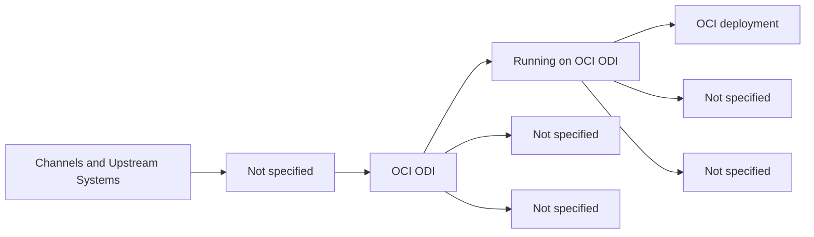
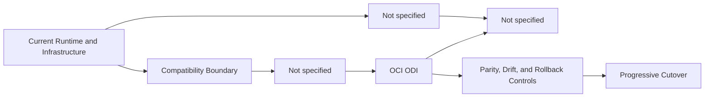

# Cloud-Native Target Architecture Overview

🏠 [Delivery Home](../README.md) | 📘 [Delivery Summary](../ANALYSIS_COMPLETE.md) | 🌊 [Migration Waves](../strategic-analysis/MIGRATION_WAVES.md) | 📋 [Canonical App Inventory](../strategic-analysis/CANONICAL_APPS_MIGRATION_LIST.md) | 🤝 [Co-Living Overview](../coliving-strategy/README.md)

## Executive Summary

This document summarizes the deterministic Stage 06 target architecture outputs for **1 canonical applications**.
The portfolio resolves to **1 distinct destination architecture profile(s)** from the supplied target profile and its family/app overrides.

## Portfolio Target Profile Matrix

| Target Stack | Target Platform | Target Runtime | Deployment Model | Canonical Apps | Families | Example Apps |
|---|---|---|---|---:|---|---|
| OCI ODI | OCI | Running on OCI ODI | OCI deployment | 1 | Pentaho Data Integration | Web |

## Target Architecture Diagrams

### Profile 1: OCI ODI

- Target platform: `OCI`
- Target runtime: `Running on OCI ODI`
- Deployment model: `OCI deployment`
- Canonical apps: `1`
- Families: `Pentaho Data Integration`

#### Co-Living Pattern

## Canonical App To-Be Documents

| App | Family | Target Stack | Target Runtime | To-Be | Migration Strategy |
|---|---|---|---|---|---|
| Web | Pentaho Data Integration | OCI ODI | Running on OCI ODI | [to-be](./canonical-app-to-be/Web/to-be.md) | [migration-strategy](./canonical-app-to-be/Web/migration-strategy.md) |

## Metadata

- analysis date: 2026-07-22
- analyst / agent: GPS Code Introspector
- profile source: <target-profile>/target-architecture-profile.json
- generated canonical app count: 1
- distinct target profile count: 1
