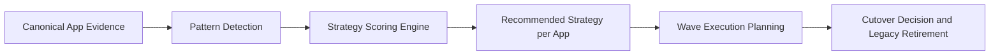
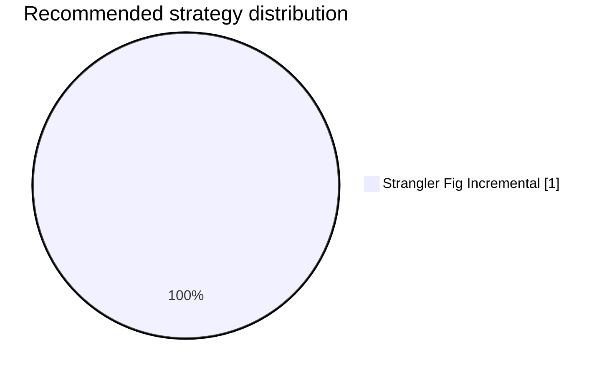
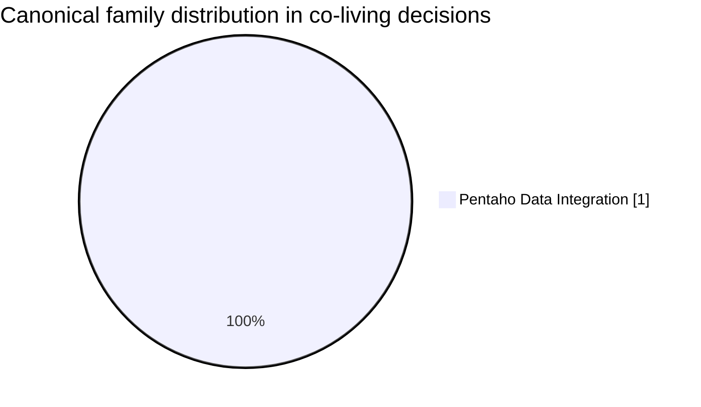
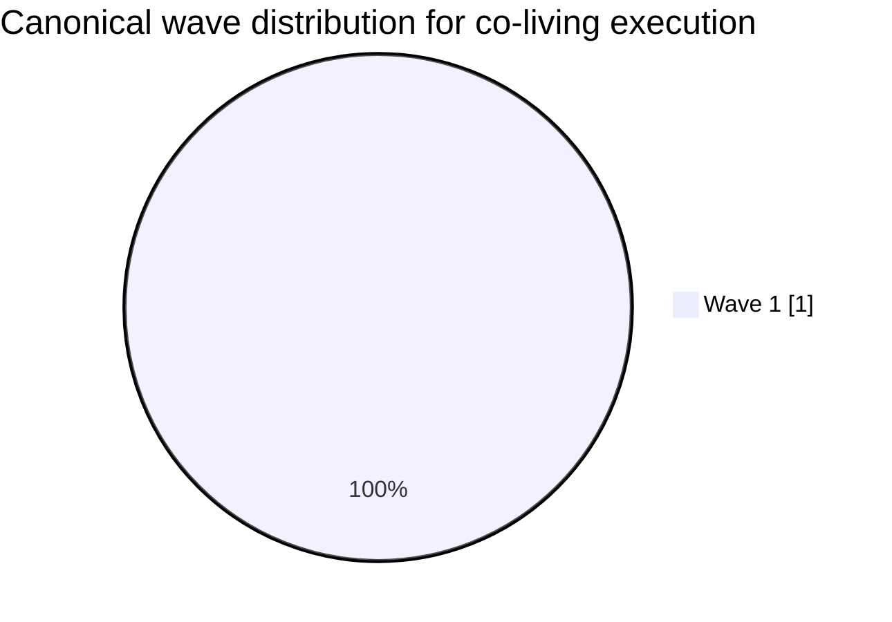
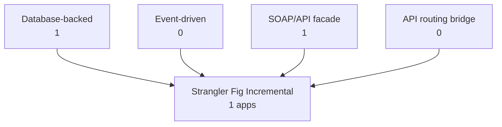
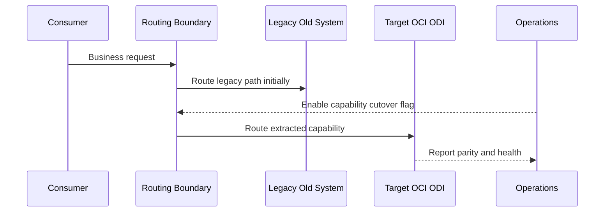
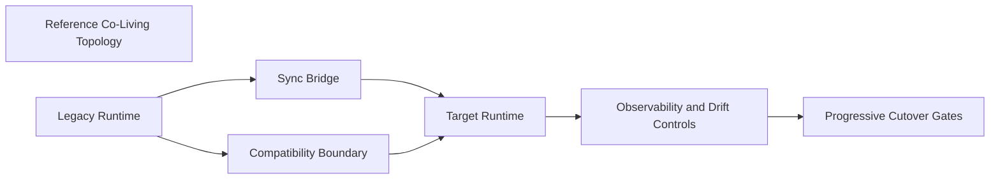

# Aggregated Co-Living Patterns

🏠 [Delivery Home](../README.md) | 📘 [Delivery Summary](../ANALYSIS_COMPLETE.md) | 🤝 [Co-Living Overview](./README.md) | 📋 [Canonical Inventory](../strategic-analysis/CANONICAL_APPS_MIGRATION_LIST.md) | 🌊 [Migration Waves](../strategic-analysis/MIGRATION_WAVES.md)

## Executive Summary

This executive synthesis explains the migration coexistence behavior observed across the canonical application portfolio and translates those signals into recommended migration strategy decisions per app.
Canonical apps analyzed: **1**.

- Dominant recommended strategy: **Strangler Fig Incremental** across **1** apps.
- Dominant family in this portfolio slice: **Pentaho Data Integration** with **1** canonical apps.
- Wave concentration peak: **Wave 1** with **1** canonical apps.
- Primary control objective: preserve contract and state parity during phased coexistence until cutover criteria are met.

## Resolved Target Profiles

| Target Stack | Target Platform | Target Runtime | Deployment Model | Canonical Apps |
|---|---|---|---|---:|
| OCI ODI | OCI | Running on OCI ODI | OCI deployment | 1 |

## Executive Decision Flow

## Pattern Taxonomy

## Detected Aggregated Migration Patterns

| Pattern | What We Detected | Why It Matters for Execution | Canonical Apps | Example Apps |
|---|---|---|---:|---|
| Database-backed dual-run with GoldenGate | Detected relational state coupling with preferred Oracle GoldenGate change-data-capture bridge. | Legacy and target runtimes must stay state-consistent before any irreversible traffic cutover. | 1 | [Web](./app-by-app/Web/coliving-strategy.md) |
| Database-backed dual-run with fallback CDC | Detected relational state coupling with a non-GoldenGate synchronization bridge. | Extra reconciliation gates are required because parity quality depends on alternate CDC implementation. | 0 | - |
| Event-driven coexistence | Detected queue/topic/event footprint in analysis/deep-dive/roadmap evidence. | Cutover quality depends on message ordering, retry semantics, and idempotent consumer behavior. | 0 | - |
| SOAP/API compatibility facade | Detected contract-preserving integration style requiring protocol translation boundary. | Legacy consumers can keep running while modern internals evolve behind a controlled facade. | 1 | [Web](./app-by-app/Web/coliving-strategy.md) |
| Phased API routing bridge | Detected API edge routing style suitable for controlled progressive redirection. | Traffic can shift incrementally with rollback while preserving stable client contracts. | 0 | - |
| Coexistence without Stage 07 strategy file | Stage 08 generated from to-be, roadmap, and wave evidence without app migration-strategy.md. | Portfolio governance should close this gap before implementation starts for that app. | 0 | - |
| Recommended: Strangler Fig Incremental | Highest scoring strategy for the app is Strangler Fig Incremental. | Best fit where routing boundaries, phased rollout controls, and manageable contract drift exist. | 1 | [Web](./app-by-app/Web/coliving-strategy.md) |
| Recommended: ACL / Facade | Highest scoring strategy for the app is Anti-Corruption Layer / Facade. | Best fit where protocol/schema shielding is critical to isolate legacy behavior from modern code. | 0 | - |
| Recommended: CDC Replication Bridge | Highest scoring strategy for the app is CDC Replication Bridge. | Best fit where persistent state dual-run is the primary migration risk driver. | 0 | - |

## Portfolio Composition Diagrams

## Strategy Selection Model

Scoring model source: Amplifyn Modernisation Patterns and Migration Strategies (Strangler Fig, ACL/facade, CDC, dual writes, outbox, backfill, risk-managed rollout).

| Strategy Candidate | Typical Strong Signals |
|---|---|
| Strangler Fig Incremental | gateway/routing/API boundaries, migration sequencing, phased rollout controls |
| Anti-Corruption Layer / Facade | SOAP/proprietary/shared-schema/non-idempotent legacy interfaces |
| CDC Replication Bridge | tight database coupling and synchronized coexistence requirement |
| Dual Writes with Reconciliation | temporary write overlap with explicit parity reconciliation gates |
| Backfill + Incremental Catch-up | bulk historical migration plus incremental convergence requirements |
| Big-Bang Rewrite | exceptional unsalvageable constraints only (default penalized) |

## Selected Strategy Transition Diagrams

Only strategies that appear as selected in this portfolio run are explained below.

### Strangler Fig Incremental (1 apps selected)

Representative apps: [Web](./app-by-app/Web/coliving-strategy.md)

**Old System to New Migrated System (Architecture)**

**Old System to New Migrated System (Sequence)**

## Dominant Pattern Combinations

| # | Pattern Combination | Canonical Apps | Example Apps |
|---:|---|---:|---|
| 1 | sync=Oracle GoldenGate CDC (preferred); integration=Contract-preserving SOAP/API facade; database=yes; events=no | 1 | [Web](./app-by-app/Web/coliving-strategy.md) |

## Wave Distribution by Pattern

| Wave | Database + GoldenGate | Event-driven | SOAP/API facade | API routing bridge | No Stage 07 file |
|---|---:|---:|---:|---:|---:|
| Wave 1 | 1 | 0 | 1 | 0 | 0 |

## Best Strategy Per Canonical App

## Recommended Strategy Per Canonical App

| App | Wave | Family | Recommended Strategy | Why This Strategy | Score | To-Be | Migration | Roadmap |
|---|---|---|---|---|---:|---|---|---|
| [Web](./app-by-app/Web/coliving-strategy.md) | Wave 1 | Pentaho Data Integration | Strangler Fig Incremental | Baseline recommendation favors incremental over big-bang. ; Routing/API boundary evidence supports phased redirection. | 62 | [To-Be](../cloud-native-architecture/canonical-app-to-be/Web/to-be.md) | [Migration](../cloud-native-architecture/canonical-app-to-be/Web/migration-strategy.md) | [Roadmap](../modernization-roadmap/Web/roadmap.md) |

## Strategy Ranking Evidence Per App

| App | Top-3 Ranked Candidates |
|---|---|
| [Web](./app-by-app/Web/coliving-strategy.md) | Strangler Fig Incremental (62), CDC Replication Bridge (48), Anti-Corruption Layer / Facade (45) |

## Recommended Portfolio Baseline

- Keep highest-scoring strategy per app as the default recommendation and escalate only tie or low-confidence cases to architecture review.
- Keep Oracle GoldenGate as default for database-backed coexistence and use alternate CDC only where constraints are explicit and approved.
- Standardize compatibility boundaries per detected integration style before traffic cutover windows are opened.
- Enforce wave-level parity, drift, rollback, and observability gates before legacy retirement decisions.

## Fresh Data References (Current Run)

- [Canonical App Inventory](../strategic-analysis/CANONICAL_APPS_MIGRATION_LIST.md)
- [Migration Waves](../strategic-analysis/MIGRATION_WAVES.md)
- [Portfolio Co-Living Overview](./README.md)
- [Stage 06 To-Be Folder](../cloud-native-architecture/canonical-app-to-be/)
- [Stage 08 App-by-App Strategies](./app-by-app/)

## Further Reading

- [Amplifyn: Modernisation Patterns and Migration Strategies](https://www.amplifyn.com/post/modernisation-patterns-migration-strategies)
- [Martin Fowler: Strangler Fig Application](https://martinfowler.com/bliki/StranglerFigApplication.html)
- [Azure Architecture Center: Strangler Fig Pattern](https://learn.microsoft.com/azure/architecture/patterns/strangler-fig)
- [Microservices.io: Anti-Corruption Layer Pattern](https://microservices.io/patterns/refactoring/anti-corruption-layer.html)
- [Debezium Documentation (CDC)](https://debezium.io/documentation/reference/stable/)

## Metadata

- analysis date: 2026-07-22
- analyst / agent: GPS Code Introspector
- target stack: OCI ODI
- target platform: OCI
- target runtime: Running on OCI ODI
- deployment model: OCI deployment
- distinct target profile count: 1
- canonical app count: 1
