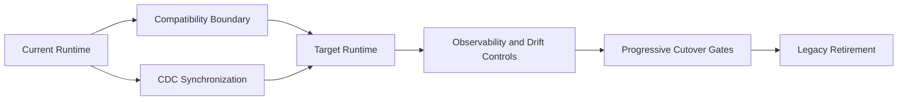

# Co-Living Strategy Overview

🏠 [Delivery Home](../README.md) | 📘 [Delivery Summary](../ANALYSIS_COMPLETE.md) | ☁️ [To-Be Overview](../cloud-native-architecture/README.md) | 📋 [Canonical App Inventory](../strategic-analysis/CANONICAL_APPS_MIGRATION_LIST.md) | 🌊 [Migration Waves](../strategic-analysis/MIGRATION_WAVES.md)

## Executive Summary

This stage defines how canonical applications coexist between the current estate and **1 resolved target architecture profile(s)** until migration cutover and retirement are complete.
The cross-app pattern synthesis is published in [AGGREGATED_PATTERNS.md](AGGREGATED_PATTERNS.md).
Summary-of-record path: `coliving-strategy/AGGREGATED_PATTERNS.md`.

## Resolved Target Profiles

| Target Stack | Target Platform | Target Runtime | Deployment Model | Canonical Apps | Families |
|---|---|---|---|---:|---|
| OCI ODI | OCI | Running on OCI ODI | OCI deployment | 1 | Pentaho Data Integration |

## Default Co-Living Posture

- Preserve the current production path while the target runtime is validated under real operational load.
- Use CDC-based synchronization as the default bridge between current and target state.
- Prefer Oracle GoldenGate when synchronized operational databases must remain aligned across the coexistence window.
- Use vendor-neutral CDC, event-carried state transfer, or controlled batch reconciliation only when GoldenGate is not feasible.
- Exit coexistence only after traffic, state, observability, and rollback criteria are satisfied.

## Portfolio Transition Logic

## Canonical App Coverage

| App | Wave | Family | To-Be Path | Migration Path | Co-Living Path |
|---|---|---|---|---|---|
| Web | Wave 1 | Pentaho Data Integration | [to-be](../cloud-native-architecture/canonical-app-to-be/Web/to-be.md) | [migration-strategy](../cloud-native-architecture/canonical-app-to-be/Web/migration-strategy.md) | [co-living](app-by-app/Web/coliving-strategy.md) |

## Portfolio Distribution

| Family | Canonical Apps |
|---|---|
| Pentaho Data Integration | 1 |

## Metadata

- analysis date: 2026-07-22
- analyst / agent: GPS Code Introspector
- target stack: OCI ODI
- target platform: OCI
- target runtime: Running on OCI ODI
- deployment model: OCI deployment
- distinct target profile count: 1
- canonical app count: 1
