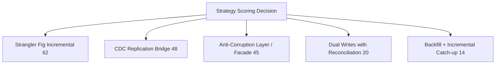
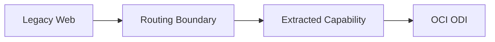
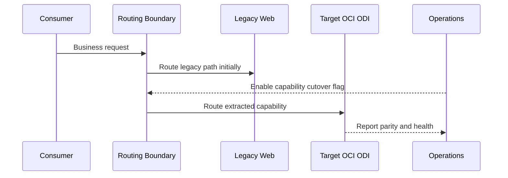
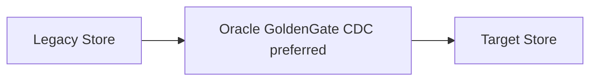
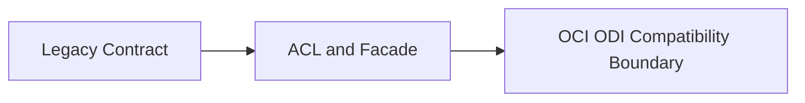
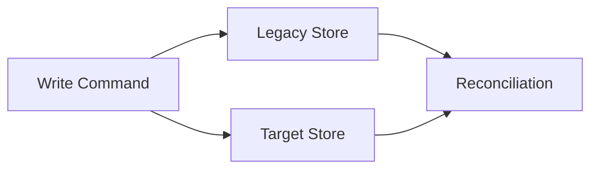
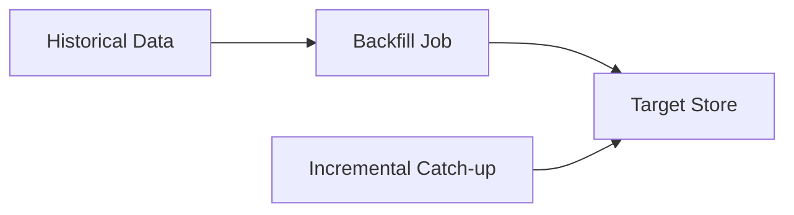
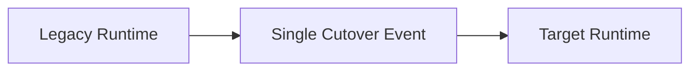

# Web — Co-Living Strategy

🏠 [Delivery Home](../../../README.md) | 📘 [Delivery Summary](../../../ANALYSIS_COMPLETE.md) | 🤝 [Co-Living Overview](../../README.md) | 📄 [Analysis](../../../app-by-app-analysis/Web/analysis.md) | 🔬 [Deep Dive](../../../app-by-app-analysis/Web/deep-dive.md) | 🗺️ [Roadmap](../../../modernization-roadmap/Web/roadmap.md) | ☁️ [To-Be](../../../cloud-native-architecture/canonical-app-to-be/Web/to-be.md) | 🚚 [Migration Strategy](../../../cloud-native-architecture/canonical-app-to-be/Web/migration-strategy.md)

- **Source Stack:** SOAP + WSDL + Oracle + Database
- **Target Stack:** OCI ODI
- **Target Platform:** OCI
- **Target Runtime:** Running on OCI ODI
- **Deployment Model:** OCI deployment
- **Wave:** Wave 1
- **Confidence:** Medium-High
- **Recommended Modernization Strategy:** Strangler Fig Incremental (score 62)

## 1. Executive Summary

`Web` should run in a controlled co-living posture where the current `SOAP + WSDL + Oracle + Database` path remains available while the target `OCI ODI` path is validated, synchronized, and progressively promoted.
Based on pattern scoring, the recommended migration strategy is **Strangler Fig Incremental**.

## Strategy Selection (Scoring)

- Selected strategy: **Strangler Fig Incremental**
- Score: **62**
- Why: Incremental modernization with capability-by-capability traffic redirection.
- Top evidence signals:
  - Baseline recommendation favors incremental over big-bang.
  - Routing/API boundary evidence supports phased redirection.
  - Stage 07 migration sequencing exists.
  - Risk controls (rollback/observability/canary) are evidenced.

| Rank | Strategy Candidate | Score |
|---:|---|---:|
| 1 | Strangler Fig Incremental | 62 |
| 2 | CDC Replication Bridge | 48 |
| 3 | Anti-Corruption Layer / Facade | 45 |
| 4 | Dual Writes with Reconciliation | 20 |
| 5 | Backfill + Incremental Catch-up | 14 |

## 2. Selected Strategy - Detailed Execution Plan

### Recommended Strategy (Highest Priority)

### Strangler Fig Incremental — Score 62 (Conditional Fit)

**Static Strategy Intent:** Replace legacy capabilities in slices while routing production traffic progressively to the target stack.

**Score-Based Guidance:** Use as a secondary/combined strategy where constraints require it, with explicit controls.

**Why this was selected for this app**
- Baseline recommendation favors incremental over big-bang.
- Routing/API boundary evidence supports phased redirection.
- Stage 07 migration sequencing exists.
- Risk controls (rollback/observability/canary) are evidenced.

**Strong-fit conditions (pre-baked)**
- API or gateway boundaries are available for selective traffic redirection.
- Migration is phased by capability, domain, or workflow seams.
- Rollback windows must stay open while production parity is validated.

**Execution playbook for this app (dynamic inserts)**
1. Establish a stable ingress boundary for Web and keep contract compatibility at the edge.
1. Extract one capability at a time into OCI ODI for wave Wave 1.
1. Redirect traffic gradually using quality gates tied to parity and operational SLOs.
1. Retire legacy paths only after sustained stability and rollback closure.

**Strategy Priority Diagram**

**Recommended Strategy Diagram**

**Selected Strategy Sequence Diagram**

**Execution Controls for This App**
- Wave alignment: execute in `Wave 1` with rollback preserved until parity gates pass.
- Data synchronization mode: `Oracle GoldenGate CDC (preferred)` (fallback `Vendor-neutral CDC or controlled batch reconciliation when GoldenGate is not feasible.`).
- Interface transition posture: Contract-preserving SOAP/API facade.
- Deployment target: OCI / Running on OCI ODI / OCI deployment.

## Why Other Strategies Are Not Recommended

The strategies below are evaluated dynamically per app but are ranked below the selected recommendation for this specific context.

### CDC Replication Bridge — Score 48 (Conditional Fit)

**Static Strategy Intent:** Synchronize legacy and target state continuously so both runtimes can coexist without data divergence.

**Why not recommended for this app**
- Ranked lower than the selected strategy by 14 points (62 vs 48).
- Use as a secondary/combined strategy where constraints require it, with explicit controls.
- Compared to the selected strategy, weaker or missing evidence was found for: Baseline recommendation favors incremental over big-bang.; Routing/API boundary evidence supports phased redirection.

**Alternative Strategy Diagram**

### Anti-Corruption Layer / Facade — Score 45 (Conditional Fit)

**Static Strategy Intent:** Protect modern services from legacy coupling by translating protocols, payloads, and operational behavior at a boundary layer.

**Why not recommended for this app**
- Ranked lower than the selected strategy by 17 points (62 vs 45).
- Use as a secondary/combined strategy where constraints require it, with explicit controls.
- Compared to the selected strategy, weaker or missing evidence was found for: Baseline recommendation favors incremental over big-bang.; Routing/API boundary evidence supports phased redirection.

**Alternative Strategy Diagram**

### Dual Writes with Reconciliation — Score 20 (Not Recommended)

**Static Strategy Intent:** Temporarily write to both legacy and target stores while measuring parity and failure behavior.

**Why not recommended for this app**
- Ranked lower than the selected strategy by 42 points (62 vs 20).
- Avoid unless hard evidence proves all higher-ranked options are non-viable.
- Compared to the selected strategy, weaker or missing evidence was found for: Baseline recommendation favors incremental over big-bang.; Routing/API boundary evidence supports phased redirection.

**Alternative Strategy Diagram**

### Backfill + Incremental Catch-up — Score 14 (Not Recommended)

**Static Strategy Intent:** Initialize target data from historical snapshots, then converge with incremental updates until cutover.

**Why not recommended for this app**
- Ranked lower than the selected strategy by 48 points (62 vs 14).
- Avoid unless hard evidence proves all higher-ranked options are non-viable.
- Compared to the selected strategy, weaker or missing evidence was found for: Baseline recommendation favors incremental over big-bang.; Routing/API boundary evidence supports phased redirection.

**Alternative Strategy Diagram**

### Big-Bang Rewrite — Score -30 (Not Recommended)

**Static Strategy Intent:** Replace the legacy implementation in one step only when incremental modernization is demonstrably non-viable.

**Why not recommended for this app**
- Ranked lower than the selected strategy by 92 points (62 vs -30).
- Avoid unless hard evidence proves all higher-ranked options are non-viable.
- Compared to the selected strategy, weaker or missing evidence was found for: Baseline recommendation favors incremental over big-bang.; Routing/API boundary evidence supports phased redirection.

**Alternative Strategy Diagram**

## Metadata

- analysis date: 2026-07-22
- analyst / agent: GPS Code Introspector
- app family: Pentaho Data Integration
- migration strategy present: yes
- preferred CDC mechanism: Oracle GoldenGate CDC (preferred)
- selected modernization strategy: Strangler Fig Incremental
- selected strategy score: 62
- profile source: <target-profile>/target-architecture-profile.json
